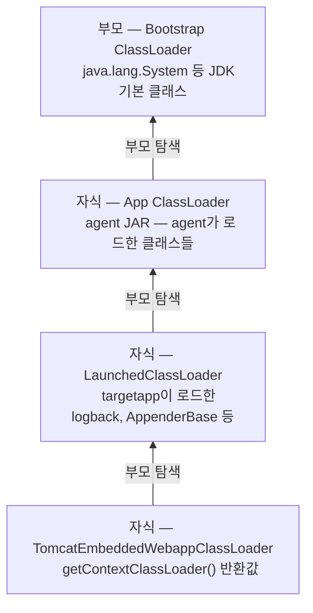

# apm-observatory

1단계 도식:

2단계 도식:
```mermaid
graph TD
    LOG["log.info(msg) / log.warn(msg)"]
    BL["Logger.buildLoggingEventAndAppend()
    new LoggingEvent(level, msg, timestamp, thread, MDC...)"]
    CA["Logger.callAppenders(LoggingEvent)
    this부터 부모 Logger까지 순회"]

    subgraph LIST["appenderList"]
        CON["ConsoleAppender
        Spring Boot 자동설정"]
        FA["FileAppender 등
        선택적으로 추가하는 Appender들"]
        PX["$Proxy — Appender 타입
        agent가 동적으로 추가"]
    end

    AL["AppenderAttachableImpl.appendLoopOnAppenders()
    List&lt;Appender&gt; 순회 → doAppend(event) 호출"]

    LOG --> BL
    BL --> CA
    CA --> LIST
    LIST --> AL
    AL -->|"doAppend(event)"| CON
    AL -->|"doAppend(event)"| FA
    AL -->|"doAppend(event)"| PX

    PX -->|"InvocationHandler
    메서드명 doAppend name match → 위임"| GR

    GR["GrpcLogbackAppender.doAppend(Object event)
    event.getFormattedMessage()
    event.getTimeStamp()
    event.getLevel()
    event.getMDCPropertyMap()
    → 리플렉션으로 ILoggingEvent 메서드 추출"]

    GR -->|"gRPC"| GW["gateway"]
