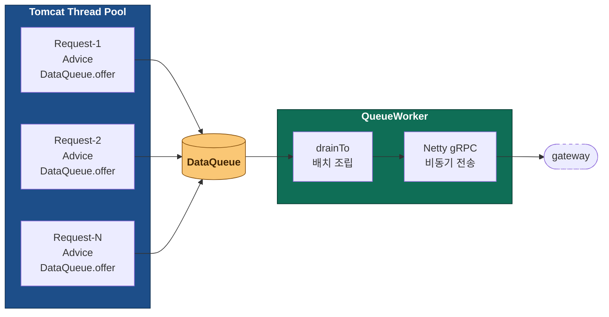
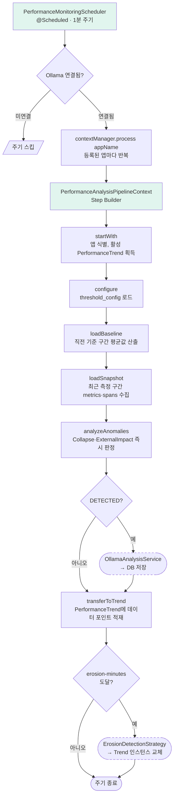
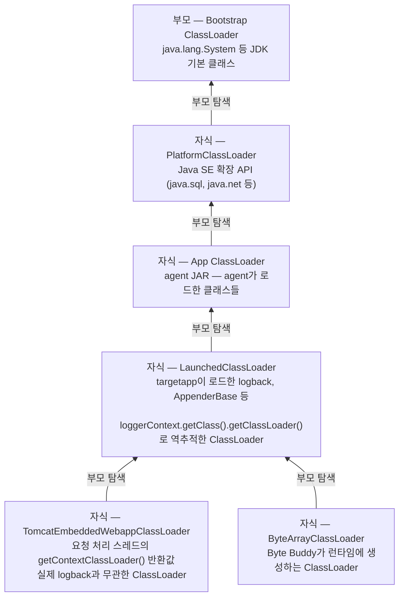
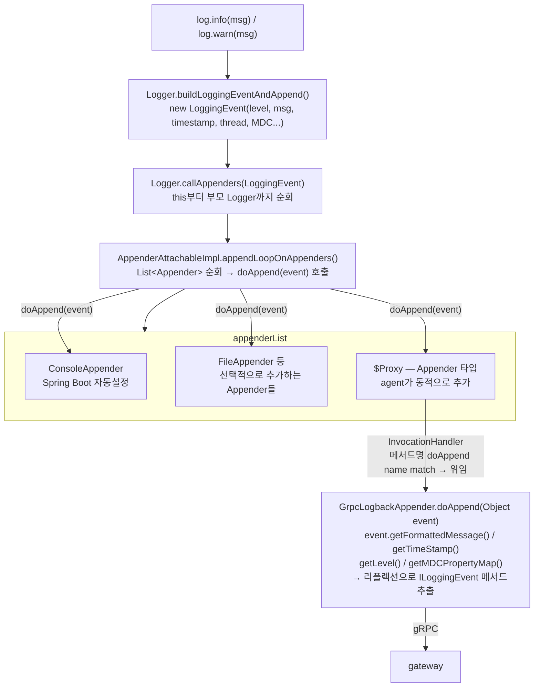

# apm-observatory

## 목차

- [1. 이 프로젝트에 대해](#1-이-프로젝트에-대해)
- [2. 기술 선택과 그 이유](#2-기술-선택과-그-이유)
- [3. 전체 구조 한눈에 보기](#3-전체-구조-한눈에-보기)
- [4. 모듈별 설계 결정들](#4-모듈별-설계-결정들)
- [5. 전체 모듈 구조 요약](#5-전체-모듈-구조-요약)
- [6. 데이터 흐름과 코드 경로](#6-데이터-흐름과-코드-경로)
- [7. 프로젝트 진행 중 어려웠던 문제들과 해결과정](#7-프로젝트-진행-중-어려웠던-문제들과-해결과정)
- [8. 테스트 전략](#8-테스트-전략)
- [9. 실행 방법](#9-실행-방법)

---

## 1. 이 프로젝트에 대해

APM은 장애 원인을 데이터로 짚어주는 유용한 도구지만, 그 내부가 어떻게 만들어져 있는지에 대한 궁금증은 늘 남아 있었습니다. 도구로 사용만 해왔을 뿐 내부를 알아본 적은 없었습니다. 메서드 실행 시간이 어떻게 측정되는지, 한 요청이 여러 시스템을 거치는 동안 어떻게 추적되는지, 수집한 데이터가 어떤 경로로 화면까지 흘러오는지.

이 프로젝트는 그 내부를 직접 만들어보면서 이해하려는 시도입니다.

### 이 프로젝트의 AI 사용에 대해

JVM 내부 동작, 바이트코드 조작(Java Instrumentation), OpenTelemetry 사양 등 직접 다뤄본 적 없는 영역의 학습이 선행되어야 했습니다. 학습 없이는 무엇을 만들지조차 결정할 수 없었기 때문에 질의응답으로 이해를 먼저 쌓고, 그 위에서 설계를 의논하고 코드를 작성하는 순서로 진행했습니다. 학습량과 질문이 많아질수록 채팅 한 번에 담을 수 있는 한계를 넘어섰고, 채팅 간에 맥락을 잃지 않고 이어가는 것이 중요했습니다.

| 항목 | 내용 |
|---|---|
| 모델 | Claude Sonnet 4.6, Claude Opus 4.7 |
| 사용 환경 | 클로드 프로젝트 + 채팅 UI (claude.ai) |
| 컨텍스트 관리 방식 | 프로젝트 지침 + 프로젝트 파일 + 세션 간 인계 노트(section) |

이 컨텍스트 관리 방식은 Anthropic이 정의한 [**컨텍스트 엔지니어링(Context Engineering)**](https://www.anthropic.com/engineering/effective-context-engineering-for-ai-agents)을 그대로 구현해놓은 클로드 프로젝트 환경에 맞춰 구성한 것입니다. 위 링크에서 컨텍스트 엔지니어링이 관리하는 세 영역 — *system instructions, external data, message history* — 이 표의 세 항목과 일치합니다.

- **프로젝트 지침** — 코딩 철학, 설계·구현 접근, 응답 형식 등 매 채팅에 공통으로 적용될 작업 원칙을 등록.
- **프로젝트 파일** — 채용 공고, 진단 커맨드셋 등 매 채팅에서 반복 참조되는 자료를 등록.
- **세션 간 인계 노트(section)** — 채팅 종료 시점에 결정 사항·이월 항목·다음 작업을 정리해 파일로 저장하고, 다음 채팅 시작 시 다시 등록.

코드는 모두 AI가 작성했고, 핵심 설계와 흐름은 직접 결정했습니다.

이 프로젝트는 위와 같이 클로드가 제공하는 환경에서 작업했으며, 통상 하네스(agent harness)라 불리는 에이전트가 동작하는 환경(agent loop, tool interface, execution sandbox 등)은 다루지 않았습니다.

**구현 범위**

- 바이트코드 조작으로 Metrics / Traces / Logs 수집
- gRPC + Netty 기반 데이터 전송과 인증
- Redis Streams 기반 버퍼링과 재처리
- TimescaleDB 기반 시계열 저장
- 룰 기반 이상 감지와 AI 자연어 분석/권고
- Spring Security + JWT 기반 REST API

**기술 스택**

| 카테고리 | 기술 |
|---|---|
| 언어/런타임 | Java 21 |
| 프레임워크 | Spring Boot 3.5.13 |
| 바이트코드 조작 | Byte Buddy 1.14.10 |
| 통신 | gRPC 1.60.0, Protobuf 3.25.1, Netty (grpc-netty-shaded) |
| 데이터 | TimescaleDB (PostgreSQL 15), Redis 7.2 Streams (Lettuce 6.3.1) |
| 분석 | Apache Commons Math 3.6.1 (선형 회귀), Spring AI 1.0.5 + Ollama (llama3.2 1B 모델) |
| 인증 | Spring Security + JWT |

**빠른 둘러보기**

빠르게 둘러보고 싶다면 [3. 전체 구조 한눈에 보기](#3-전체-구조-한눈에-보기)로 시스템의 모양을, [5. 전체 모듈 구조 요약](#5-전체-모듈-구조-요약)으로 모듈별 책임을 잡을 수 있습니다. 결정 근거가 궁금하다면 [2. 기술 선택과 그 이유](#2-기술-선택과-그-이유)를, 직접 띄워보고 싶다면 [9. 실행 방법](#9-실행-방법)을 보면 됩니다.

[목차로 돌아가기](#목차)

---

## 2. 기술 선택과 그 이유

APM 백엔드를 설계하는 시점에서 각 구성요소마다 여러 후보를 놓고 골랐습니다. 선택의 기준은 이 프로젝트의 구조적 요구사항에서 얻는 이점이 잃는 것보다 큰가였습니다.

---

**바이트코드 조작**
- ASM
- Javassist
- Spring AOP
- **Byte Buddy** ✓

Spring AOP는 Spring 컨텍스트 안에서만 동작해서 에이전트 용도로는 처음부터 맞지 않았습니다. ASM과 Javassist도 검토했지만 바이트코드를 직접 다루는 저수준 API를 처음부터 익혀서 구현하기에는 레퍼런스를 찾고 이해하는 데 드는 비용이 컸습니다. Byte Buddy는 ASM을 기반으로 만들어진 라이브러리로, 메서드 인터셉터를 체이닝 방식으로 선언하는 추상화된 API가 구조적으로 파악하기 수월했습니다.

---

**에이전트 언어 및 전송**
- Golang + gRPC
- **Java + gRPC + Protobuf** ✓

Go는 언어 설계 자체가 경량 고루틴과 채널 기반 동시성을 내장하고 있어 네트워크 전송에 최적화되어 있고, gRPC 전송도 지원합니다. 다만 새 언어 학습 부담과 단일 언어로 통일하는 것이 구현하기에 적합한 난이도라고 봐서 Java를 선택했습니다. 전송은 에이전트가 타겟 앱과 같은 JVM에서 돌아가기 때문에 오버헤드가 낮은 Protobuf 바이너리 직렬화와 OpenTelemetry의 표준 전송 프로토콜인 [OTLP](https://opentelemetry.io/docs/specs/otlp/)가 지원하는 gRPC를 선택했습니다.

---

**게이트웨이**
- Spring MVC
- Spring WebFlux
- **Netty** ✓

게이트웨이는 인증·검증 후 수집서버에서 저장하기 알맞은 포맷으로 Redis Streams를 통해 전송하는 데 특화된 모듈입니다. 에이전트로부터 전송된 데이터를 비즈니스 로직 없이 Redis 계층으로 전송만 하기 때문에, 동시에 들어오는 많은 전송을 thread-per-request로 받는 Spring MVC 대신 많은 I/O bound 처리에 특화된 이벤트 루프 방식의 Netty 네트워크 서버와 Redis 전송만 구현할 수 있는 Lettuce를 사용해 구현했습니다. WebFlux도 도메인 로직이 따로 없는 이 모듈에는 프레임워크 단위 추상화까지 필요하지 않았습니다.

---

**버퍼**
- Kafka
- RabbitMQ
- **Redis Streams + AOF** ✓

Kafka는 파티셔닝 기반 수평 확장, 컨슈머 그룹별 독립 오프셋, 대용량 스트림 처리까지 지원하는 강력한 도구지만 브로커 클러스터 구성과 운영 복잡도가 개인 프로젝트 수준에서는 과했습니다. 실제 프로덕션 규모라면 Kafka가 맞는 선택일 것으로 봅니다. RabbitMQ는 개인 프로젝트 규모에서는 충분한 선택지였지만, [persistent 메시지를 큐에 도달하는 즉시 디스크에 기록하는 구조](https://www.rabbitmq.com/docs/persistence-conf)라 APM 에이전트가 보내는 짧고 빈번한 메시지 특성상 디스크 I/O가 병목이 될 것으로 예상했습니다. Redis는 [인메모리 기반으로 매우 빠른 읽기/쓰기 속도를 제공하는 구조](https://redis.io/docs/latest/develop/get-started/faq/)라 짧은 데이터를 빠르게 처리하는 데 유리할 것으로 봤고, AOF로 영속성도 확보할 수 있었습니다.

---

**시계열 저장**
- PostgreSQL
- InfluxDB
- **PostgreSQL + TimescaleDB** ✓

Metrics 데이터는 특정 시간 범위의 평균, 최대값, 추세를 묻는 쿼리가 대부분입니다. 시간을 기준으로 데이터를 파티셔닝하고 집계하는 게 핵심인데, 일반 RDB는 이런 시계열 특성에 최적화되어 있지 않아 데이터가 쌓일수록 쿼리 성능이 떨어질 수 있습니다. InfluxDB는 시계열 전용 DB로 이 문제를 잘 해결하지만 Spans, Logs, AI 분석 결과까지 함께 저장해야 하는 상황에서 DB를 여러 개 띄우면 시연이 복잡해져 선택하지 않았습니다. TimescaleDB는 PostgreSQL의 하이퍼테이블 파티셔닝으로 시계열 쿼리 성능을 확보하면서 하나의 DB로 단순화할 수 있어 선택했습니다.

---

**수집서버 수신·저장 스택**
- 논블로킹 비동기 (Netty 기반 WebFlux + 비동기 Redis/R2DBC)
- **동기 블로킹 (Spring Data Redis + Spring Data JPA)** ✓

수집서버는 Redis Streams를 수신해 TimescaleDB에 적재하는 모듈입니다. Redis 수신과 이어지는 DB 저장을 익숙한 Spring 구조 안에서 일관되게 다루기 위해 Spring Data Redis와 Spring Data JPA를 택했습니다. Span의 종료 시점을 정확히 후킹하는 대신 Span 파생 계산으로 우회해 구현했기 때문에 TraceID 묶음의 종료 시점을 특정할 수 없고, 일정 시간 대기한 뒤 모인 데이터를 저장하는 동기 블로킹 방식을 택했습니다. Span을 정확히 후킹할 수 있고 더 많은 후킹 지점과 데이터 총량을 다루는 프로덕션 규모라면, 수신부터 저장까지 논블로킹 비동기로 통일하는 Netty 기반 WebFlux 스택을 택했을 것으로 생각합니다.

---

**AI 분석**
- OpenAI API / Anthropic API
- LangChain4j
- **Spring AI + Ollama** ✓

처음에는 외부 API를 쓰는 방향도 봤는데, 호출마다 비용이 나가고 네트워크 연결이 없으면 시연도 안 되는 게 부담이었습니다. Ollama로 로컬에서 모델을 직접 돌리면 그 문제가 없었고, Spring AI가 모델 교체를 추상화해줘서 나중에 외부 API로 전환해도 코드 변경이 최소화될 것으로 봤습니다. 엔터프라이즈급 AI 파이프라인이 실제로 어떻게 구성되는지는 알지 못하기 때문에 개인 수준에서 무료로 접목할 수 있는 방식으로 구현했고, 그 접목 방식을 직접 설계하고 구현해본 것에 의미를 뒀습니다.

[목차로 돌아가기](#목차)

---

## 3. 전체 구조 한눈에 보기


데이터는 타겟 앱에서 시작해서 에이전트, 게이트웨이, Redis, 수집서버를 거쳐 TimescaleDB에 쌓입니다. 이후 API 서버와 AI 파이프라인이 독립적으로 그 데이터를 소비합니다.

수집하는 데이터의 범위는 [OpenTelemetry 공식 문서](https://opentelemetry.io/docs/concepts/observability-primer/)가 정의하는 Observability 세 축인 Metrics, Traces, Logs를 기준으로 삼았습니다. 시스템에서 무슨 일이 일어났는지 파악하기 위한 세 가지 신호로, Metrics는 시간에 따른 수치 추세를, Traces는 요청이 시스템을 가로지른 경로를, Logs는 특정 시점의 맥락을 제공합니다. 세 가지가 함께 있을 때 무엇이, 어디서, 왜 문제가 됐는지를 연결해서 볼 수 있습니다. 이 프로젝트는 세 가지 모두를 수집하고 조회할 수 있는 파이프라인을 구현했으며, AI는 그 위에서 이상 징후를 자연어로 설명하고 권고를 생성하는 역할을 합니다.

**모듈별 역할 요약**

| 모듈 | 역할 |
|---|---|
| agent | 바이트코드 조작으로 Metrics / Traces / Logs 수집 |
| gateway | gRPC 수신, API Key 인증, Redis Streams 라우팅 |
| collectorserver | Redis Streams 소비, TimescaleDB 저장 |
| aipipeline | 룰 기반 이상 감지, AI 자연어 분석 및 권고 |
| apiserver | JWT 인증, REST API 제공 |
| targetappmvc | 에이전트 후킹 대상 샘플 애플리케이션 |
| common | gRPC Protobuf 정의 공유 모듈 |

[목차로 돌아가기](#목차)

---

## 4. 모듈별 설계 결정들

---

### 모듈별 설계

---

**[agent]**

에이전트 설계의 시작은 에이전트가 타겟 앱의 JVM 안에서 함께 실행된다는 사실이었습니다. 에이전트가 수집하는 모든 지점은 타겟 앱의 요청 처리 스레드 위에서 실행됩니다. 데이터 저장과 전송 과정의 성능 비효율이 요청 처리 스레드를 점유하거나 블로킹하면 그 지연이 타겟 앱으로 전파됩니다. 에이전트의 부하가 타겟 앱에 영향을 주어서는 안된다고 생각했습니다.

에이전트의 역할은 크게 두 가지입니다. 관측 데이터를 수집하는 것과 수집한 데이터를 엔드포인트로 전송하는 것입니다. 수집은 Byte Buddy Advice가 담당하고, 전송 측의 효율적인 설계를 고민해야 했습니다. 가장 단순한 방법은 HTTP JSON 전송입니다. 구현이 쉽고 디버깅이 편하지만 APM 에이전트처럼 짧고 빈번한 데이터를 대량으로 전송하는 환경에서는 맞지 않다고 판단했습니다.

```
[HTTP JSON]                          [gRPC + Protobuf]
요청마다 TCP 연결 수립                 HTTP/2 단일 연결 위에서 다중 스트림
{"cpu":0.45,"heap":1024,...}         binary: 0x08 0x3d 0x10 0x80...
텍스트 직렬화 → 파싱 비용              바이너리 직렬화 → 파싱 비용 낮음
HTTP 헤더 오버헤드                    헤더 압축 (HPACK)
```

JSON 텍스트 직렬화 비용, HTTP 헤더 오버헤드, 요청마다 연결을 맺는 비용이 누적됩니다. gRPC + Protobuf는 바이너리 직렬화로 페이로드 크기가 작고 HTTP/2 기반으로 하나의 연결에서 다중 스트림을 처리합니다. 또한 gRPC는 OpenTelemetry의 표준 전송 프로토콜인 [OTLP](https://opentelemetry.io/docs/specs/otlp/)가 채택한 방식이기도 합니다.

전송 방식을 정했다면 다음은 어떤 구조로 전송할 것인가였습니다. 수많은 에이전트가 동시에 데이터를 전송하는 상황을 가정하면 전송 구조가 타겟 앱 스레드에 미치는 영향이 커집니다. Java 플랫폼 스레드는 OS 스레드와 1:1로 매핑됩니다. 스레드가 네트워크 I/O를 기다리는 동안에도 블로킹 상태로 약 1MB의 스택 메모리를 점유하고, OS 스케줄러는 이 스레드를 블로킹 상태로 두고 다른 스레드로 전환하는 컨텍스트 스위칭 비용을 지불합니다. Tomcat의 기본 `maxThreads`는 200입니다. ([Apache Tomcat 공식 문서](https://tomcat.apache.org/tomcat-10.1-doc/config/http.html)) Advice에서 수집 즉시 전송하면 전송이 완료될 때까지 요청 처리 스레드가 gRPC 채널을 잡고 기다리게 됩니다. 전송 지연이 요청 처리 지연으로 전파되는 구조입니다.

Go의 고루틴은 이 구조가 다릅니다. Go 런타임은 G(고루틴), M(OS 스레드), P(논리 프로세서) 세 가지로 구성됩니다. Go 코드는 G 위에서 실행되고, G는 P의 실행 큐에 들어가고, P는 실제 OS 스레드인 M에 붙어서 실행됩니다. OS 스레드를 사용하는 건 동일하지만 Go 런타임 스케줄러가 그 위에서 고루틴을 직접 스케줄링합니다. 고루틴이 블로킹 상태가 되면 P가 M에서 분리되고 다른 M에 붙어서 다른 고루틴을 계속 실행합니다. OS 스레드가 1~2MB를 소비하는 것과 달리 고루틴은 약 2KB에서 시작합니다. ([Go 공식 FAQ](https://go.dev/doc/faq#goroutines))

```
[Java 플랫폼 스레드]
OS Thread-1 ── Request-1 (블로킹 중)
OS Thread-2 ── Request-2 (블로킹 중)
OS Thread-3 ── Request-3 (블로킹 중)
...
OS Thread-200 ── Request-200
                 Request-201 ← 대기
블로킹 중인 스레드는 다른 요청을 처리할 수 없음
스레드당 스택 메모리 ~1MB / 최대 200개 한도

[Go 고루틴 G/M/P]
┌──────────────────────────────────┐
│           Go Runtime             │
│  ┌────────────┐ ┌────────────┐   │
│  │     P-1    │ │     P-2    │   │
│  │  G1 G2 G3  │ │  G4 G5 G6  │   │
│  │     M-1    │ │     M-2    │   │
│  └────────────┘ └────────────┘   │
└──────────────────────────────────┘
       │                 │
  OS Thread-1       OS Thread-2
G1 블로킹 시 → P-1이 즉시 G2 실행
OS Thread-1는 블로킹되지 않음
고루틴당 초기 스택 ~2KB / 수십만 동시 실행 가능
```

대규모 전송 환경에서는 Go 고루틴 방식이 구조적으로 유리합니다. 다만 별도 Go 프로세스로 분리하면 프로세스 간 통신 구현이 추가되고, 단일 언어로 통일하는 것이 구현하기에 적합한 난이도라고 봐서 Java를 선택했습니다.

다음과 같이 구현했습니다. Java 에이전트 안에서 `QueueWorker`를 별도 데몬 스레드로 분리했습니다. `setDaemon(true)`로 설정하면 타겟 앱의 일반 스레드가 모두 종료될 때 JVM과 함께 종료됩니다. Advice는 `DataQueue`에 넣기만 하고 `QueueWorker`가 배치로 묶어 Netty 기반 gRPC 채널로 전송합니다. Netty는 비동기 이벤트 루프 기반이라 전송 중에 `QueueWorker` 스레드가 블로킹되지 않습니다. 이 규모에서는 단일 데몬 스레드로 충분하다고 판단했습니다.



`QueueWorker`는 `setDaemon(true)`로 등록된 데몬 스레드로 동작합니다. `offer()`는 즉시 반환되어 타겟 앱 스레드를 블로킹하지 않고, 큐가 꽉 차면 드롭되어 타겟 앱에 영향을 주지 않습니다.

- [`agent/src/main/java/com/apm/observatory/agent/worker/QueueWorker.java`](https://github.com/buss-sooin/apm-observatory/blob/main/agent/src/main/java/com/apm/observatory/agent/worker/QueueWorker.java)
- [`agent/src/main/java/com/apm/observatory/agent/queue/DataQueue.java`](https://github.com/buss-sooin/apm-observatory/blob/main/agent/src/main/java/com/apm/observatory/agent/queue/DataQueue.java)

---

**[gateway]**

에이전트가 게이트웨이 없이 수집서버에 직접 연결하는 구조도 가능합니다. 그러나 그 구조에서는 수집서버가 모든 에이전트 커넥션을 직접 받으면서 동시에 Redis 발행과 DB 저장까지 담당해야 합니다. 에이전트 수가 늘어날수록 수집서버가 커넥션 부하를 고스란히 받고, 수집서버 장애가 에이전트 연결 전체를 끊는 단일 장애 지점이 됩니다.

게이트웨이를 중간에 두면 역할이 분리됩니다. 게이트웨이가 에이전트 커넥션을 전담하고 Redis Streams로 넘기면, 수집서버는 Redis에서 데이터를 꺼내 저장하는 역할에만 집중합니다. 수집서버는 에이전트 커넥션 부하로부터 격리됩니다.

```
[직접 연결]
agent-1 ──┐
agent-2 ──┤──→ collectorserver (커넥션 + Redis 발행 + DB 저장 전부 담당)
agent-N ──┘    단일 장애 지점

[게이트웨이 분리]
agent-1 ──┐                       stream:metrics ──┐
agent-2 ──┤──→ gateway ──────────→ stream:spans   ──┤──→ collectorserver ──→ DB
agent-N ──┘    (커넥션 전담)       stream:logs    ──┘    (저장 전담)
```

외부 요청을 받는 게이트웨이 특성상 요청에 대한 인증이 필요했습니다. 인증 구현은 gRPC 공식 가이드의 인터셉터 방식을 참조했습니다. ([Java Example](https://github.com/grpc/grpc-java/tree/master/examples/src/main/java/io/grpc/examples/header)) 인증 실패 시 `UNAUTHENTICATED`로 즉시 거부하고 `MonitoringServiceImpl`까지 요청이 전달되지 않습니다.

```
에이전트 요청
    ↓
ApiKeyAuthInterceptor
    ├─ API Key 없음 또는 불일치
    │       → UNAUTHENTICATED 즉시 반환
    │
    └─ 인증 성공
            ↓
        MonitoringServiceImpl → RedisStreamPublisher
```

- [`gateway/src/main/java/com/apm/observatory/gateway/interceptor/ApiKeyAuthInterceptor.java`](https://github.com/buss-sooin/apm-observatory/blob/main/gateway/src/main/java/com/apm/observatory/gateway/interceptor/ApiKeyAuthInterceptor.java)
- [`gateway/src/main/java/com/apm/observatory/gateway/service/MonitoringServiceImpl.java`](https://github.com/buss-sooin/apm-observatory/blob/main/gateway/src/main/java/com/apm/observatory/gateway/service/MonitoringServiceImpl.java)

---

**[gateway] Protobuf 파싱 경계**

처음 설계는 Protobuf 바이너리를 단순 Redis를 통해 수집서버까지 그대로 가져가는 방식이었습니다. 그런데 그렇게 하면 common 모듈과 gRPC 의존성이 수집서버까지 전파됩니다. 수집서버가 Redis에서 꺼낸 바이너리를 직접 역직렬화해야 하니 구현 복잡도가 올라가는 게 눈에 보였습니다.

게이트웨이는 언제든 늘어날 수 있는 외부 에이전트의 데이터를 빠르게 받는 것이 목적입니다. 반면 게이트웨이 이후 내부 구간에서는 에이전트 수가 동적으로 늘어나더라도 Redis Streams를 통해 수신 속도를 통제하고 확장할 수 있습니다. 또한 수집서버 장애나 재시작으로 인한 데이터 유실을 대비하고자 Consumer Group + ACK 구조로 재처리가 가능하고 AOF로 디스크에도 보존되는 Redis Streams를 택했습니다. 이 구조에서 바이너리를 유지해 전송 효율을 극대화하는 이득보다, 게이트웨이에서 파싱을 끝내 모듈 복잡성을 줄이고 수집서버가 저장 역할에만 집중하게 하는 쪽이 낫다고 판단했습니다.

```
[처음 — 바이너리 유지 + 단순 Redis]
agent ──→ gateway ──→ Redis(바이너리) ──→ collectorserver(역직렬화)
                                          common 모듈 의존 필요
                                          gRPC 의존성 전파

[최종 — 게이트웨이에서 파싱 + Redis Streams]
agent ──→ gateway(역직렬화) ──→ Redis Streams(Map<String,String>) ──→ collectorserver
                                Consumer Group + ACK                  m.get("cpu_usage")
                                AOF 보존                              common 모듈 의존 없음
```

- [`gateway/src/main/java/com/apm/observatory/gateway/redis/RedisStreamPublisher.java`](https://github.com/buss-sooin/apm-observatory/blob/main/gateway/src/main/java/com/apm/observatory/gateway/redis/RedisStreamPublisher.java)

모니터링은 수집한 데이터가 즉시 결과로 이어져야 합니다. 에이전트가 동시다발적으로 보내는 데이터를 빠르게 받는 것만큼, 게이트웨이가 Redis Streams로 발행하는 속도도 중요합니다. 발행이 블로킹되면 그만큼 데이터가 파이프라인에 늦게 진입하고 모니터링 결과도 늦어집니다. Netty 기반으로 하나의 커넥션을 여러 스레드가 공유할 수 있고 발행 응답을 기다리는 동안 스레드가 블로킹되지 않는 Lettuce 비동기 방식을 선택했습니다. ([Lettuce 공식 문서](https://redis.github.io/lettuce/user-guide/async-api/))

- [`gateway/src/main/java/com/apm/observatory/gateway/redis/RedisStreamPublisher.java`](https://github.com/buss-sooin/apm-observatory/blob/main/gateway/src/main/java/com/apm/observatory/gateway/redis/RedisStreamPublisher.java)

---

**[collectorserver]**

수집서버를 만들 때는 Metrics, Spans, Logs 3종의 raw data가 어떤 모습으로 저장되어야 하는지부터 떠올렸습니다. Metrics는 단일 지표로 원자화되는 형태이고, Spans는 한 요청 안에서 부모-자식 관계로 묶이는 계층 구조이며, Logs는 시간순으로 쌓이는 히스토리 성격입니다. 각 특성에 맞춰 테이블을 만들었습니다. 3종의 raw data를 각자 전용 스트림으로 수집해서 정해진 스키마 형태로 저장하는 것에만 집중하는 모듈로 설계했습니다.

테이블 형태가 다르면 저장 로직도 별도의 형태로 나타납니다. 반면 Redis Streams를 빌려 데이터를 꺼내오는 부분은 종류와 무관하게 같은 흐름입니다. Redis를 빌린 수집 부분에서는 공통 코드를 뽑아내고, 저장 로직의 차이는 자바의 Template Method Pattern을 사용해 분리했습니다.

---

**[collectorserver] ACK 기반 재처리**

모니터링은 관측의 영역입니다. 어느 시점에 무엇이 일어났는지 추적할 수 있어야 의미가 있고, 그러려면 시간 축 위에 끊김 없는 연속된 데이터가 남아있어야 합니다. 중간에 추적이 끊기면 그 시점의 자원 사용량, 호출 흐름, 로그가 함께 사라져 추적이 불가능해지기 때문에 유실이 없도록 해야 한다고 생각했습니다.

Redis Streams는 새로운 메시지를 끝에 덧붙이기만 할 수 있는 로그 구조이며, 메시지 ACK와 Consumer Group을 기본으로 제공합니다([Redis 공식 — Streams](https://redis.io/docs/latest/develop/data-types/streams/)). Consumer Group이 메시지를 소비하면 PEL(Pending Entry List)에 기록되고, 처리한 결과를 ACK로 보내야 PEL에서 제거됩니다. 처리에 실패하면 ACK 없이 PEL에 남아 다음 폴링에서 다시 시도할 수 있습니다. 수집서버는 DB 저장까지 성공한 뒤에만 ACK를 보내도록 두어 유실 가능성을 차단했습니다.

- [`collectorserver/src/main/java/com/apm/observatory/collectorserver/consumer/AbstractStreamConsumer.java`](https://github.com/buss-sooin/apm-observatory/blob/main/collectorserver/src/main/java/com/apm/observatory/collectorserver/consumer/AbstractStreamConsumer.java)

---

**[collectorserver] SpanProcessor**

수집서버의 Metrics와 Logs는 들어온 raw data를 스키마에 맞춰 그대로 저장하면 되지만, Spans는 한 요청 안에서 여러 Span이 부모-자식 관계로 묶이는 계층 구조라 같은 TraceID끼리 모아 처리해야 될 것이라 생각했습니다.

후킹 범위와 기준은 임의로 정했습니다. 실제 APM이 어떤 구조로 어떻게 흘러가는지 이해가 부족하지만, Span이 계층 구조를 표현할 수 있고 탐지 범위가 명확해지도록 나름의 도식을 잡아 세 지점을 정했습니다. DispatcherServlet을 ROOT로 두고, PreparedStatement는 DB, RestClient는 EXTERNAL로 분류했습니다. 이 세 지점만 후킹하면 한 요청에서 측정되는 건 전체 응답시간(ROOT)과 외부 호출 시간(DB, EXTERNAL)뿐이고, 비즈니스 로직 처리 시간은 어느 후킹에서도 잡히지 않습니다.

측정되지 않은 시간을 그대로 두지 않고 INTERNAL이라는 이름으로 파생 계산해 채워넣기로 했습니다. 계산식은 단순합니다.

```
INTERNAL duration = ROOT duration - sum(DB) - sum(EXTERNAL)
```

이 계산이 성립하려면 같은 TraceID의 ROOT, DB, EXTERNAL Span이 모두 도착해야 합니다. 이 프로젝트의 에이전트는 Span이 종료되는 시점마다 게이트웨이로 전송하는 구조라, 같은 TraceID 묶음이 수집서버에 한 번에 도착하지 않습니다. TraceID별로 Span을 모아두는 버퍼(`TraceBuffer`)를 두고, 일정 시간이 지나면 그 시점까지 모인 Span으로 INTERNAL을 계산해 한꺼번에 저장하는 방식을 택했습니다. 전파되는 TraceID의 종료 시점을 어떻게 특정해야 할지는 명확히 알 수 없어 버퍼 수집 시간은 30초로 정했습니다.

- [`collectorserver/src/main/java/com/apm/observatory/collectorserver/processor/SpanProcessor.java`](https://github.com/buss-sooin/apm-observatory/blob/main/collectorserver/src/main/java/com/apm/observatory/collectorserver/processor/SpanProcessor.java)

---

**[aipipeline]**

AI를 어떻게 쓸지 먼저 정했습니다. 이상을 감지하는 데 쓰는 게 아니라, 감지된 결과를 받아 권고를 생성하는 데 쓰기로 했습니다. 감지 방식 자체에는 모니터링 전용으로 설계된 모델, 수학적 시계열 모델, 데이터의 고유 패턴 인식 등 여러 길이 있었지만 모두 모델이나 알고리즘이 판단의 주체가 되는 방식이고, 개인 PC에서 돌리는 오픈소스 모델 규모로는 복합적인 근거를 유추해 결론을 내는 판단을 맡기기 어려웠습니다. 판단의 근거를 좁힐 수 있는 정제된 데이터를 주고 결론을 내게 하는 방식이 모델이 가장 안정적으로 답할 수 있는 형태였고, 그래서 감지는 코드가, 권고는 AI가 맡는 구조로 정했습니다.

이상 감지 규칙은 일종의 도메인 로직이라 스트림으로 전달받은 데이터를 즉시 저장하는 수집서버의 역할과 책임에서 분리되는 게 맞다고 봤습니다. 모니터링이라는 분야를 깊게 다뤄본 경험이 없어 단정하긴 어렵지만, 관측 데이터를 빠르게 모아 저장하고 즉시 제공하는 흐름이 모니터링의 중심이라고 생각했고, 그 흐름에 부가 연산을 끼워 넣어 저장 경로를 늘이고 싶지 않았습니다. 또 모델 호출은 응답 시간과 안정성이 일반 코드와 다르게 흔들리는 구간이라 분리해두면 AI 쪽에서 문제가 생겨도 수집과 제공의 기본 흐름에 전파되지 않습니다. 이런 이유로 aipipeline을 별도 모듈로 설계했습니다. 권고 결과를 외부에 노출하는 API 호출은 apiserver가 담당합니다.

- [`aipipeline/src/main/java/com/apm/observatory/aipipeline/scheduler/PerformanceMonitoringScheduler.java`](https://github.com/buss-sooin/apm-observatory/blob/main/aipipeline/src/main/java/com/apm/observatory/aipipeline/scheduler/PerformanceMonitoringScheduler.java)
- [`aipipeline/src/main/java/com/apm/observatory/aipipeline/ai/service/OllamaAnalysisService.java`](https://github.com/buss-sooin/apm-observatory/blob/main/aipipeline/src/main/java/com/apm/observatory/aipipeline/ai/service/OllamaAnalysisService.java)

---

**[aipipeline] 룰 기반 이상 감지**

이상 감지 규칙은 두 기준으로 구분했습니다. 원인의 위치(앱 자원 내부 vs 외부 의존성)와 변화의 속도(즉각 급등 vs 점진 상승). 이 두 기준의 조합으로 시스템 장애 상태를 세 가지 패턴으로 표현했습니다.

- **즉각적인 이상 신호 (Collapse)** — 자원과 응답시간이 동시에 급등하는 패턴
- **점진적인 이상 신호 (Erosion)** — 자원과 응답시간이 완만하게 같은 방향으로 상승하는 패턴
- **외부 영향의 이상 신호 (External Impact)** — 앱 자원은 정상인데 외부 API 응답시간만 평소 대비 늘어난 패턴

---

**규칙 도출의 구조**

```
이상 원인의 위치
├─ 내부 (앱 자원)
│   ├─ 자원 (cpu, heap)
│   │    ├─ 즉각 급등   →  즉각적인 이상 신호 (Collapse)
│   │    └─ 점진 상승   →  점진적인 이상 신호 (Erosion)
│   └─ 응답시간 (전체 Span)
│        ├─ 즉각 지연   →  즉각적인 이상 신호 (Collapse)
│        └─ 점진 상승   →  점진적인 이상 신호 (Erosion)
└─ 외부 (외부 의존성)
    └─ 외부 응답시간 (EXTERNAL Span)
         └─ 평소 대비 지연 → 외부 영향의 이상 신호 (External Impact)
                            (내부 자원 정상 전제)
```

---

**상태 표현**

각 측정 요소의 결과를 정상/비정상 이분값으로 두면 표현할 수 있는 경우의 수가 부족합니다. 측정값이 임계 안에 머무르는 정상, 임계를 넘어선 이상, 데이터를 못 모아 판정이 성립하지 않는 상태는 서로 다른 의미를 갖고 이후 조합 단계에서도 분기가 달라야 합니다. 표현 단위를 enum으로 두어 각 측정 요소가 가질 수 있는 값을 명시했습니다.

측정 영역별로 enum을 분리했습니다.

- `ResourceStatus` — 자원 측정값(cpu, heap)의 즉각 상태를 분류
- `ResponseStatus` — 응답시간 측정값(전체 Span 또는 외부 Span)의 즉각 상태를 분류
- `TrendStatus` — 시계열 기울기 기반 추세 상태를 분류 (점진 상승 판정 전용)
- `DetectionStatus` — 위 세 enum의 조합으로 도달하는 최종 이상 판정 결과

```java
enum ResourceStatus {
    SPIKED,    // 측정값이 임계 초과 — 이상 상태
    NORMAL,    // 측정값이 임계 이하 — 정상 상태
    NODATA     // 측정 데이터 없음 — 판정 불가 상태
}

enum ResponseStatus {
    SLOWED,    // 측정값이 임계 초과 — 지연 발생
    NORMAL,    // 측정값이 임계 이하 — 정상 응답
    NODATA     // 측정 데이터 없음 — 판정 불가 상태
}

enum TrendStatus {
    RISING,    // 시계열 기울기가 양수 임계 초과 — 점진 상승 중
    FLAT,      // 시계열 기울기가 양수 임계 이하 — 평탄
    NODATA     // 데이터 포인트 부족 — 기울기 계산 불가
}

enum DetectionStatus {
    DETECTED,        // 이상 조합 성립
    NOT_DETECTED,    // 이상 조합 미성립
    UNDETERMINABLE   // 조합 입력 중 NODATA 포함 — 판정 불가
}
```

이상 신호는 위 enum 값들이 특정 조합으로 모일 때 성립합니다.

```
즉각적인 이상 신호 (Collapse)
   ResourceStatus = SPIKED
   ResponseStatus = SLOWED
                      → DetectionStatus = DETECTED


점진적인 이상 신호 (Erosion)
   자원 TrendStatus  = RISING
   응답 TrendStatus  = RISING
                      → DetectionStatus = DETECTED


외부 영향의 이상 신호 (External Impact)
   ResourceStatus = NORMAL
   ResponseStatus = SLOWED   (외부 응답시간만 측정)
                      → DetectionStatus = DETECTED
```

---

**장애 감지의 전체 구조**

```
이상 원인의 위치
├─ 내부
│   ├─ 자원 (cpu, heap) — ResourceStatus
│   │    ├─ 즉각 급등           → SPIKED
│   │    ├─ 즉각 급등 아님       → NORMAL
│   │    └─ 측정 데이터 없음     → NODATA
│   │
│   ├─ 자원 추세 — TrendStatus
│   │    ├─ 점진 상승           → RISING
│   │    ├─ 평탄                → FLAT
│   │    └─ 데이터 포인트 부족   → NODATA
│   │
│   ├─ 응답시간 (전체 Span) — ResponseStatus
│   │    ├─ 즉각 지연           → SLOWED
│   │    ├─ 즉각 지연 아님       → NORMAL
│   │    └─ 측정 데이터 없음     → NODATA
│   │
│   └─ 응답시간 추세 — TrendStatus
│        ├─ 점진 상승           → RISING
│        ├─ 평탄                → FLAT
│        └─ 데이터 포인트 부족   → NODATA
│
└─ 외부
    ├─ 자원 (cpu, memoryRate) — ResourceStatus
    │    ├─ 절대 임계 이하       → NORMAL
    │    ├─ 절대 임계 초과       → SPIKED
    │    └─ 측정 데이터 없음     → NODATA
    │
    └─ 외부 응답시간 (EXTERNAL Span) — ResponseStatus
         ├─ 평소 대비 지연       → SLOWED
         ├─ 평소 대비 평탄       → NORMAL
         └─ 측정 데이터 없음     → NODATA

조합 결과 → DetectionStatus
   각 규칙의 이상 조합 성립          → DETECTED
   각 규칙의 이상 조합 미성립        → NOT_DETECTED
   조합 입력 중 NODATA 하나라도 포함 → UNDETERMINABLE
```

---

<a id="status-formula"></a>
**status 결정 수식**

각 측정 요소의 enum 값은 정해진 수식으로 결정됩니다. 이동 평균으로 노이즈를 제거하고 평소 대비 임계 배수를 넘는지를 보는 식이 기본 구조이며, 점진 상승 판정만 시간 축 기울기를 추가로 봅니다. 수식에 등장하는 측정 구간과 기준 구간의 주기/길이는 [AI 분석 흐름의 구간 변수 단락](#interval-vars)에서 다룹니다.

**자원 급등 (`ResourceStatus = SPIKED`, Collapse용)**
```
avg(cpu)  > baselineCpu  × spikeMultiplier
avg(heap) > baselineHeap × spikeMultiplier
```
- `avg(cpu)` — 최근 측정 구간 동안 수집된 CPU 사용률(%)의 평균
- `avg(heap)` — 최근 측정 구간 동안 수집된 heap 사용량(bytes)의 평균
- `baselineCpu`, `baselineHeap` — 직전 기준 구간의 평균값
- `spikeMultiplier` — 평소 대비 몇 배를 넘어야 SPIKED로 보는지의 임계 배수 (threshold_config 설정값, 기본 3.0)

둘 중 하나라도 만족되면 SPIKED.

**내부 응답 지연 (`ResponseStatus = SLOWED`, Collapse용)**
```
avg(spanDuration) > baselineSpan × spikeMultiplier
```
- `avg(spanDuration)` — 최근 측정 구간 동안 수집된 INTERNAL Span의 평균 응답시간(ms)
- `baselineSpan` — 직전 기준 구간의 INTERNAL Span 평균 응답시간(ms)
- `spikeMultiplier` — 자원 급등과 동일한 임계 배수

**외부 응답 지연 (`ResponseStatus = SLOWED`, External Impact용)**
```
avg(externalDuration) > baselineExternal × externalRatioMultiplier
```
- `avg(externalDuration)` — 최근 측정 구간 동안 수집된 EXTERNAL Span의 평균 응답시간(ms)
- `baselineExternal` — 직전 기준 구간의 EXTERNAL Span 평균 응답시간(ms)
- `externalRatioMultiplier` — 외부 호출 지연 판정용 임계 배수 (자원/내부 응답과 다른 별도 설정값)

**자원 정상 (`ResourceStatus = NORMAL`, External Impact용)** — 외부 영향 판정에서 자원 측은 평소 대비가 아니라 절대 임계 이하인지를 봅니다. 외부 의존성에서 오는 영향을 가리는 게 목적이므로 자원이 평소보다 낮든 평소 수준이든 임계 이하면 충분합니다.
```
avg(cpu)        ≤ cpuThreshold
avg(memoryRate) ≤ memoryThreshold
```
- `avg(cpu)` — 위와 동일
- `avg(memoryRate)` — 최근 측정 구간 동안 `heapUsed / heapMax × 100` 의 평균(%) — 절대값이 아닌 사용률
- `cpuThreshold`, `memoryThreshold` — 자원이 정상 범위에 있는지를 가르는 절대 임계값 (threshold_config 설정값)

**점진 상승 (`TrendStatus = RISING`)**
```
slope = SimpleRegression(시계열 데이터 포인트).getSlope()
RISING ⇔ slope > slopeMinPositive
```
- `시계열 데이터 포인트` — 누적 윈도우 동안 일정 주기로 쌓인 측정값들
- `SimpleRegression` — Apache Commons Math 라이브러리의 단순 선형 회귀 클래스
- `slope` — 데이터 포인트들에 직선을 맞췄을 때의 기울기 (Y축 변화량 / X축 변화량). 데이터 포인트가 2개 미만이면 NaN
- `slopeMinPositive` — "양수이면서 의미 있는 상승"이라고 보는 최소 기울기 임계값 (threshold_config 설정값)

코드가 위 수식으로 측정 요소의 status를 결정하고, 그 status 조합으로 DetectionStatus를 확정한 뒤, AI는 그 결과와 근거 데이터를 받아 자연어 원인 설명과 권고를 생성합니다. 감지 결과의 신뢰는 규칙이, 설명의 품질은 AI가 책임집니다.

- [`aipipeline/src/main/java/com/apm/observatory/aipipeline/analysis/evaluator/PerformanceCollapseEvaluator.java`](https://github.com/buss-sooin/apm-observatory/blob/main/aipipeline/src/main/java/com/apm/observatory/aipipeline/analysis/evaluator/PerformanceCollapseEvaluator.java)
- [`aipipeline/src/main/java/com/apm/observatory/aipipeline/analysis/evaluator/PerformanceErosionEvaluator.java`](https://github.com/buss-sooin/apm-observatory/blob/main/aipipeline/src/main/java/com/apm/observatory/aipipeline/analysis/evaluator/PerformanceErosionEvaluator.java)
- [`aipipeline/src/main/java/com/apm/observatory/aipipeline/analysis/evaluator/ExternalImpactEvaluator.java`](https://github.com/buss-sooin/apm-observatory/blob/main/aipipeline/src/main/java/com/apm/observatory/aipipeline/analysis/evaluator/ExternalImpactEvaluator.java)

---

**[apiserver]**

수집해서 저장한 데이터를 외부에서 조회하는 모듈입니다. 위젯이나 대시보드 UI 없이 JSON으로 응답하는 환경이라, 응답 형태가 데이터를 그대로 읽을 수 있을 만큼 명확해야 한다고 생각했습니다. Metrics와 Logs는 원형 그대로 노출하고, Spans는 한 요청 안의 여러 Span을 평면적으로 나열하면 호출 관계가 안 보이니 TraceID 기준으로 트리 구조로 조립하고 각 Span의 시작 오프셋(`offsetMs`)과 깊이(`depth`)를 함께 내려서 폭포수 형태로 읽힐 수 있게 했습니다.

AI 분석 결과는 aipipeline이 이미 결과와 근거(evidence)를 분리해 저장해둔 상태라, API는 그 중 AI 결과 본문만 조회해서 그대로 노출합니다. evidence를 같이 노출하려면 룰 계산을 재현하거나 근거 데이터를 모듈 간에 끌어오는 의존성이 필요한데, 그 의존성을 common 모듈에 얹기에는 부담이 컸습니다. 따라서 결과만을 보여주는 구성을 선택했습니다.

제공하는 엔드포인트는 다음과 같습니다.

| 엔드포인트 | 용도 |
|---|---|
| `GET /metrics/current` | 앱의 최신 자원 스냅샷 |
| `GET /metrics/trend` | 시간 범위 내 자원 시계열 |
| `GET /metrics/summary` | 구간 집계 + 기울기 + 임계값 대비 수준 |
| `GET /spans/waterfall` | TraceID 기준 Span 트리 (offsetMs, depth 포함) |
| `GET /logs/stream` | 시간 범위 내 로그 (level 필터 선택) |
| `GET /ai/results` | AI 분석 결과 목록 |
| `GET /ai/results/{id}` | AI 분석 결과 단건 |
| `POST /auth/login` | JWT 발급 |
| `POST /config/threshold` | 임계값 설정 (ADMIN) |
| `POST/DELETE /config/business-cycle` | 비즈니스 사이클 설정/삭제 (ADMIN) |

인증과 권한은 Spring Security와 JWT의 기본 구성을 그대로 따랐습니다. 로그인 시 JWT를 발급하고, 이후 요청은 Authorization 헤더로 검증하며, 설정 변경은 ADMIN 역할로 제한합니다. 외부 API 모듈에서 갖춰야 할 기본을 표준 방식으로 챙기는 정도이고, 별도의 결정이 들어간 자리는 아닙니다.

- [`apiserver/src/main/java/com/apm/observatory/apiserver/span/controller/SpanController.java`](https://github.com/buss-sooin/apm-observatory/blob/main/apiserver/src/main/java/com/apm/observatory/apiserver/span/controller/SpanController.java)
- [`apiserver/src/main/java/com/apm/observatory/apiserver/ai/controller/AiResultController.java`](https://github.com/buss-sooin/apm-observatory/blob/main/apiserver/src/main/java/com/apm/observatory/apiserver/ai/controller/AiResultController.java)
- [`apiserver/src/main/java/com/apm/observatory/apiserver/auth/`](https://github.com/buss-sooin/apm-observatory/blob/main/apiserver/src/main/java/com/apm/observatory/apiserver/auth/)

---

### 공통 설계 결정

---

**Package by Feature 패키지 구조**

패키지를 레이어(controller, service, repository)로 나누는 방식이 익숙하지만 이 프로젝트에서는 기능(auth, metrics, span, log, config, ai) 단위로 나눴습니다. 레이어 기준으로 나누면 하나의 기능을 수정할 때 여러 패키지를 가로질러야 합니다. 기능 단위로 나누면 관련 코드가 한 곳에 모여 있어서 변경 범위를 파악하기 쉽습니다. 각 기능 안에서 필요한 레이어(controller, adapter, entity, repository, model)를 두는 방식으로 구성했습니다.

- [`apiserver/src/main/java/com/apm/observatory/apiserver/`](https://github.com/buss-sooin/apm-observatory/blob/main/apiserver/src/main/java/com/apm/observatory/apiserver/)
- [`aipipeline/src/main/java/com/apm/observatory/aipipeline/`](https://github.com/buss-sooin/apm-observatory/blob/main/aipipeline/src/main/java/com/apm/observatory/aipipeline/)

---

**Port & Adapter 외부 경계 설계**

DB, Redis, 외부 API 같은 인프라와 도메인 로직 사이에 Port(인터페이스)와 Adapter(구현체)를 두었습니다. 도메인 로직이 JPA나 Redis 같은 기술 세부사항을 직접 알지 못하게 하기 위해서입니다. 단 모든 곳에 Port를 두지는 않았습니다. Entity에서 도메인 객체로 변환이 있거나 기술 교체 가능성이 있는 경우에만 Port + Adapter를 적용하고, 단순 조회/저장만 있는 경우는 Adapter만 두었습니다. 기준 없이 모든 곳에 인터페이스를 만드는 건 오히려 코드를 복잡하게 만든다고 판단했습니다.

- [`apiserver/src/main/java/com/apm/observatory/apiserver/metrics/port/MetricsPort.java`](https://github.com/buss-sooin/apm-observatory/blob/main/apiserver/src/main/java/com/apm/observatory/apiserver/metrics/port/MetricsPort.java)
- [`apiserver/src/main/java/com/apm/observatory/apiserver/metrics/adapter/MetricsAdapter.java`](https://github.com/buss-sooin/apm-observatory/blob/main/apiserver/src/main/java/com/apm/observatory/apiserver/metrics/adapter/MetricsAdapter.java)

---

**AI 판단 근거 저장**

AI 분석 결과만 저장하면 "왜 이 결론이 나왔는가"를 나중에 추적할 수 없습니다. 두 가지를 추가로 설계했습니다.

`ai_raw_responses`는 Ollama가 실제로 응답한 날것의 텍스트를 항상 저장합니다. 파싱 성공 여부와 무관하게 저장하기 때문에 AI가 어떤 응답을 했는지, 파싱이 왜 실패했는지 추적할 수 있습니다.

`evidence` 테이블은 AI가 어떤 데이터를 보고 이 결론을 냈는지 기록합니다. 현재는 저장만 하고 API 응답에는 포함하지 않았습니다. 계산 재현에 필요한 도메인 로직이 여러 모듈에 걸쳐 있어서 API로 노출하려면 공통 모듈 분리가 선행되어야 한다고 판단했습니다.

- [`aipipeline/src/main/java/com/apm/observatory/aipipeline/ai/entity/AiRawResponseEntity.java`](https://github.com/buss-sooin/apm-observatory/blob/main/aipipeline/src/main/java/com/apm/observatory/aipipeline/ai/entity/AiRawResponseEntity.java)
- [`aipipeline/src/main/java/com/apm/observatory/aipipeline/ai/entity/AiAnalysisMetricsEvidenceEntity.java`](https://github.com/buss-sooin/apm-observatory/blob/main/aipipeline/src/main/java/com/apm/observatory/aipipeline/ai/entity/AiAnalysisMetricsEvidenceEntity.java)

[목차로 돌아가기](#목차)

---

## 5. 전체 모듈 구조 요약

```
apm-observatory/
├── common/           # gRPC Protobuf 정의 공유 모듈
├── agent/            # 바이트코드 조작 기반 데이터 수집
├── gateway/          # gRPC 수신, 인증, Redis Streams 라우팅
├── collectorserver/  # Redis Streams 소비, TimescaleDB 저장
├── aipipeline/       # 룰 기반 이상 감지, AI 분석 및 결과 저장
├── apiserver/        # JWT 인증, REST API 제공
├── targetappmvc/     # 에이전트 후킹 대상 샘플 애플리케이션
├── docker/           # 모듈별 Dockerfile
├── docker-compose.yml
└── README.md
```

**common**

agent와 gateway가 gRPC로 통신할 때 쓰는 Protobuf 메시지 타입을 정의합니다. 두 모듈이 공유해야 하는 계약이라 별도 모듈로 분리했습니다.

**agent**

타겟 앱 JVM에 `-javaagent`로 붙어서 동작합니다. Byte Buddy로 DispatcherServlet, PreparedStatement, RestClient를 후킹해서 Metrics, Spans, Logs를 수집하고 gRPC로 게이트웨이에 전송합니다.

- [`agent/src/main/java/com/apm/observatory/agent/AgentMain.java`](https://github.com/buss-sooin/apm-observatory/blob/main/agent/src/main/java/com/apm/observatory/agent/AgentMain.java)
- [`agent/src/main/java/com/apm/observatory/agent/advice/mvc/`](https://github.com/buss-sooin/apm-observatory/blob/main/agent/src/main/java/com/apm/observatory/agent/advice/mvc/)

**gateway**

에이전트로부터 gRPC 요청을 받아 API Key 인증과 유효성 검증을 처리합니다. 통과한 데이터를 Metrics, Spans, Logs 각각의 Redis Stream으로 라우팅합니다. Netty 기반으로 동작합니다.

- [`gateway/src/main/java/com/apm/observatory/gateway/server/GatewayServer.java`](https://github.com/buss-sooin/apm-observatory/blob/main/gateway/src/main/java/com/apm/observatory/gateway/server/GatewayServer.java)
- [`gateway/src/main/java/com/apm/observatory/gateway/redis/RedisStreamPublisher.java`](https://github.com/buss-sooin/apm-observatory/blob/main/gateway/src/main/java/com/apm/observatory/gateway/redis/RedisStreamPublisher.java)

**collectorserver**

Redis Streams를 Consumer Group으로 소비해서 TimescaleDB에 저장합니다. Metrics는 Disk IO 누적값 계산, Spans는 INTERNAL Span 파생 계산, Logs는 가공 없이 저장합니다.

- [`collectorserver/src/main/java/com/apm/observatory/collectorserver/consumer/AbstractStreamConsumer.java`](https://github.com/buss-sooin/apm-observatory/blob/main/collectorserver/src/main/java/com/apm/observatory/collectorserver/consumer/AbstractStreamConsumer.java)
- [`collectorserver/src/main/java/com/apm/observatory/collectorserver/processor/`](https://github.com/buss-sooin/apm-observatory/blob/main/collectorserver/src/main/java/com/apm/observatory/collectorserver/processor/)

**aipipeline**

스케줄러가 주기적으로 TimescaleDB에서 데이터를 읽어 세 가지 룰 기반 이상 감지를 수행합니다. 감지된 결과를 Ollama에 전달해 자연어 분석 결과와 권고를 받아 저장합니다.

- [`aipipeline/src/main/java/com/apm/observatory/aipipeline/scheduler/PerformanceMonitoringScheduler.java`](https://github.com/buss-sooin/apm-observatory/blob/main/aipipeline/src/main/java/com/apm/observatory/aipipeline/scheduler/PerformanceMonitoringScheduler.java)
- [`aipipeline/src/main/java/com/apm/observatory/aipipeline/context/pipeline/PerformanceAnalysisPipelineContext.java`](https://github.com/buss-sooin/apm-observatory/blob/main/aipipeline/src/main/java/com/apm/observatory/aipipeline/context/pipeline/PerformanceAnalysisPipelineContext.java)

**apiserver**

JWT + Spring Security 기반 인증으로 REST API를 제공합니다. Metrics 추세, Span 폭포수 차트, 로그 스트림, AI 분석 결과 조회, 임계값 설정 API를 포함합니다.

- [`apiserver/src/main/java/com/apm/observatory/apiserver/auth/security/SecurityConfig.java`](https://github.com/buss-sooin/apm-observatory/blob/main/apiserver/src/main/java/com/apm/observatory/apiserver/auth/security/SecurityConfig.java)
- [`apiserver/src/main/java/com/apm/observatory/apiserver/metrics/controller/MetricsController.java`](https://github.com/buss-sooin/apm-observatory/blob/main/apiserver/src/main/java/com/apm/observatory/apiserver/metrics/controller/MetricsController.java)

**targetappmvc**

에이전트 후킹 대상 샘플 애플리케이션입니다. Spring MVC + MySQL로 구성되며 DB 쿼리와 외부 API 호출을 동시에 발생시키는 `/combined` 엔드포인트로 시연에 활용합니다.

- [`targetappmvc/src/main/java/com/apm/observatory/targetappmvc/controller/TestController.java`](https://github.com/buss-sooin/apm-observatory/blob/main/targetappmvc/src/main/java/com/apm/observatory/targetappmvc/controller/TestController.java)

[목차로 돌아가기](#목차)

---

## 6. 데이터 흐름과 코드 경로

Metrics, Traces, Logs가 각각 어느 클래스를 거쳐 저장되고 조회되는지, AI 분석이 어떤 흐름으로 실행되는지를 코드 레벨로 정리했습니다. fork 후 IDE에서 아래 경로를 따라가면 전체 파이프라인을 탐색할 수 있습니다.

---

### Metrics 흐름

**수집 → 전송**

`MetricsCollector`가 5초 주기로 JVM MXBean에서 CPU, 메모리, Disk IO를 수집합니다. 수집된 값은 `DataQueue`에 적재되고 `QueueWorker`가 100ms 배치로 묶어 `GrpcSenderImpl`을 통해 게이트웨이로 전송합니다.

```
MetricsCollector → DataQueue → QueueWorker → GrpcSenderImpl → (gRPC) → gateway
```

- [`agent/src/main/java/com/apm/observatory/agent/collector/MetricsCollector.java`](https://github.com/buss-sooin/apm-observatory/blob/main/agent/src/main/java/com/apm/observatory/agent/collector/MetricsCollector.java)
- [`agent/src/main/java/com/apm/observatory/agent/worker/QueueWorker.java`](https://github.com/buss-sooin/apm-observatory/blob/main/agent/src/main/java/com/apm/observatory/agent/worker/QueueWorker.java)
- [`agent/src/main/java/com/apm/observatory/agent/sender/GrpcSenderImpl.java`](https://github.com/buss-sooin/apm-observatory/blob/main/agent/src/main/java/com/apm/observatory/agent/sender/GrpcSenderImpl.java)

**수신 → 저장**

게이트웨이의 `MonitoringServiceImpl`이 gRPC 요청을 수신하고 `ApiKeyAuthInterceptor`로 인증을 처리합니다. 통과한 데이터는 `RedisStreamPublisher`가 `stream:metrics`에 발행합니다. `MetricsConsumer`가 Consumer Group으로 소비하고 `MetricsProcessor`가 Disk IO 누적값을 계산해 TimescaleDB에 저장합니다.

```
MonitoringServiceImpl → RedisStreamPublisher → stream:metrics → MetricsConsumer → MetricsProcessor → DB
```

- [`gateway/src/main/java/com/apm/observatory/gateway/service/MonitoringServiceImpl.java`](https://github.com/buss-sooin/apm-observatory/blob/main/gateway/src/main/java/com/apm/observatory/gateway/service/MonitoringServiceImpl.java)
- [`gateway/src/main/java/com/apm/observatory/gateway/redis/RedisStreamPublisher.java`](https://github.com/buss-sooin/apm-observatory/blob/main/gateway/src/main/java/com/apm/observatory/gateway/redis/RedisStreamPublisher.java)
- [`collectorserver/src/main/java/com/apm/observatory/collectorserver/consumer/MetricsConsumer.java`](https://github.com/buss-sooin/apm-observatory/blob/main/collectorserver/src/main/java/com/apm/observatory/collectorserver/consumer/MetricsConsumer.java)
- [`collectorserver/src/main/java/com/apm/observatory/collectorserver/processor/MetricsProcessor.java`](https://github.com/buss-sooin/apm-observatory/blob/main/collectorserver/src/main/java/com/apm/observatory/collectorserver/processor/MetricsProcessor.java)

**조회**

```
GET /metrics/trend    → MetricsController → MetricsPort → MetricsAdapter → DB
GET /metrics/summary  → MetricsController → MetricsPort → MetricsAdapter → DB
```

- [`apiserver/src/main/java/com/apm/observatory/apiserver/metrics/controller/MetricsController.java`](https://github.com/buss-sooin/apm-observatory/blob/main/apiserver/src/main/java/com/apm/observatory/apiserver/metrics/controller/MetricsController.java)
- [`apiserver/src/main/java/com/apm/observatory/apiserver/metrics/adapter/MetricsAdapter.java`](https://github.com/buss-sooin/apm-observatory/blob/main/apiserver/src/main/java/com/apm/observatory/apiserver/metrics/adapter/MetricsAdapter.java)

---

### Traces 흐름

**수집 → 전송**

HTTP 요청이 들어오면 `ServletAdvice`가 `DispatcherServlet.doDispatch()`를 후킹해 TraceID, SpanID를 생성하고 MDC에 전파합니다. DB 쿼리는 `PreparedStatementAdvice`가, 외부 API 호출은 `RestClientRequestAdvice`가 각각 후킹해 자식 Span을 생성합니다. 세 Advice 모두 `DataQueue`를 통해 게이트웨이로 전송됩니다.

```
ServletAdvice (INTERNAL)          ──┐
PreparedStatementAdvice (DB)      ──┤→ DataQueue → QueueWorker → GrpcSenderImpl → gateway
RestClientRequestAdvice (EXTERNAL)──┘
```

- [`agent/src/main/java/com/apm/observatory/agent/advice/mvc/ServletAdvice.java`](https://github.com/buss-sooin/apm-observatory/blob/main/agent/src/main/java/com/apm/observatory/agent/advice/mvc/ServletAdvice.java)
- [`agent/src/main/java/com/apm/observatory/agent/advice/mvc/PreparedStatementAdvice.java`](https://github.com/buss-sooin/apm-observatory/blob/main/agent/src/main/java/com/apm/observatory/agent/advice/mvc/PreparedStatementAdvice.java)
- [`agent/src/main/java/com/apm/observatory/agent/advice/mvc/RestClientRequestAdvice.java`](https://github.com/buss-sooin/apm-observatory/blob/main/agent/src/main/java/com/apm/observatory/agent/advice/mvc/RestClientRequestAdvice.java)

**수신 → 저장**

게이트웨이에서 `stream:spans`로 발행된 데이터를 `SpanConsumer`가 소비합니다. `SpanProcessor`가 DB/EXTERNAL Span의 부모-자식 관계를 정리하고 INTERNAL Span을 파생 계산해 저장합니다.

```
stream:spans → SpanConsumer → SpanProcessor → DB
```

- [`collectorserver/src/main/java/com/apm/observatory/collectorserver/consumer/SpanConsumer.java`](https://github.com/buss-sooin/apm-observatory/blob/main/collectorserver/src/main/java/com/apm/observatory/collectorserver/consumer/SpanConsumer.java)
- [`collectorserver/src/main/java/com/apm/observatory/collectorserver/processor/SpanProcessor.java`](https://github.com/buss-sooin/apm-observatory/blob/main/collectorserver/src/main/java/com/apm/observatory/collectorserver/processor/SpanProcessor.java)

**조회**

`SpanAdapter`가 trace_id로 전체 Span을 조회하고, DFS 재귀 순회로 INTERNAL → DB/EXTERNAL 트리를 조립해 폭포수 차트 형태로 반환합니다.

```
GET /spans/waterfall?trace_id= → SpanController → SpanPort → SpanAdapter → DB
```

- [`apiserver/src/main/java/com/apm/observatory/apiserver/span/controller/SpanController.java`](https://github.com/buss-sooin/apm-observatory/blob/main/apiserver/src/main/java/com/apm/observatory/apiserver/span/controller/SpanController.java)
- [`apiserver/src/main/java/com/apm/observatory/apiserver/span/adapter/SpanAdapter.java`](https://github.com/buss-sooin/apm-observatory/blob/main/apiserver/src/main/java/com/apm/observatory/apiserver/span/adapter/SpanAdapter.java)

---

### Logs 흐름

**수집 → 전송**

`AppenderRegistrationAdvice`가 `FrameworkServlet.initServletBean()`을 후킹해 Spring MVC 초기화 완료 시점에 `GrpcLogbackAppender`를 logback ROOT Logger에 등록합니다. 이후 애플리케이션에서 발생하는 모든 로그가 `GrpcLogbackAppender`를 통해 게이트웨이로 전송됩니다.

```
GrpcLogbackAppender (ROOT Logger 등록) → DataQueue → QueueWorker → GrpcSenderImpl → gateway
```

- [`agent/src/main/java/com/apm/observatory/agent/advice/mvc/AppenderRegistrationAdvice.java`](https://github.com/buss-sooin/apm-observatory/blob/main/agent/src/main/java/com/apm/observatory/agent/advice/mvc/AppenderRegistrationAdvice.java)
- [`agent/src/main/java/com/apm/observatory/agent/appender/GrpcLogbackAppender.java`](https://github.com/buss-sooin/apm-observatory/blob/main/agent/src/main/java/com/apm/observatory/agent/appender/GrpcLogbackAppender.java)

**수신 → 저장**

```
stream:logs → LogConsumer → LogProcessor → DB
```

- [`collectorserver/src/main/java/com/apm/observatory/collectorserver/consumer/LogConsumer.java`](https://github.com/buss-sooin/apm-observatory/blob/main/collectorserver/src/main/java/com/apm/observatory/collectorserver/consumer/LogConsumer.java)
- [`collectorserver/src/main/java/com/apm/observatory/collectorserver/processor/LogProcessor.java`](https://github.com/buss-sooin/apm-observatory/blob/main/collectorserver/src/main/java/com/apm/observatory/collectorserver/processor/LogProcessor.java)

**조회**

```
GET /logs/stream?app_name=&start_time=&end_time=&level= → LogController → LogAdapter → DB
```

- [`apiserver/src/main/java/com/apm/observatory/apiserver/log/controller/LogController.java`](https://github.com/buss-sooin/apm-observatory/blob/main/apiserver/src/main/java/com/apm/observatory/apiserver/log/controller/LogController.java)
- [`apiserver/src/main/java/com/apm/observatory/apiserver/log/adapter/LogAdapter.java`](https://github.com/buss-sooin/apm-observatory/blob/main/apiserver/src/main/java/com/apm/observatory/apiserver/log/adapter/LogAdapter.java)

---

### AI 분석 흐름

이 모듈의 분석 로직은 두 가지 주기로 동작합니다.

**`PerformanceAnalysisPipelineContext`의 주기 구성**

- **즉시 판정 주기** — 1분마다 한 번 돕니다. 즉각적인 이상 신호와 외부 영향의 이상 신호를 이 주기 안에서 판정합니다. 주기 내부에서 baseline을 매번 새로 산출하고 그 시점의 측정값과 비교합니다.
- **누적 분석 주기** — 30분 동안 즉시 판정 주기가 매번 측정 결과를 적재해 시계열을 쌓고, 30분에 도달하면 그 시계열에 선형 회귀를 적용해 점진적인 이상 신호를 판정합니다. 분석이 끝나면 새 시계열로 교체.

누적 분석 주기의 길이가 즉시 판정 주기의 간격보다 반드시 커야 한다는 제약은 시작 시점에 검증합니다 — `PerformanceContextManager.init()` 에서 `erosionMinutes ≤ intervalMinutes` 이면 `IllegalStateException`으로 부팅을 막습니다.

**즉시 판정 주기의 파이프라인 단계**

스케줄러가 1분마다 `PerformanceMonitoringScheduler.run()`을 호출하고, 그 안에서 등록된 앱마다 `PerformanceAnalysisPipelineContext`가 한 번 돕니다. 한 주기 동안 다음 단계를 거칩니다.



각 단계는 입력만 주면 결과가 결정되도록 짜여 있어 단계 사이에 부수 효과가 누적되지 않습니다. AI 호출과 DB 저장은 `analyzeAnomalies()` 단계에서만 일어나며, 같은 단계가 여러 번 호출되는 일은 없습니다.

<a id="interval-vars"></a>
**구간 변수의 실제 길이**

룰 기반 이상 감지 단락의 수식에 등장한 구간 변수들은 다음 설정을 사용합니다.

| 수식 변수 | 설정 키 | 기본값 |
|---|---|---|
| 최근 측정 구간 | `aipipeline.window.recent-minutes` | 5분 |
| 직전 기준 구간 | `aipipeline.window.baseline-minutes` | 30분 |
| 누적 분석 주기 길이 | `aipipeline.window.erosion-minutes` | 30분 |
| 즉시 판정 주기 간격 | `aipipeline.scheduler.interval-minutes` | 1분 |

[status 결정 수식으로 돌아가기](#status-formula)

**baseline 산출 시점**

`business_cycle`은 운영 중인 서비스의 피크 시간대(예: ecommerce의 점심·저녁 트래픽 집중 구간)를 기준 시간으로 정의해 baseline 시점을 결정하는 사용자 정의 기준입니다. 같은 임계 배수라도 어느 시점의 평균을 baseline으로 삼느냐에 따라 판정이 갈리기 때문에, 시간대별 트래픽 패턴이 뚜렷한 서비스에서 새벽 평균을 기준으로 삼아 발생하는 오탐을 막기 위해 둔 분기입니다.

| `business_cycle` 등록 여부 | baseline 시점 | 사용 의도 |
|---|---|---|
| 등록됨 | 전날 같은 시각의 같은 길이 구간 | 시간대별 트래픽 패턴이 있는 서비스 — 같은 시간대끼리 비교 |
| 미등록 | 현재로부터 직전 baseline-minutes 구간 | 시간대 영향이 작은 서비스 — 단순 직전 비교 |

**호출부 정리**

```
PerformanceMonitoringScheduler
  → PerformanceAnalysisPipelineContext
      .startWith()        // 앱 식별, 활성 Trend 획득
      .configure()        // ThresholdConfigAdapter
      .loadBaseline()     // PerformanceDataAdapter / ExternalImpactDataAdapter
      .loadSnapshot()     // 같은 두 Adapter에서 최근 구간 수집
      .analyzeAnomalies() // CollapseDetectionStrategy / ExternalImpactDetectionStrategy
      .transferToTrend()  // PerformanceTrend 누적 → 만료 시 ErosionDetectionStrategy
  → OllamaAnalysisService      // DETECTED → 자연어 분석 요청
  → AiAnalysisResultAdapter    // 분석 결과 + evidence 저장
```

- [`aipipeline/src/main/java/com/apm/observatory/aipipeline/scheduler/PerformanceMonitoringScheduler.java`](https://github.com/buss-sooin/apm-observatory/blob/main/aipipeline/src/main/java/com/apm/observatory/aipipeline/scheduler/PerformanceMonitoringScheduler.java)
- [`aipipeline/src/main/java/com/apm/observatory/aipipeline/context/PerformanceContextManager.java`](https://github.com/buss-sooin/apm-observatory/blob/main/aipipeline/src/main/java/com/apm/observatory/aipipeline/context/PerformanceContextManager.java)
- [`aipipeline/src/main/java/com/apm/observatory/aipipeline/context/pipeline/PerformanceAnalysisPipelineContext.java`](https://github.com/buss-sooin/apm-observatory/blob/main/aipipeline/src/main/java/com/apm/observatory/aipipeline/context/pipeline/PerformanceAnalysisPipelineContext.java)
- [`aipipeline/src/main/java/com/apm/observatory/aipipeline/context/strategy/CollapseDetectionStrategy.java`](https://github.com/buss-sooin/apm-observatory/blob/main/aipipeline/src/main/java/com/apm/observatory/aipipeline/context/strategy/CollapseDetectionStrategy.java)
- [`aipipeline/src/main/java/com/apm/observatory/aipipeline/ai/service/OllamaAnalysisService.java`](https://github.com/buss-sooin/apm-observatory/blob/main/aipipeline/src/main/java/com/apm/observatory/aipipeline/ai/service/OllamaAnalysisService.java)
- [`aipipeline/src/main/java/com/apm/observatory/aipipeline/ai/adapter/AiAnalysisResultAdapter.java`](https://github.com/buss-sooin/apm-observatory/blob/main/aipipeline/src/main/java/com/apm/observatory/aipipeline/ai/adapter/AiAnalysisResultAdapter.java)

**AI 분석 결과 조회**

```
GET /ai/results?app_name= → AiResultController → AiResultAdapter → DB
```

- [`apiserver/src/main/java/com/apm/observatory/apiserver/ai/controller/AiResultController.java`](https://github.com/buss-sooin/apm-observatory/blob/main/apiserver/src/main/java/com/apm/observatory/apiserver/ai/controller/AiResultController.java)
- [`apiserver/src/main/java/com/apm/observatory/apiserver/ai/adapter/AiResultAdapter.java`](https://github.com/buss-sooin/apm-observatory/blob/main/apiserver/src/main/java/com/apm/observatory/apiserver/ai/adapter/AiResultAdapter.java)

[목차로 돌아가기](#목차)

---

## 7. 프로젝트 진행 중 어려웠던 문제들과 해결과정

Spring으로 API를 만드는 건 백엔드 개발자로서 익숙한 영역입니다. 이 프로젝트에서 진짜 어려웠던 건 JVM을 사용하는 개발자가 아니라 다루는 개발자처럼 접근해야 했던 부분이었습니다.

---

**GrpcLogbackAppender와 ClassLoader**

logback은 `Logger`, `Appender`, `Layout` 세 가지를 기반으로 동작합니다. `log.info()`든 `log.warn()`이든 어떤 레벨의 로그 메서드가 호출되면 내부적으로 `Logger.buildLoggingEventAndAppend()`가 `LoggingEvent` 객체를 생성하고 `callAppenders()`를 통해 ROOT Logger에 등록된 `appenderList`를 순회하며 각 `Appender`의 `doAppend(event)`를 호출합니다. `appenderList`에 들어갈 수 있는 건 `ch.qos.logback.core.Appender` 인터페이스를 구현한 객체뿐입니다. ([logback 공식 문서 Chapter 2: Architecture](https://logback.qos.ch/manual/architecture.html), [logback GitHub Logger.java](https://github.com/qos-ch/logback/blob/master/logback-classic/src/main/java/ch/qos/logback/classic/Logger.java) — `buildLoggingEventAndAppend`, `callAppenders` 메서드)

커스텀 `Appender`를 만드는 일반적인 방법은 `AppenderBase<ILoggingEvent>`를 상속해서 `append()` 메서드를 구현하는 방식입니다. `AppenderBase`는 필터 체인 실행, 시작 상태 확인 같은 공통 처리를 담당하고 서브클래스는 실제 출력 목적지에 대한 구현만 하면 됩니다. `GrpcLogbackAppender`도 처음엔 이 방식으로 만들었습니다.

ClassLoader 위임 모델 (Delegation Model) — 화살표 방향: 클래스를 찾을 때 부모로 탐색 위임하는 방향



([Oracle Java 21 ClassLoader JavaDoc](https://docs.oracle.com/en/java/javase/21/docs/api/java.base/java/lang/ClassLoader.html) — "Each instance of ClassLoader has an associated parent class loader" 단락)

`AppenderBase`는 `LaunchedClassLoader` 소속(Spring Boot fat JAR의 `BOOT-INF/lib/logback-classic.jar`)이고 `GrpcLogbackAppender`는 `App ClassLoader` 소속입니다. `App ClassLoader`는 `LaunchedClassLoader`의 부모이기 때문에 자식인 `LaunchedClassLoader`의 클래스를 볼 수 없습니다.

`AppenderBase` 상속을 시도한 과정에서 아래와 같은 순서로 문제가 발생했습니다.

---

**1차 시도. logback.xml에 GrpcLogbackAppender 클래스명 직접 등록 (실패)**
```
ClassNotFoundException: GrpcLogbackAppender not found
// Spring Boot가 logback-spring.xml을 읽을 때 사용하는 LaunchedClassLoader의 탐색 범위 밖
```
Spring Boot가 `logback-spring.xml`을 읽을 때 `LaunchedClassLoader`를 사용하는데 `GrpcLogbackAppender`는 agent JAR 소속이라 탐색 범위 밖입니다.

---

**2차 시도. agent JAR에 logback `implementation`으로 패키징 (실패)**
```
LoggerFactory is not a Logback LoggerContext
// Spring Boot가 클래스패스에서 logback 구현체 두 개를 감지
```
Spring Boot가 클래스패스에서 logback 구현체가 두 개라고 감지합니다.

---

**3차 시도. logback `compileOnly` + 첫 요청 시점 리플렉션 등록 (실패)**
```
ClassCastException
// GrpcLogbackAppender(App ClassLoader)와 AppenderBase(LaunchedClassLoader)
// 로드한 ClassLoader가 달라 JVM이 다른 타입으로 인식
```
`agentCl.loadClass()`로 `GrpcLogbackAppender`를 로드하면 `AppenderBase`를 찾으려 하는데, `GrpcLogbackAppender`(`App ClassLoader`)와 `AppenderBase`(`LaunchedClassLoader`)를 로드한 ClassLoader가 다릅니다. JVM의 타입 동일성 규칙은 클래스명이 같아도 로드한 ClassLoader가 다르면 다른 타입입니다. 결국 어느 ClassLoader로 로드하든 상속 구조 자체가 ClassLoader 경계를 넘을 수 없었습니다. logback이 제공하는 방식으로는 해결이 안 되고 코드를 직접 주입하는 방법이 필요했습니다.

---

**4차 시도. `Thread.currentThread().getContextClassLoader()`로 ClassLoader 탐색 (실패)**
```
ClassCastException
// TomcatEmbeddedWebappClassLoader 반환
// ROOT Logger(LaunchedClassLoader)와 다른 ClassLoader에 주입 → 타입 불일치
```
내장 Tomcat이 요청 처리 스레드의 context ClassLoader를 `TomcatEmbeddedWebappClassLoader`로 설정하기 때문에 이 메서드가 `TomcatEmbeddedWebappClassLoader`를 반환했습니다. ROOT Logger(`LaunchedClassLoader` 소속)가 `addAppender(proxy)`를 받을 때 로드한 ClassLoader가 달라 타입 불일치가 발생합니다.

---

**5차 시도. `LoggerFactory.getILoggerFactory().getClass().getClassLoader()`로 `LaunchedClassLoader` 역추적 + `ClassInjector.UsingReflection` 바이트코드 주입 + `Proxy.newProxyInstance` 프록시 생성 (성공)**
```
[Agent] GrpcLogbackAppender ROOT Logger 등록 성공
// redis-cli XLEN stream:logs → (integer) 17
```
`loggerContext` 객체 자신의 `getClassLoader()`로 ROOT Logger를 실제로 로드한 `LaunchedClassLoader`를 찾았습니다. `ClassInjector.UsingReflection`은 `ClassLoader`의 `protected` 메서드인 `defineClass()`를 Java 버전별 모듈 제약을 내부적으로 처리하면서 호출해서 `GrpcLogbackAppender` 바이트코드를 `LaunchedClassLoader`에 직접 주입합니다. 주입 후 `GrpcLogbackAppender`는 `LaunchedClassLoader` 소속이 되어 logback 클래스들과 같은 ClassLoader 안에 있게 됩니다.

`AppenderBase` 상속을 제거했으니 `GrpcLogbackAppender`는 `Appender` 인터페이스를 구현하지 않아 `appenderList`에 직접 등록할 수 없습니다. `LaunchedClassLoader`로 로드한 `Appender` 인터페이스를 `Proxy.newProxyInstance`에 넘기면 JVM이 런타임에 `Appender`를 구현하는 프록시 클래스를 메모리 안에서 즉석으로 생성합니다. ROOT Logger가 `addAppender(proxy)`를 받을 때 프록시가 `LaunchedClassLoader` 소속의 `Appender` 구현체로 인식되어 타입 검사를 통과합니다.

최종 해결 실행 흐름 (Execution Flow)



logback이 `proxy.doAppend(event)`를 호출하면 `InvocationHandler`가 받아서 메서드명 `"doAppend"`로 `GrpcLogbackAppender`에서 같은 이름의 메서드를 찾아 호출합니다. `event`는 실제로 `LoggingEvent` 객체인데 `GrpcLogbackAppender`가 `ILoggingEvent`를 직접 import할 수 없으니 `Object`로 받아서 `ILoggingEvent` 인터페이스에 정의된 메서드들(`getFormattedMessage()`, `getTimeStamp()`, `getLevel()`, `getMDCPropertyMap()` 등)을 리플렉션으로 꺼내 gRPC로 게이트웨이에 전송합니다. ([logback GitHub ILoggingEvent.java](https://github.com/qos-ch/logback/blob/master/logback-classic/src/main/java/ch/qos/logback/classic/spi/ILoggingEvent.java))

이 구조에서 `AppenderBase.doAppend()`의 원본 동작인 필터 체인 실행과 시작 상태 확인이 우회됩니다. 사이드 이펙트 없이 온전히 구현하려 했다면 이 원본 동작도 함께 구현해줘야 하지만, 이 프로젝트에서는 전송 구현만 담당했습니다.

다른 방식으로 접근할 수 있는지 알아보기 위해 소스코드가 공개된 OpenTelemetry Java agent를 찾아봤는데, "전체 애플리케이션에서 전역으로 접근 가능해야 하는 클래스와 인터페이스"를 별도 bootstrap 모듈로 분리해서 Bootstrap ClassLoader에 올리는 구조로 되어 있었습니다. ([OpenTelemetry Java instrumentation — javaagent-structure.md](https://github.com/open-telemetry/opentelemetry-java-instrumentation/blob/main/docs/contributing/javaagent-structure.md) — "classes and interfaces that must be globally available to the whole application" 단락) 이 구조를 완전히 이해하고 적용하기엔 현재 시점에서 지식이 부족하다고 판단해서 이 프로젝트에서는 적용하지 않았습니다.

`--add-opens java.base/java.lang=ALL-UNNAMED` 옵션은 `defineClass()`를 직접 리플렉션으로 호출할 때 Java 9 이전 환경에서 모듈 시스템 제약을 우회하기 위해 필요합니다. 이 프로젝트는 Java 21에서 `ClassInjector.UsingReflection`을 사용했고 내부적으로 Java 버전별 모듈 제약을 처리해주기 때문에 별도로 추가하지 않았습니다.

- [`agent/src/main/java/com/apm/observatory/agent/appender/GrpcLogbackAppender.java`](https://github.com/buss-sooin/apm-observatory/blob/main/agent/src/main/java/com/apm/observatory/agent/appender/GrpcLogbackAppender.java)
- [`agent/src/main/java/com/apm/observatory/agent/advice/mvc/AppenderRegistrationAdvice.java`](https://github.com/buss-sooin/apm-observatory/blob/main/agent/src/main/java/com/apm/observatory/agent/advice/mvc/AppenderRegistrationAdvice.java)

---

**start_time이 전부 1970-01-01로 저장된 문제**

Byte Buddy `@Advice`는 표시한 메서드를 별개로 호출하지 않고, 후킹 대상 클래스(예: `DispatcherServlet.doDispatch`)의 바이트코드에 본문을 runtime에 그대로 심는 인라인 방식으로 동작합니다. 인라인된 코드 안에서 발생한 예외는 `suppress = Throwable.class` 옵션으로 자동 삽입되는 try-catch에 의해 호출자에게 전파되지 않고 메서드는 정상 종료된 것처럼 보입니다. ([Byte Buddy `Advice.OnMethodEnter` JavaDoc](https://javadoc.io/doc/net.bytebuddy/byte-buddy/latest/net/bytebuddy/asm/Advice.OnMethodEnter.html))

`ServletAdvice`는 초기 구현 단계에서 Span 수집과 Log appender 등록 두 기능이 한 파일 안에 들어 있었고, 이때 `start_time`이 모두 `1970-01-01`로 저장됐습니다. 이후 Log appender의 후킹 지점을 분리하는 리팩토링을 거치면서 새 advice(`AppenderRegistrationAdvice`)에서 같은 문제가 다시 드러났습니다.

**삽입된 인라인 바이트코드의 문제 되는 부분** (`DispatcherServlet.doDispatch`)
```
 0: getstatic     ServletAdvice.appenderRegistered    // private static AtomicBoolean
 5: invokevirtual AtomicBoolean.compareAndSet         // ← 여기서 IllegalAccessError 발생
 8: ifeq          14
11: invokestatic  ServletAdvice.registerGrpcAppender
14: invokestatic  UUID.randomUUID                     // 정상이면 이후 코드 실행
...
44: invokestatic  System.currentTimeMillis            // long 반환
47: goto          52                                  // 정상이면 catch 건너뜀
50: pop                                               // 예외 잡고 버림
51: lconst_0                                          // long 0을 스택에 push
52: lstore_3                                          // startTime ← 0 (예외 시) 또는 정상값
```
> Byte Buddy의 덤프 옵션(`-Dnet.bytebuddy.dump`)으로 변환된 클래스를 디스크에 저장한 뒤 javap으로 디스어셈블한 결과.

---

**1차 시도. `start_time` 1970-01-01로 잘못 저장됨**
```sql
SELECT start_time FROM spans WHERE span_type = 'INTERNAL' LIMIT 5;
-- 1970-01-01 09:00:00
```
`1970-01-01 09:00:00`은 KST(+9) 기준 epoch 0입니다. 타임존 변환 문제라면 시간 값 자체는 정상이어야 하는데, 0이 저장됐다는 건 `start_time` 자체가 0이라는 뜻이었습니다. 모든 INTERNAL Span을 조회하니 931건 전부 동일했습니다.

---

**2차 시도. `currentTimeMillis()`가 실행되지 않고 0이 반환됨**

`onEnter()`가 0을 반환한다는 건 마지막 줄 `return System.currentTimeMillis()`가 실행되지 않았다는 뜻이었습니다. 그런데 코드상 `currentTimeMillis()` 외에 0을 반환할 자리가 없었습니다.

`long` 변수 반환 직전까지의 코드 줄을 하나씩 제거하며 테스트한 결과, `private static AtomicBoolean appenderRegistered` 선언과 `compareAndSet`을 실행하는 if 문을 함께 제거했을 때 DB에 날짜가 정상 저장됐습니다.

이후 `long` 형 반환값이 0으로 치환되는 자리를 찾기 위해 Byte Buddy 변환 결과를 디스크에 덤프해 javap으로 확인했더니, 도입부의 바이트코드 블록에 보이는 `getstatic`(offset 0-5)에서 `IllegalAccessError`가 발생하고, `suppress` 옵션에 의해 자동 삽입된 catch 블록(offset 50-52)이 `pop` + `lconst_0`으로 `long` 0을 반환값 자리에 채우는 구조였습니다.

---

**3차 시도. 분리된 advice에서 `IllegalAccessError` 노출**

`ServletAdvice`는 `DispatcherServlet.doDispatch`에 후킹되어 매 요청마다 호출됩니다. 매 요청에 간섭해 코드를 심는 방식보다 한 번의 후킹으로 동일한 효과를 낼 수 있는 방법을 모색했습니다.

이 프로젝트의 로깅은 Spring Boot 기본 logger인 Logback 하나로 통일되어 있어, Logback의 출력 책임을 가진 `Appender`를 초기화 시점에 1회만 등록하면 이후의 모든 로그가 그 `Appender`를 거쳐 수집됩니다. Log appender 등록 책임을 `AppenderRegistrationAdvice`로 분리하고 후킹 자리를 `FrameworkServlet.initServletBean`(Spring MVC 초기화 1회)으로 옮겼습니다.

`AtomicBoolean`의 `compareAndSet(false, true)`은 원자적 비교-교환 연산이라 여러 스레드가 동시에 호출해도 `true`를 반환하는 호출은 단 하나뿐입니다. `ServletAdvice`에서 제거했던 이 코드를 새로 만든 `AppenderRegistrationAdvice`에 옮겨 appender 등록의 초기 1회 실행을 보장했습니다.

`doDispatch`처럼 매 요청을 후킹하는 자리와 달리, 초기 1회 등록이 정상 동작하면 `suppress`로 에러를 억제하지 않아도 타겟 앱 실행에 영향을 주지 않으리라 보고 `suppress`를 적용하지 않은 채 실행했더니 콘솔에 다음 에러가 출력됐습니다.

```
java.lang.IllegalAccessError: class org.springframework.web.servlet.FrameworkServlet
tried to access private field com.apm.observatory.agent.advice.mvc.AppenderRegistrationAdvice.appenderRegistered
(FrameworkServlet is in loader LaunchedClassLoader
 AppenderRegistrationAdvice is in loader 'app')
```

---

**4차 시도. `System.getProperty`로 우회**

ClassLoader가 클래스를 찾을 때의 의존성 방향을 고려해, agent와 targetapp의 ClassLoader가 공유하는 공통 조상인 Bootstrap ClassLoader를 통해 탐색 가능하게 하기 위해 `System.getProperty`/`setProperty`를 응용했습니다. `java.lang.System`은 JDK 기본 클래스라 Bootstrap ClassLoader에 로드되므로 어느 ClassLoader 환경에서도 접근 가능합니다.

```java
@Advice.OnMethodExit
public static void onExit() {
        if (System.getProperty("apm.appender.registered") == null) {
        System.setProperty("apm.appender.registered", "true");
        registerGrpcAppender();
        ClassLoaderDiagnostic.run();
        }
        }
```

---

**5차 시도. `public static AtomicBoolean`으로 개선 (해결)**

ClassLoader 경계 시각에 매몰되어 있다가 `IllegalAccessError` 에러 문구를 다시 보니, 결국 다른 클래스의 `private` 필드에 접근할 수 없다는 접근 제어자의 문제였습니다. `public static`으로 바꾸는 것만으로 해결되고, `AtomicBoolean.compareAndSet(false, true)`의 원자적 비교-교환 연산으로 멀티 스레드 환경에서의 1회 실행 보장까지 되는 더 나은 해결책이었습니다. `System.getProperty/setProperty` 방식은 `get`과 `set`이 별개 연산이라 동시성을 고려하지 않은 자원값 변경으로 동시성 문제가 있을 수 있다고 판단했습니다.

```java
public static final AtomicBoolean appenderRegistered = new AtomicBoolean(false);

        if (appenderRegistered.compareAndSet(false, true)) {
        registerGrpcAppender();
        }
```

- [`agent/src/main/java/com/apm/observatory/agent/advice/mvc/AppenderRegistrationAdvice.java`](https://github.com/buss-sooin/apm-observatory/blob/main/agent/src/main/java/com/apm/observatory/agent/advice/mvc/AppenderRegistrationAdvice.java)

---

<a id="classloader-diagnostic"></a>
**ClassLoaderDiagnostic**

ClassLoader 문제를 디버깅하는 과정에서 JVM에 어떤 ClassLoader들이 올라와 있고 계층 구조가 어떻게 되는지를 직접 찍어볼 수단이 없었습니다. 출력 유틸리티를 직접 만들기로 했습니다.

`Instrumentation` 객체는 `premain()`의 인자로만 받을 수 있어서 `AgentMain`에서 `ClassLoaderDiagnostic.init(inst)`로 먼저 전달해야 합니다. 이후 진단이 필요한 시점에 `public static` 메서드를 직접 호출합니다. 내부적으로는 데이터 조회와 출력 역할을 분리해서 출력 메서드만 외부에 노출했습니다.

실제 출력 결과는 [9-5. ClassLoaderDiagnostic 출력 확인](#9-5-classloaderdiagnostic-출력-확인)에서 확인할 수 있습니다.

```
===== [Diagnostic] ClassLoader 계층 구조 =====

null (Bootstrap)
└── PlatformClassLoader
    └── AppClassLoader
        ├── LaunchedClassLoader
        ├── ByteArrayClassLoader
        └── JavaDispatcher$DynamicClassLoader

===== [Diagnostic] 현재 Thread[nio-8080-exec-1]의 ClassLoader 상세 정보 =====

Name               : TomcatEmbeddedWebappClassLoader
Parent             : LaunchedClassLoader
SystemClassLoader  : AppClassLoader
PlatformClassLoader: PlatformClassLoader
```

- [`agent/src/main/java/com/apm/observatory/agent/diagnostic/ClassLoaderDiagnostic.java`](https://github.com/buss-sooin/apm-observatory/blob/main/agent/src/main/java/com/apm/observatory/agent/diagnostic/ClassLoaderDiagnostic.java)

---

**그 외 해결한 문제들**

| 번호 | 문제 | 원인 | 해결 |
|---|---|---|---|
| ① | shadowJar Java 21 호환 오류 | 구버전 플러그인이 Java 21 클래스 처리 불가 | com.gradleup.shadow 8.3.5로 교체 |
| ③ | logback.xml ClassNotFoundException | LaunchedClassLoader가 agent JAR 클래스 접근 불가 | premain 대신 첫 요청 시점 리플렉션 등록 (최종 ② 방식으로 해결) |
| ④ | JPA 집계 함수 자동 완성 명명 미지원 | JPA 자동 완성 명명은 단순 조회에만 적용 | @Query + JPQL로 직접 작성 |
| ⑤ | null 언박싱 NPE (AVG 결과) | 집계 함수 결과 null 가능 | Optional.ofNullable().orElse(0.0) 적용 |
| ⑥ | Redis MKSTREAM 미지원 | Spring Data Redis createGroup()이 MKSTREAM 파라미터 미지원 | RedisCallback으로 직접 실행 |
| ⑦ | app_name 빈값 (spans) | AgentContext에 getAppName() 누락 | AgentContext.getAppName(), getHost() 추가 |
| ⑧ | app_name = 'jar' 반환 | resolveAppName()이 JAR 파일명 그대로 반환 | 버전 제거 로직 추가, -Dapm.app.name 명시 권장 |
| ⑨ | Ollama 모델 유실 | 볼륨 초기화 시 ollama_data 포함 | 볼륨 초기화 시 ollama_data 제외 |
| ⑩ | Ollama JSON 파싱 실패 | 메모리 부족 응답 잘림, 필드 타입 불일치 | num-predict 제한, 프롬프트 명시, @JsonProperty 추가 |
| ⑪ | span_type VARCHAR(20) 초과 | 컬럼 크기 부족 | VARCHAR(100)으로 변경, 프롬프트에 단일 값 선택 지시 |
| ⑫ | 타임존 문제 | 컨테이너 TZ 미설정 | docker-compose.yml TZ: Asia/Seoul, -Duser.timezone 추가 |
| ⑭ | Span 트리 미성립 | DB/EXTERNAL Span의 parent_span_id가 traceId로 저장 | ServletAdvice에서 spanId MDC 저장, 자식 Span MDC["span_id"] 참조 |
| ⑮ | Hibernate TIMESTAMPTZ 오류 | Hibernate 6.6과 설정 비호환 | application.yml에서 timezone.default_storage 제거 |
| ⑯ | FrameworkServlet 후킹 IllegalAccessError | Advice 인라인 시 private 메서드 접근 불가 | registerGrpcAppender() public으로 변경 |
| ⑰ | TomcatEmbeddedWebappClassLoader 주입 실패 | getContextClassLoader()가 실제 logback ClassLoader가 아님 | LoggerFactory.getILoggerFactory()로 실제 ClassLoader 역추적 |

[목차로 돌아가기](#목차)

---

## 8. 테스트 전략

모든 코드에 테스트를 작성하지 않았습니다. 테스트를 쓸지 말지를 코드 단위로 매번 다시 결정하지 않으려면 일관된 판단 기준이 필요했고, 세 가지 질문으로 좁혔습니다.

- 이 코드가 틀릴 가능성이 있는가
- 그 틀림이 비즈니스에 영향을 주는가
- 외부 시스템 없이 독립적으로 검증 가능한가

세 가지 모두에 해당할 때만 TDD 대상으로 봤습니다.

aipipeline의 이상 감지 평가 로직(`PerformanceCollapseEvaluator`, `PerformanceErosionEvaluator`, `ExternalImpactEvaluator`)은 계산식이 있어 틀릴 가능성이 있고, 그 결과가 AI 분석 흐름 전체를 결정하며, 외부 시스템 없이 입력값만 주면 검증할 수 있습니다. 세 조건을 모두 만족해 TDD 대상으로 잡았습니다.

agent와 gateway는 도메인 로직이 거의 없고 관측과 전송 책임만 담당하는 구조라 외부 모듈과의 통합 동작이 곧 검증 대상이 됩니다. 빌드와 실제 구동으로 검증하는 쪽이 맞다고 봤습니다.

JPA Repository, Redis 발행, 외부 API 호출 같은 외부 의존 코드는 두 가지 길로 검증할 수 있습니다. 실제 라이브러리를 그대로 띄우면 빌드와 실제 구동 검증과 다르지 않아서 별도의 단위 테스트로 둘 이유가 줄어듭니다. Mock으로 대체하는 방식은 도메인 로직 검증에서는 유효한 도구이지만, 외부 시스템과의 결합 자체는 어느 쪽으로도 단위 테스트만으로는 검증되지 않습니다. 이 영역은 빌드와 실제 구동으로 검증하기로 했습니다.

---

**테스트가 검증하는 것은 무엇인가**

테스트 코드는 구현이 바뀌면 같이 바뀌는 거울이 아니라 그 메서드가 어떤 비즈니스 행위를 해야 하는가를 적은 명세에 가까워야 한다고 봤습니다. JUnit의 `@DisplayName`을 비즈니스 시나리오 문장으로 적고, 메서드명도 `cpu_급등시_SPIKED`처럼 조건과 기대 결과를 그대로 쓰는 방식을 택했습니다. 클래스 레벨 `@DisplayName`은 그 평가기 자체가 무엇을 판정하는지를 한 문장으로 요약합니다.

```java
@DisplayName("자원 급등과 응답 지연이 동시 발생했을 때만 PerformanceCollapse로 판정한다")
class PerformanceCollapseEvaluatorTest { ... }
```

- [`aipipeline/src/test/java/com/apm/observatory/aipipeline/evaluator/PerformanceCollapseEvaluatorTest.java`](https://github.com/buss-sooin/apm-observatory/blob/main/aipipeline/src/test/java/com/apm/observatory/aipipeline/evaluator/PerformanceCollapseEvaluatorTest.java)

---

**예시**

즉각적인 이상 신호의 자원 판단 메서드 `isResourceSpiked`를 예로 듭니다. 이 메서드는 룰 기반 이상 감지 단락의 자원 급등 수식을 그대로 옮긴 것이며, 입력만 주면 결과가 결정되는 순수 함수라 단위 테스트로 검증하기에 적합합니다.

룰 기반 이상 감지 단락에서 정의한 자원 급등 수식은 다음과 같습니다.

```
avg(cpu)  > baselineCpu  × spikeMultiplier
avg(heap) > baselineHeap × spikeMultiplier
```

자원 판단의 핵심 테스트 시나리오는 다음과 같이 적었습니다.

```java
@Test
@DisplayName("CPU가 평소 대비 3배 초과하면 SPIKED")
void cpu_급등시_SPIKED() {
        List<MetricsSnapshot> metrics = List.of(metricsSnapshot(60.0, 1000L, 8000L));
        assertThat(evaluator.isResourceSpiked(metrics, 15.0, 500.0, SPIKE_MULTIPLIER))
        .isEqualTo(ResourceStatus.SPIKED);
        }
```

위 수식의 각 변수는 이 테스트 입력값과 다음과 같이 대응됩니다.

```
수식 변수            테스트 입력값                       대입 결과
─────────────────────────────────────────────────────────────────
avg(cpu)             metricsSnapshot(60.0, ...)  →  60.0
baselineCpu          isResourceSpiked의 두 번째   →  15.0
spikeMultiplier      SPIKE_MULTIPLIER 상수        →  3.0

  60.0 > 15.0 × 3.0 = 45.0  →  SPIKED 분기 만족
```

`@DisplayName`이 시나리오를, 메서드명이 조건과 결과를 그대로 담고 있어 코드만 봐도 무엇을 검증하는 테스트인지 잡힙니다. NORMAL과 NODATA 케이스도 같은 결로, heap 분기 케이스도 같은 결로 작성했습니다.

---

**Red → Green → Refactor**

`isResourceSpiked` 메서드는 다음 절차로 작성했습니다.

- **Red.** 메서드 본문은 `UnsupportedOperationException`으로 두고 SPIKED, NORMAL, NODATA 테스트를 먼저 작성해 모두 실패시킴.
- **Green.** CPU 케이스부터 가장 단순하게 통과시키고, Heap 케이스 테스트를 추가하면서 Red → Green을 반복.
- **Refactor.** CPU와 Heap을 따로 순회하던 평균 계산을 단일 순회 안에서 두 합계를 동시에 누적하는 형태로 정리. 테스트 재실행으로 동일 통과 확인.

이 절차는 메서드 단위로 닫혀 있고, `isSpanSlowed`와 `evaluate`도 같은 흐름으로 작성했습니다.

- [`aipipeline/src/main/java/com/apm/observatory/aipipeline/analysis/evaluator/PerformanceCollapseEvaluator.java`](https://github.com/buss-sooin/apm-observatory/blob/main/aipipeline/src/main/java/com/apm/observatory/aipipeline/analysis/evaluator/PerformanceCollapseEvaluator.java)

---

**같은 절차를 적용한 다른 클래스**

- `PerformanceErosionEvaluator` — 이동 평균과 선형 회귀 기울기로 점진적 상승을 판정. 8개 테스트.
- `ExternalImpactEvaluator` — 앱 자원이 정상인 상태에서 외부 호출만 평소 대비 늘어난 패턴을 판정. 10개 테스트.
- `PerformanceTrend.isExpired()` — 30분 누적 윈도우의 만료 시점 판정. 3개 테스트.

이 외에 `PromptBuildStrategy` 계열은 도구성 클래스(AI 프롬프트 빌더)로 분류해 같은 방식으로 테스트를 작성했습니다. 프롬프트 텍스트의 품질이 그대로 AI 응답 품질을 결정하기 때문에 입력 → 텍스트 결과를 명세로 두는 게 맞다고 봤습니다.

- [`aipipeline/src/test/java/com/apm/observatory/aipipeline/evaluator/PerformanceErosionEvaluatorTest.java`](https://github.com/buss-sooin/apm-observatory/blob/main/aipipeline/src/test/java/com/apm/observatory/aipipeline/evaluator/PerformanceErosionEvaluatorTest.java)
- [`aipipeline/src/test/java/com/apm/observatory/aipipeline/evaluator/ExternalImpactEvaluatorTest.java`](https://github.com/buss-sooin/apm-observatory/blob/main/aipipeline/src/test/java/com/apm/observatory/aipipeline/evaluator/ExternalImpactEvaluatorTest.java)
- [`aipipeline/src/test/java/com/apm/observatory/aipipeline/analyzer/PerformanceTrendTest.java`](https://github.com/buss-sooin/apm-observatory/blob/main/aipipeline/src/test/java/com/apm/observatory/aipipeline/analyzer/PerformanceTrendTest.java)
- [`aipipeline/src/test/java/com/apm/observatory/aipipeline/prompt/PromptBuildStrategyTest.java`](https://github.com/buss-sooin/apm-observatory/blob/main/aipipeline/src/test/java/com/apm/observatory/aipipeline/prompt/PromptBuildStrategyTest.java)

[목차로 돌아가기](#목차)

---

## 9. 실행 방법

### 9-1. 사전 요구사항

이 프로젝트는 Docker 컨테이너 11개를 동시에 띄웁니다.
인프라(PostgreSQL/TimescaleDB, Redis, MySQL, Ollama), Java 애플리케이션 5개
(gateway, targetappmvc, collectorserver, aipipeline, apiserver), 그리고
Ollama 모델을 자동으로 다운로드하는 일회성 초기화 컨테이너 한 개로 구성됩니다.

**필요한 도구**

- Docker Engine 또는 Docker Desktop (docker compose 명령어 지원 버전)
- Git

**Docker 리소스 설정**

Ollama가 LLM 모델을 메모리에 로드하고, Java 컨테이너 5개가 각자 JVM을 띄우며,
DB 두 종류(TimescaleDB, MySQL)가 함께 돌아가기 때문에 Docker 기본 리소스로는
부족합니다. Docker Desktop을 쓰는 경우 Settings → Resources에서 다음 범위로
조정해주세요. 개인 PC마다 할당 가능한 리소스가 다를 수 있어 환경에 맞게
조절하면 됩니다.

| 항목 | 범위 |
|---|---|
| CPU | 4 cores 이상 |
| Memory | 8 GB 이상 |
| Disk image size | 80 GB 이상 |

**포트 사용 여부 점검**

다음 포트가 호스트에 열립니다. 다른 프로세스가 점유 중이면 컨테이너가 뜨지
않으니 미리 확인해주세요.

| 포트 | 용도 |
|---|---|
| 5432 | PostgreSQL (TimescaleDB) |
| 6379 | Redis |
| 3306 | MySQL |
| 11434 | Ollama |
| 9090 | Gateway (gRPC) |
| 8080 | targetappmvc (HTTP) |
| 8083 | aipipeline (HTTP) |
| 8084 | apiserver (HTTP) |

[목차로 돌아가기](#목차)

### 9-2. 최초 실행

저장소를 로컬에 받아온 뒤, 프로젝트 루트에서 다음을 실행합니다.

```bash
docker compose up -d --build
```

Java 컨테이너 5개를 각각 Gradle로 빌드하므로 최초 실행은 시간이 꽤
걸립니다. 빌드가 끝난 컨테이너부터 순차적으로 기동되며, aipipeline은
Ollama 모델 다운로드가 끝나야 시작합니다.

**모델 다운로드 진행 상황 확인 (선택)**

```bash
docker logs -f apm-ollama-init
```

**기동 완료 확인**

```bash
docker compose ps
```

모든 컨테이너의 상태가 `Up (healthy)` 로 표시되면 시연 준비가 끝난
상태입니다. `apm-ollama-init` 은 모델 다운로드 후 정상 종료되므로
목록에 보이지 않아도 정상입니다.

[목차로 돌아가기](#목차)

### 9-3. 시연 시나리오

이 프로젝트의 핵심은 수집된 데이터를 바탕으로 AI가 이상 패턴을 감지해
DB에 결과를 남기는 흐름입니다. 시연은 토큰 발급 → 임계값 조정 →
트래픽 발생 → 데이터 확인 → AI 감지 결과 확인 순서로 진행합니다.

**1. 토큰 발급**

apiserver의 인증 API에서 JWT 토큰을 발급받습니다. 이후의 모든 API
호출에 이 토큰이 필요합니다.

```bash
curl -X POST http://localhost:8084/auth/login \
  -H "Content-Type: application/json" \
  -d '{"username":"admin","password":"admin0903"}'
```

응답에 들어있는 `token` 값을 이후 명령어의 `<TOKEN>` 자리에 넣습니다.
또는 `http://localhost:8084/swagger-ui/index.html` 에서 같은 API 를
직접 실행해 토큰을 받을 수도 있습니다.

**2. 임계값 낮추기 (시연용)**

기본 임계값이 높게 잡혀있어 짧은 시연 트래픽으로는 AI 감지가 발생하지
않습니다. 시연 목적으로 임계값을 낮춥니다.

```bash
curl -X POST http://localhost:8084/config/threshold \
  -H "Content-Type: application/json" \
  -H "Authorization: Bearer <TOKEN>" \
  -d '{
    "app_name": "targetappmvc",
    "cpu_threshold": 0.1,
    "memory_threshold": 0.1,
    "span_duration_multiplier": 0.01,
    "external_ratio_multiplier": 0.01,
    "slope_min_positive": 0.000001
  }'
```

**3. 트래픽 발생**

`/combined` 엔드포인트는 DB 쿼리와 외부 API 호출을 동시에 수행해서 한
요청으로 메트릭, 스팬 트리, 로그가 모두 수집되게 만든 시연용
엔드포인트입니다.

```bash
for i in $(seq 1 15); do
  curl -s -o /dev/null -w "$i: %{http_code}\n" http://localhost:8080/combined
  sleep 1
done
```

**4. 수집 결과 확인**

조회 API 목록입니다. 모두 `Authorization: Bearer <TOKEN>` 헤더가 필요합니다.

```bash
# 현재 메트릭
curl "http://localhost:8084/metrics/current?app_name=targetappmvc" \
  -H "Authorization: Bearer <TOKEN>"

# 메트릭 추세
curl "http://localhost:8084/metrics/trend?app_name=targetappmvc&start_time=<START>&end_time=<END>" \
  -H "Authorization: Bearer <TOKEN>"

# 메트릭 요약
curl "http://localhost:8084/metrics/summary?app_name=targetappmvc&start_time=<START>&end_time=<END>" \
  -H "Authorization: Bearer <TOKEN>"

# 스팬 폭포수
curl "http://localhost:8084/spans/waterfall?trace_id=<TRACE_ID>" \
  -H "Authorization: Bearer <TOKEN>"

# 로그 스트림
curl "http://localhost:8084/logs/stream?app_name=targetappmvc&start_time=<START>&end_time=<END>" \
  -H "Authorization: Bearer <TOKEN>"
```

`<START>` 와 `<END>` 는 ISO-8601 형식(예: `2026-05-12T00:00:00Z`),
`<TRACE_ID>` 는 스팬 응답에 포함된 trace 식별자입니다.

**5. AI 감지 결과 확인**

aipipeline은 1분 주기 스케줄러로 즉시 판정을 돌립니다. 트래픽 발생
직후에는 결과가 아직 없을 수 있으니, 1~2분 정도 기다린 뒤 확인합니다.
DB에서 직접 결과를 조회합니다.

```bash
docker exec apm-postgres psql -U apm_user -d apm_db \
  -c "SELECT id, app_name, severity, pattern_type, ai_summary, timestamp
      FROM ai_analysis_results
      ORDER BY timestamp DESC
      LIMIT 5;"
```

`pattern_type` 컬럼에 감지된 패턴(`COLLAPSE`, `EXTERNAL_IMPACT`, `EROSION`
중 하나)과 `ai_summary` 에 LLM이 생성한 요약 텍스트가 들어있으면 시연이
정상 동작한 것입니다.

[목차로 돌아가기](#목차)

### 9-4. 시연 후 삭제 및 초기화

시연이 끝나고 이 프로젝트와 관련된 자원을 모두 정리합니다.

**이 프로젝트가 빌드한 이미지만 삭제 (같은 외부 이미지를 쓰는 다른 도구가 있을 때)**

```bash
docker compose down --rmi local -v
```

**이 프로젝트가 빌드한 이미지 + 외부 의존 이미지 모두 삭제**

```bash
docker compose down --rmi all -v
```

**볼륨 정리 확인**

컨테이너가 이미 정리된 상태에서 `down -v`를 실행하면 이미지는
삭제되지만 볼륨은 남아있을 수 있습니다. 아래 명령어로 남은 볼륨을
확인합니다.

```bash
docker volume ls --filter "name=apm-observatory_"
```

결과에 볼륨이 표시되면 다음 명령어로 직접 삭제합니다.

```bash
docker volume rm apm-observatory_mysql_data \
                 apm-observatory_ollama_data \
                 apm-observatory_postgres_data \
                 apm-observatory_redis_data
```

[목차로 돌아가기](#목차)

### 9-5. ClassLoaderDiagnostic 출력 확인

`프로젝트 진행 중 어려웠던 문제들과 해결과정` 단락의 ClassLoaderDiagnostic
설명에서 이어집니다.

`docker compose ps` 결과 targetappmvc 컨테이너가 healthy 상태라면,
healthcheck 가 보낸 HTTP 요청이 ClassLoaderDiagnostic 을 이미
트리거했기 때문에 별도 요청 없이도 출력이 로그에 남아있습니다.
다음 명령으로 출력을 확인합니다.

```bash
docker logs apm-targetappmvc | grep -A 30 "ClassLoader 계층 구조"
```

`===== [Diagnostic] ClassLoader 계층 구조 =====` 로 시작하는 블록이
출력되면 정상입니다. 형태와 의미는 위 ClassLoaderDiagnostic 단락의
예시를 참고하면 됩니다.

> **참고**: Spring Boot 의 DispatcherServlet 은 기본적으로 lazy init
> 입니다. 컨테이너가 healthy 상태가 되기 전이거나 healthcheck 가
> 없는 환경에서는 아직 트리거되지 않을 수 있습니다. 그런 경우
> 다음 명령으로 첫 요청을 직접 보낸 뒤 위 조회 명령으로 확인합니다.
>
> ```bash
> curl http://localhost:8080/combined
> ```

[ClassLoaderDiagnostic 단락으로 돌아가기](#classloader-diagnostic)

[목차로 돌아가기](#목차)