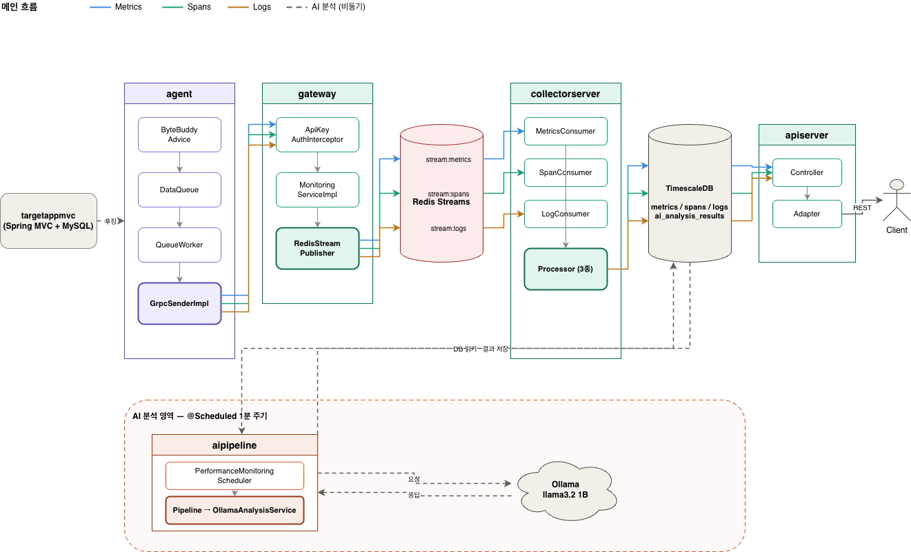

# apm-observatory

Java 애플리케이션의 관측 데이터를 수집하고 조회하는 APM 백엔드를, 상용 도구를 쓰지 않고 직접 만들어본 프로젝트입니다.

## 목차

- [1. 이 프로젝트에 대해](#1-이-프로젝트에-대해)
- [2. 기술 스택](#2-기술-스택)
- [3. 전체 구조 한눈에 보기](#3-전체-구조-한눈에-보기)
- [4. 모듈 구조 요약](#4-모듈-구조-요약)
- [5. 더 자세히 보기](#5-더-자세히-보기)

---

## 1. 이 프로젝트에 대해

Java 애플리케이션에 APM을 연동해 사용하는, 일반적으로 일해 온 방식으로는 그 도구와 그 아래 JVM이 내부에서 어떻게 구성되고 동작하는지를 설명할 수 없다는 걸 알게 됐습니다. 메서드 실행 시간은 어떻게 측정되는지, 한 요청이 여러 시스템을 거치는 경로는 어떻게 추적되는지, 수집한 데이터는 어떤 경로로 화면까지 오는지, APM 도구를 사용하는 것만으로 깊이 이해하기란 어려운 일이었습니다.

이 프로젝트는 그 내부를 직접 만들어보면서 이해하려는 시도입니다. 무엇을 어떻게 수집할지 정하려면 기준이 필요했는데, 관측 데이터의 형식과 수집 방식을 벤더에 종속되지 않게 표준화한 [OpenTelemetry](https://opentelemetry.io/docs/concepts/observability-primer/)가 시스템 관측 신호를 Metrics, Traces, Logs 세 축으로 정리한 것을 기준으로 삼았습니다. APM 제품이 갖춘 방대한 기능을 모두 따라 만들지는 않았고, 각각의 기능을 하나씩 수집부터 조회까지 동작하는 단순한 형태로 구현했습니다.

**구현 범위**

- 바이트코드 조작으로 Metrics / Traces / Logs 수집
- gRPC + Netty 기반 데이터 전송과 인증
- Redis Streams 기반 버퍼링과 재처리
- TimescaleDB 기반 시계열 저장
- 룰 기반 이상 감지와 AI 자연어 분석/권고
- Spring Security + JWT 기반 REST API

[목차로 돌아가기](#목차)

---

## 2. 기술 스택

| 카테고리 | 기술 |
|---|---|
| 언어/런타임 | Java 21 |
| 프레임워크 | Spring Boot 3.5.13 |
| 바이트코드 조작 | Byte Buddy 1.14.10 |
| 통신 | gRPC 1.60.0, Protobuf 3.25.1, Netty (grpc-netty-shaded) |
| 데이터 | TimescaleDB (PostgreSQL 15), Redis 7.2 Streams (Lettuce 6.3.1) |
| 분석 | Apache Commons Math 3.6.1 (선형 회귀), Spring AI 1.0.5 + Ollama (llama3.2 1B 모델) |
| 인증 | Spring Security + JWT |
| 빌드/실행 | Gradle 멀티 모듈, Docker Compose |

구성요소마다 어떤 후보를 놓고 무엇을 기준으로 골랐는지는 위키의 [기술 선택과 그 이유](https://github.com/buss-sooin/apm-observatory/wiki/기술-선택과-그-이유)에 정리했습니다.

[목차로 돌아가기](#목차)

---

## 3. 전체 구조 한눈에 보기



데이터는 타겟 앱에서 시작해서 에이전트, 게이트웨이, Redis, 수집서버를 거쳐 TimescaleDB에 쌓입니다. 이후 API 서버와 AI 파이프라인이 독립적으로 그 데이터를 소비합니다.

수집하는 데이터의 범위는 [OpenTelemetry 공식 문서](https://opentelemetry.io/docs/concepts/observability-primer/)가 정의하는 Observability 세 축인 Metrics, Traces, Logs를 기준으로 삼았습니다. Metrics는 시간에 따른 수치 추세를, Traces는 요청이 시스템을 가로지른 경로를, Logs는 특정 시점의 맥락을 제공합니다. 세 가지가 함께 있을 때 무엇이, 어디서, 왜 문제가 됐는지를 연결해서 볼 수 있습니다. 이 프로젝트는 세 가지 모두를 수집하고 조회할 수 있는 파이프라인을 구현했으며, AI는 그 위에서 이상 징후를 자연어로 설명하고 권고를 생성하는 역할을 합니다.

각 신호가 후킹 지점에서 저장·조회까지 어떤 클래스를 거치는지는 위키의 [데이터 흐름과 코드 경로](https://github.com/buss-sooin/apm-observatory/wiki/데이터-흐름과-코드-경로)에서 따라갈 수 있습니다.

[목차로 돌아가기](#목차)

---

## 4. 모듈 구조 요약

```
apm-observatory/
├── common/           # gRPC Protobuf 정의 공유 모듈
├── agent/            # 바이트코드 조작 기반 데이터 수집
├── gateway/          # gRPC 수신, 인증, Redis Streams 라우팅
├── collectorserver/  # Redis Streams 소비, TimescaleDB 저장
├── aipipeline/       # 룰 기반 이상 감지, AI 분석 및 결과 저장
├── apiserver/        # JWT 인증, REST API 제공
├── targetappmvc/     # 에이전트 후킹 대상 샘플 애플리케이션
├── docker/           # 모듈별 Dockerfile
├── docker-compose.yml
└── README.md
```

| 모듈 | 역할 | 설계 상세 |
|---|---|---|
| agent | 타겟 앱 JVM에 `-javaagent`로 붙어 Metrics / Traces / Logs 수집 후 gRPC 전송 | [모듈 설계 · agent](https://github.com/buss-sooin/apm-observatory/wiki/모듈-설계-agent) |
| gateway | gRPC 수신, API Key 인증, Redis Streams 라우팅 | [모듈 설계 · gateway](https://github.com/buss-sooin/apm-observatory/wiki/모듈-설계-gateway) |
| collectorserver | Redis Streams 소비, 가공 후 TimescaleDB 저장 | [모듈 설계 · collectorserver](https://github.com/buss-sooin/apm-observatory/wiki/모듈-설계-collectorserver) |
| aipipeline | 룰 기반 이상 감지, AI 자연어 분석 및 권고 생성 | [모듈 설계 · aipipeline](https://github.com/buss-sooin/apm-observatory/wiki/모듈-설계-aipipeline) |
| apiserver | JWT 인증, 조회 REST API 제공 | [모듈 설계 · apiserver](https://github.com/buss-sooin/apm-observatory/wiki/모듈-설계-apiserver) |
| targetappmvc | 에이전트 후킹 대상 샘플 애플리케이션. Spring MVC + MySQL로 구성되며 DB 쿼리와 외부 API 호출을 동시에 발생시키는 `/combined` 엔드포인트로 시연합니다 | [`TestController.java`](https://github.com/buss-sooin/apm-observatory/blob/main/targetappmvc/src/main/java/com/apm/observatory/targetappmvc/controller/TestController.java) |
| common | agent와 gateway가 공유해야 하는 계약이라 별도 모듈로 분리한 gRPC Protobuf 정의 | [`monitoring.proto`](https://github.com/buss-sooin/apm-observatory/blob/main/common/src/main/proto/monitoring.proto) |

모듈 전체에 공통으로 적용한 패키지 구조와 경계 설계는 위키의 [공통 설계 결정](https://github.com/buss-sooin/apm-observatory/wiki/공통-설계-결정)에 있습니다.

[목차로 돌아가기](#목차)

---

## 5. 더 자세히 보기

이 README는 프로젝트를 한눈에 파악하는 데 필요한 만큼만 담았습니다. 설계 근거, 구현 세부사항, 실행 절차는 [위키](https://github.com/buss-sooin/apm-observatory/wiki)에 나눠 정리했습니다.

| 위키 페이지 | 내용 |
|---|---|
| [실행 방법](https://github.com/buss-sooin/apm-observatory/wiki/실행-방법) | Docker Compose로 직접 띄워 수집부터 조회까지 확인하는 절차와 시연 시나리오 |
| [기술 선택과 그 이유](https://github.com/buss-sooin/apm-observatory/wiki/기술-선택과-그-이유) | 구성요소별 후보 비교와 선택 기준 |
| [데이터 흐름과 코드 경로](https://github.com/buss-sooin/apm-observatory/wiki/데이터-흐름과-코드-경로) | Metrics / Traces / Logs / AI 분석 네 갈래를 클래스 단위로 추적 |
| [모듈별 설계](https://github.com/buss-sooin/apm-observatory/wiki/모듈-설계-agent) | 모듈마다 무엇을 고민하고 어떻게 구현했는지 |
| [어려웠던 문제와 해결 과정](https://github.com/buss-sooin/apm-observatory/wiki/어려웠던-문제와-해결-과정) | ClassLoader 위임 문제 등 원인 추적과 해결 기록 |
| [테스트 전략](https://github.com/buss-sooin/apm-observatory/wiki/테스트-전략) | 무엇을 어디까지 검증했는지 |

[목차로 돌아가기](#목차)
