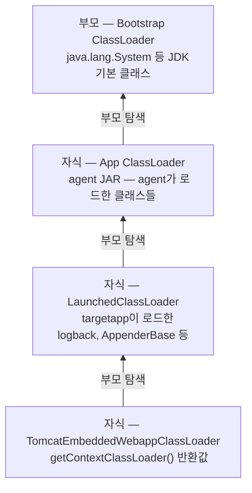
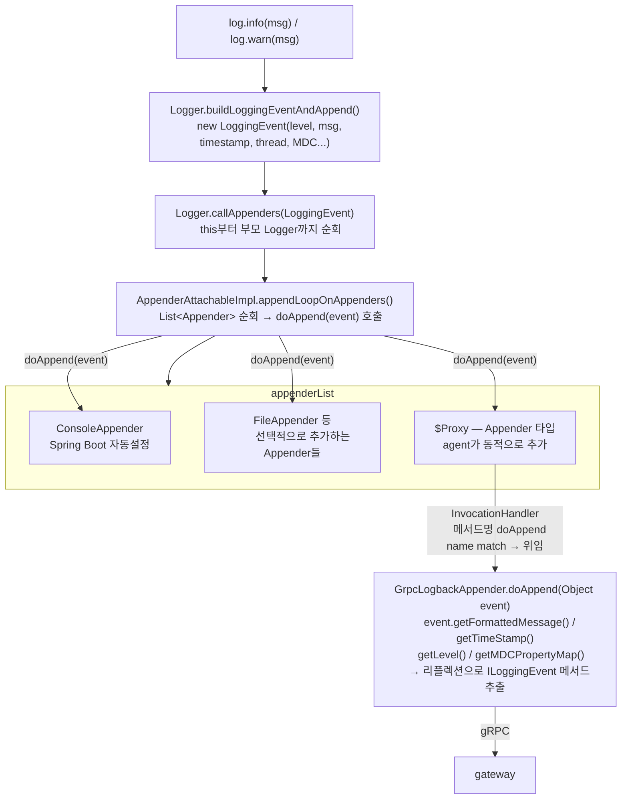

# apm-observatory

APM을 처음 제대로 쓴 건 이전 직장에서였습니다. 명절마다 장애가 반복됐고, 원인은 항상 비슷했습니다. 문제가 있다는 걸 알고 있었지만 근거 없이는 아무것도 바꿀 수 없었습니다. APM이 그 근거를 만들어줬습니다. 쿼리 어디서 경합이 일어나는지, 어느 구간에서 응답이 밀리는지, 데이터로 보여줄 수 있었습니다.

그 경험이 이 프로젝트의 시작입니다. 도구를 사용하는 것과 도구가 어떻게 동작하는지 이해하는 것은 다릅니다. 에이전트가 코드 한 줄 바꾸지 않고 어떻게 메서드 실행 시간을 측정하는지, Trace ID가 어떻게 요청을 가로질러 전파되는지 — 직접 만들어보면서 이해하고 싶었습니다.

관심 있는 섹션부터 읽어도 됩니다. 각 섹션 하단 링크로 언제든 목차로 돌아올 수 있습니다.

---

## 목차

- [1. 이 프로젝트에 대해](#1-이-프로젝트에-대해)
- [2. 기술 선택과 그 이유](#2-기술-선택과-그-이유)
- [3. 전체 구조 한눈에 보기](#3-전체-구조-한눈에-보기)
- [4. 핵심 설계 결정들](#4-핵심-설계-결정들)
- [5. 모듈 구조](#5-모듈-구조)
- [6. 데이터 흐름과 코드 경로](#6-데이터-흐름과-코드-경로)
- [7. 직접 부딪힌 문제들](#7-직접-부딪힌-문제들)
- [8. 테스트 전략](#8-테스트-전략)
- [9. 현실 조건에서의 타협](#9-현실-조건에서의-타협)
- [10. AI와 함께 개발한 방식](#10-ai와-함께-개발한-방식)
- [11. 실행 방법](#11-실행-방법)
- [12. 앞으로 개선하고 싶은 것](#12-앞으로-개선하고-싶은-것)

---

## 1. 이 프로젝트에 대해

APM 도구를 8년간 사용하면서도 그 내부가 어떻게 동작하는지는 알지 못했습니다. 코드 한 줄 바꾸지 않았는데 에이전트가 어떻게 메서드 실행 시간을 측정하는지, Trace ID가 어떻게 요청을 가로질러 전파되는지, 수집된 데이터가 어떤 경로를 거쳐 화면에 나타나는지.

이 프로젝트는 그 내부를 직접 만들어보면서 이해하려는 시도입니다.

**구현 범위**

- 바이트코드 조작으로 타겟 애플리케이션 코드 변경 없이 Metrics / Traces / Logs 수집
- gRPC + Netty 게이트웨이를 통한 데이터 전송 및 인증
- Redis Streams 기반 버퍼링과 장애 복구
- TimescaleDB 시계열 저장
- 룰 기반 이상 감지 + AI를 통한 자연어 분석 및 권고
- Spring Security + JWT 기반 REST API

**구현하지 않은 것과 이유**

실제 APM이라면 당연히 있어야 할 것들이지만 포트폴리오 범위에서 제외한 항목들은 [9. 현실 조건에서의 타협](#9-현실-조건에서의-타협)에 정리했습니다.

[▲ 목차로](#목차)

---

## 2. 기술 선택과 그 이유

APM 백엔드를 설계하는 시점에서 각 구성요소마다 여러 후보를 놓고 골랐습니다. 선택의 기준은 이 프로젝트의 구조적 요구사항에서 얻는 이점이 잃는 것보다 큰가였습니다.

---

**바이트코드 조작**
- ASM
- Javassist
- Spring AOP
- **Byte Buddy** ✓

Spring AOP는 Spring 컨텍스트 안에서만 동작해서 에이전트 용도로는 처음부터 맞지 않았습니다. ASM과 Javassist도 검토했지만 바이트코드를 직접 다루는 저수준 API를 처음부터 익혀서 구현하기에는 레퍼런스를 찾고 이해하는 데 드는 비용이 컸습니다. Byte Buddy는 ASM을 기반으로 만들어진 라이브러리로, 메서드 인터셉터를 체이닝 방식으로 선언하는 추상화된 API가 구조적으로 파악하기 수월했습니다.

---

**에이전트 언어 및 전송**
- Golang + gRPC
- **Java + gRPC + Protobuf** ✓

Golang은 언어 설계 자체가 경량 고루틴과 채널 기반 동시성을 내장하고 있어 네트워크 전송에 최적화되어 있고, gRPC 전송도 가능할 것으로 예상했습니다. 그러나 JVM 내부에서 클래스 로딩 시점에 개입해 바이트코드를 조작하려면 Java 에이전트여야 한다는 구조적 제약이 있었고, 새 언어 학습 부담과 Java 단에서 처리를 통일한다는 관점에서 Java를 선택했습니다. 전송은 에이전트가 타겟 앱과 같은 JVM에서 돌아가기 때문에 오버헤드가 낮은 Protobuf 바이너리 직렬화와 OpenTelemetry의 표준 전송 프로토콜인 [OTLP](https://opentelemetry.io/docs/specs/otlp/)가 지원하는 gRPC를 선택했습니다.

---

**게이트웨이**
- Spring MVC
- Spring WebFlux
- **Netty** ✓

Spring MVC는 커넥션마다 스레드를 하나씩 점유하는 구조라 에이전트 수가 늘어날수록 스레드를 그만큼 소비한다는 구조적 문제가 있습니다. 개인 프로젝트 규모에서 실제로 스레드 고갈이 나는 상황을 재현하기는 어렵지만 구조적으로 맞지 않다고 판단했습니다. WebFlux도 같은 구조적 문제를 해결하는 방향으로 고려했지만, 에이전트가 100ms 배치로 묶어서 전송하고 Redis Streams가 버퍼를 담당하는 구조에서 WebFlux가 진짜 필요한 규모의 요구사항이 없었습니다. 개인 프로젝트 수준에서 Mono/Flux 기반으로 전환하는 복잡도를 감수할 이유가 없었고, gRPC 서버 자체가 Netty 위에서 동작하는 만큼 필요한 만큼만 직접 구현할 수 있는 Netty를 선택했습니다.

---

**버퍼**
- Kafka
- RabbitMQ
- **Redis Streams + AOF** ✓

Kafka는 파티셔닝 기반 수평 확장, 컨슈머 그룹별 독립 오프셋, 대용량 스트림 처리까지 지원하는 강력한 도구지만 브로커 클러스터 구성과 운영 복잡도가 개인 프로젝트 수준에서는 과했습니다. 실제 프로덕션 규모라면 Kafka가 맞는 선택일 것으로 봅니다. RabbitMQ는 개인 프로젝트 규모에서는 충분한 선택지였지만, [persistent 메시지를 큐에 도달하는 즉시 디스크에 기록하는 구조](https://www.rabbitmq.com/docs/persistence-conf)라 APM 에이전트가 보내는 짧고 빈번한 메시지 특성상 디스크 I/O가 병목이 될 것으로 예상했습니다. Redis는 [인메모리 기반으로 매우 빠른 읽기/쓰기 속도를 제공하는 구조](https://redis.io/docs/latest/develop/get-started/faq/)라 짧은 데이터를 빠르게 처리하는 데 유리할 것으로 봤고, AOF로 영속성도 확보할 수 있었습니다.

---

**시계열 저장**
- 일반 PostgreSQL
- InfluxDB
- **PostgreSQL + TimescaleDB** ✓

Metrics 데이터는 특정 시간 범위의 평균, 최대값, 추세를 묻는 쿼리가 대부분입니다. 시간을 기준으로 데이터를 파티셔닝하고 집계하는 게 핵심인데, 일반 RDB는 이런 시계열 특성에 최적화되어 있지 않아 데이터가 쌓일수록 쿼리 성능이 떨어질 수 있습니다. InfluxDB는 시계열 전용 DB로 이 문제를 잘 해결하지만 Spans, Logs, AI 분석 결과까지 함께 저장해야 하는 상황에서 DB를 여러 개 띄우면 시연이 복잡해져 선택하지 않았습니다. TimescaleDB는 PostgreSQL의 하이퍼테이블 파티셔닝으로 시계열 쿼리 성능을 확보하면서 하나의 DB로 단순화할 수 있어 선택했습니다.

---

**수집서버 처리 모델**
- 전통적 스레드풀
- Spring WebFlux
- **Virtual Thread** ✓

전통적 스레드풀은 I/O 대기 중 스레드를 점유한 채로 기다립니다. WebFlux는 써본 경험이 있지만 Mono/Flux 기반으로 모듈 전체를 통일해야 하고, 개인 프로젝트 수준에서 그 복잡도를 감수할 만한 요구사항이 없었습니다. Virtual Thread는 I/O 대기 중 OS 스레드를 반납하기 때문에 기존 명령형 코드 스타일을 그대로 유지하면서 같은 효과를 얻을 수 있었습니다.

---

**AI 분석**
- OpenAI API / Anthropic API
- LangChain4j
- **Spring AI + Ollama** ✓

처음에는 외부 API를 쓰는 방향도 봤는데, 호출마다 비용이 나가고 네트워크 연결이 없으면 시연도 안 되는 게 부담이었습니다. Ollama로 로컬에서 모델을 직접 돌리면 그 문제가 없었고, Spring AI가 모델 교체를 추상화해줘서 나중에 외부 API로 전환해도 코드 변경이 최소화될 것으로 봤습니다. 엔터프라이즈급 AI 파이프라인이 실제로 어떻게 구성되는지는 알지 못하기 때문에 개인 수준에서 무료로 접목할 수 있는 방식으로 구현했고, 그 접목 방식을 직접 설계하고 구현해본 것에 의미를 뒀습니다.

[▲ 목차로](#목차)

---

## 3. 전체 구조 한눈에 보기


데이터는 타겟 앱에서 시작해서 에이전트, 게이트웨이, Redis, 수집서버를 거쳐 TimescaleDB에 쌓입니다. 이후 API 서버와 AI 파이프라인이 독립적으로 그 데이터를 소비합니다.

수집하는 데이터의 범위는 [OpenTelemetry 공식 문서](https://opentelemetry.io/docs/concepts/observability-primer/)가 정의하는 Observability 세 축인 Metrics, Traces, Logs를 기준으로 삼았습니다. 시스템에서 무슨 일이 일어났는지 파악하기 위한 세 가지 신호로, Metrics는 시간에 따른 수치 추세를, Traces는 요청이 시스템을 가로지른 경로를, Logs는 특정 시점의 맥락을 제공합니다. 세 가지가 함께 있을 때 무엇이, 어디서, 왜 문제가 됐는지를 연결해서 볼 수 있습니다. 이 프로젝트는 세 가지 모두를 수집하고 조회할 수 있는 파이프라인을 구현했으며, AI는 그 위에서 이상 징후를 자연어로 설명하고 권고를 생성하는 역할을 합니다.

**모듈별 역할 요약**

| 모듈 | 역할 |
|---|---|
| agent | 바이트코드 조작으로 Metrics / Traces / Logs 수집 |
| gateway | gRPC 수신, API Key 인증, Redis Streams 라우팅 |
| collectorserver | Redis Streams 소비, TimescaleDB 저장 |
| aipipeline | 룰 기반 이상 감지, AI 자연어 분석 및 권고 |
| apiserver | JWT 인증, REST API 제공 |
| targetappmvc | 에이전트 후킹 대상 샘플 애플리케이션 |
| common | gRPC Protobuf 정의 공유 모듈 |

[▲ 목차로](#목차)

---

## 4. 핵심 설계 결정들

코드를 어떻게 작성했는가보다 왜 이 구조로 설계했는가에 대한 기록입니다.

---

**패키지 구조 — Package by Feature**

패키지를 레이어(controller, service, repository)로 나누는 방식이 익숙하지만 이 프로젝트에서는 기능(auth, metrics, span, log, config, ai) 단위로 나눴습니다. 레이어 기준으로 나누면 하나의 기능을 수정할 때 여러 패키지를 가로질러야 합니다. 기능 단위로 나누면 관련 코드가 한 곳에 모여 있어서 변경 범위를 파악하기 쉽습니다. 각 기능 안에서 필요한 레이어(controller, adapter, entity, repository, model)를 두는 방식으로 구성했습니다.

📎 [`apiserver/src/main/java/com/apm/observatory/apiserver/`](https://github.com/buss-sooin/apm-observatory/blob/main/apiserver/src/main/java/com/apm/observatory/apiserver/)
📎 [`aipipeline/src/main/java/com/apm/observatory/aipipeline/`](https://github.com/buss-sooin/apm-observatory/blob/main/aipipeline/src/main/java/com/apm/observatory/aipipeline/)

---

**외부 경계 설계 — Port & Adapter**

DB, Redis, 외부 API 같은 인프라와 도메인 로직 사이에 Port(인터페이스)와 Adapter(구현체)를 두었습니다. 도메인 로직이 JPA나 Redis 같은 기술 세부사항을 직접 알지 못하게 하기 위해서입니다. 단 모든 곳에 Port를 두지는 않았습니다. Entity에서 도메인 객체로 변환이 있거나 기술 교체 가능성이 있는 경우에만 Port + Adapter를 적용하고, 단순 조회/저장만 있는 경우는 Adapter만 두었습니다. 기준 없이 모든 곳에 인터페이스를 만드는 건 오히려 코드를 복잡하게 만든다고 판단했습니다.

📎 [`apiserver/src/main/java/com/apm/observatory/apiserver/metrics/port/MetricsPort.java`](https://github.com/buss-sooin/apm-observatory/blob/main/apiserver/src/main/java/com/apm/observatory/apiserver/metrics/port/MetricsPort.java)
📎 [`apiserver/src/main/java/com/apm/observatory/apiserver/metrics/adapter/MetricsAdapter.java`](https://github.com/buss-sooin/apm-observatory/blob/main/apiserver/src/main/java/com/apm/observatory/apiserver/metrics/adapter/MetricsAdapter.java)

---

**TDD 적용 범위 결정**

모든 코드에 테스트를 작성하지 않았습니다. TDD를 적용할 대상을 세 가지 기준으로 판단했습니다. 틀릴 가능성이 있는가, 그 틀림이 비즈니스에 영향을 주는가, 외부 시스템 없이 독립적으로 검증 가능한가. 세 가지 모두 해당할 때만 TDD 대상으로 봤습니다.

aipipeline의 이상 감지 평가 로직(PerformanceCollapseEvaluator, PerformanceErosionEvaluator, ExternalImpactEvaluator)은 계산식이 있고 그 결과가 AI 파이프라인 전체 흐름을 결정하기 때문에 TDD를 적용했습니다. 반면 agent, gateway는 바이트코드 조작이나 네트워크 전송이 핵심이라 외부 환경 없이는 의미 있는 검증이 불가능해서 제외했습니다. JPA Repository나 Redis 연동처럼 외부 시스템에 직접 의존하는 코드도 테스트 비용 대비 효과가 낮아서 빌드와 실제 구동으로 검증하는 방식을 택했습니다.

📎 [`aipipeline/src/test/java/com/apm/observatory/aipipeline/evaluator/`](https://github.com/buss-sooin/apm-observatory/blob/main/aipipeline/src/test/java/com/apm/observatory/aipipeline/evaluator/)

---

**게이트웨이 레이어가 존재하는 이유**

에이전트가 수집서버에 직접 연결하는 구조도 가능합니다. 그러나 그렇게 하면 수집서버가 인증, 유효성 검증, 커넥션 관리, 데이터 저장을 모두 담당해야 합니다. 에이전트 수가 늘어날수록 수집서버가 직접 모든 커넥션 부하를 받고, 잘못된 데이터가 들어오면 DB 저장 직전까지 전파됩니다.

게이트웨이를 중간에 두면 역할이 분리됩니다. 인증과 유효성 검증은 입구에서 끝내고, 수집서버는 Redis에서 신뢰할 수 있는 데이터를 꺼내 저장하는 역할에만 집중합니다. Netty 기반 게이트웨이가 다수의 에이전트 커넥션을 받아내고 Redis로 넘기는 구조에서 수집서버는 커넥션 부하로부터 격리됩니다.

📎 [`gateway/src/main/java/com/apm/observatory/gateway/interceptor/ApiKeyAuthInterceptor.java`](https://github.com/buss-sooin/apm-observatory/blob/main/gateway/src/main/java/com/apm/observatory/gateway/interceptor/ApiKeyAuthInterceptor.java)
📎 [`gateway/src/main/java/com/apm/observatory/gateway/service/MonitoringServiceImpl.java`](https://github.com/buss-sooin/apm-observatory/blob/main/gateway/src/main/java/com/apm/observatory/gateway/service/MonitoringServiceImpl.java)

---

**수집서버와 API 서버 분리**

데이터를 수집하고 저장하는 역할과 저장된 데이터를 외부에 제공하는 역할을 별도 모듈로 분리했습니다. 하나로 합쳐도 동작하지만 수집서버는 Redis Streams를 소비하는 I/O 중심 작업이고 API 서버는 HTTP 요청을 처리하는 작업이라 부하 특성이 다릅니다. 실제 프로덕션이라면 각각 독립적으로 스케일링할 수 있어야 하고, 수집서버 장애가 API 서버에 전파되지 않아야 합니다.

---

**AI 판단 근거 저장 — evidence 테이블과 ai_raw_responses**

AI 분석 결과만 저장하면 "왜 이 결론이 나왔는가"를 나중에 추적할 수 없습니다. 두 가지를 추가로 설계했습니다.

`ai_raw_responses`는 Ollama가 실제로 응답한 날것의 텍스트를 항상 저장합니다. 파싱 성공 여부와 무관하게 저장하기 때문에 AI가 어떤 응답을 했는지, 파싱이 왜 실패했는지 추적할 수 있습니다.

`evidence` 테이블은 AI가 어떤 데이터를 보고 이 결론을 냈는지 기록합니다. 현재는 저장만 하고 API 응답에는 포함하지 않았습니다. 계산 재현에 필요한 도메인 로직이 여러 모듈에 걸쳐 있어서 API로 노출하려면 공통 모듈 분리가 선행되어야 한다고 판단했습니다.

📎 [`aipipeline/src/main/java/com/apm/observatory/aipipeline/ai/entity/AiRawResponseEntity.java`](https://github.com/buss-sooin/apm-observatory/blob/main/aipipeline/src/main/java/com/apm/observatory/aipipeline/ai/entity/AiRawResponseEntity.java)
📎 [`aipipeline/src/main/java/com/apm/observatory/aipipeline/ai/entity/AiAnalysisMetricsEvidenceEntity.java`](https://github.com/buss-sooin/apm-observatory/blob/main/aipipeline/src/main/java/com/apm/observatory/aipipeline/ai/entity/AiAnalysisMetricsEvidenceEntity.java)

---

**AI 파이프라인 설계 — 룰 기반 감지 + AI 설명 구조**

AI 모델을 직접 학습시키거나 구축하는 건 제 영역 밖이었습니다. 대신 AI가 잘할 수 있는 것과 코드가 더 잘할 수 있는 것을 분리했습니다.

이상 징후를 감지하는 건 코드가 합니다. Metrics와 Span 데이터를 주기적으로 읽어서 세 가지 패턴(자원과 응답시간 급등 동시 발생, 자원과 응답시간 완만한 동반 상승, 자원 정상인데 외부 API 응답 급등)을 룰 기반으로 판단합니다. 이동 평균으로 노이즈를 제거하고 선형 회귀로 기울기를 계산하는 방식입니다. 상세 알고리즘은 [7. 직접 부딪힌 문제들](#7-직접-부딪힌-문제들)에 정리했습니다.

AI는 이 감지 결과를 받아서 자연어로 원인을 설명하고 권고를 생성합니다. 실제 APM 제품이 AI를 어떻게 활용하는지는 알지 못합니다. 다만 이 구조를 선택한 이유는 명확합니다. 정량적 판단을 AI에게 맡기면 모델 품질에 따라 감지 정확도가 흔들리지만, 룰이 판단하고 AI가 설명하는 구조에서는 감지 결과의 신뢰성은 룰이 보장하고 AI는 설명의 품질만 책임집니다.

📎 [`aipipeline/src/main/java/com/apm/observatory/aipipeline/analysis/evaluator/PerformanceCollapseEvaluator.java`](https://github.com/buss-sooin/apm-observatory/blob/main/aipipeline/src/main/java/com/apm/observatory/aipipeline/analysis/evaluator/PerformanceCollapseEvaluator.java)
📎 [`aipipeline/src/main/java/com/apm/observatory/aipipeline/ai/service/OllamaAnalysisService.java`](https://github.com/buss-sooin/apm-observatory/blob/main/aipipeline/src/main/java/com/apm/observatory/aipipeline/ai/service/OllamaAnalysisService.java)

[▲ 목차로](#목차)

---

## 5. 모듈 구조

```
apm-observatory/
├── common/           # gRPC Protobuf 정의 공유 모듈
├── agent/            # 바이트코드 조작 기반 데이터 수집
├── gateway/          # gRPC 수신, 인증, Redis Streams 라우팅
├── collectorserver/  # Redis Streams 소비, TimescaleDB 저장
├── aipipeline/       # 룰 기반 이상 감지, AI 분석 및 결과 저장
├── apiserver/        # JWT 인증, REST API 제공
├── targetappmvc/     # 에이전트 후킹 대상 샘플 애플리케이션
├── docker/           # 모듈별 Dockerfile
├── docker-compose.yml
└── README.md
```

**common**

agent와 gateway가 gRPC로 통신할 때 쓰는 Protobuf 메시지 타입을 정의합니다. 두 모듈이 공유해야 하는 계약이라 별도 모듈로 분리했습니다.

**agent**

타겟 앱 JVM에 `-javaagent`로 붙어서 동작합니다. Byte Buddy로 DispatcherServlet, PreparedStatement, RestClient를 후킹해서 Metrics, Spans, Logs를 수집하고 gRPC로 게이트웨이에 전송합니다. 타겟 앱 코드를 한 줄도 바꾸지 않습니다.

📎 [`agent/src/main/java/com/apm/observatory/agent/AgentMain.java`](https://github.com/buss-sooin/apm-observatory/blob/main/agent/src/main/java/com/apm/observatory/agent/AgentMain.java)
📎 [`agent/src/main/java/com/apm/observatory/agent/advice/mvc/`](https://github.com/buss-sooin/apm-observatory/blob/main/agent/src/main/java/com/apm/observatory/agent/advice/mvc/)

**gateway**

에이전트로부터 gRPC 요청을 받아 API Key 인증과 유효성 검증을 처리합니다. 통과한 데이터를 Metrics, Spans, Logs 각각의 Redis Stream으로 라우팅합니다. Netty 기반으로 동작합니다.

📎 [`gateway/src/main/java/com/apm/observatory/gateway/server/GatewayServer.java`](https://github.com/buss-sooin/apm-observatory/blob/main/gateway/src/main/java/com/apm/observatory/gateway/server/GatewayServer.java)
📎 [`gateway/src/main/java/com/apm/observatory/gateway/redis/RedisStreamPublisher.java`](https://github.com/buss-sooin/apm-observatory/blob/main/gateway/src/main/java/com/apm/observatory/gateway/redis/RedisStreamPublisher.java)

**collectorserver**

Redis Streams를 Consumer Group으로 소비해서 TimescaleDB에 저장합니다. Metrics는 Disk IO 누적값 계산, Spans는 INTERNAL Span 파생 계산, Logs는 가공 없이 저장합니다. Virtual Thread 기반으로 동작합니다.

📎 [`collectorserver/src/main/java/com/apm/observatory/collectorserver/consumer/AbstractStreamConsumer.java`](https://github.com/buss-sooin/apm-observatory/blob/main/collectorserver/src/main/java/com/apm/observatory/collectorserver/consumer/AbstractStreamConsumer.java)
📎 [`collectorserver/src/main/java/com/apm/observatory/collectorserver/processor/`](https://github.com/buss-sooin/apm-observatory/blob/main/collectorserver/src/main/java/com/apm/observatory/collectorserver/processor/)

**aipipeline**

스케줄러가 주기적으로 TimescaleDB에서 데이터를 읽어 세 가지 룰 기반 이상 감지를 수행합니다. 감지된 결과를 Ollama에 전달해 자연어 분석 결과와 권고를 받아 저장합니다.

📎 [`aipipeline/src/main/java/com/apm/observatory/aipipeline/scheduler/PerformanceMonitoringScheduler.java`](https://github.com/buss-sooin/apm-observatory/blob/main/aipipeline/src/main/java/com/apm/observatory/aipipeline/scheduler/PerformanceMonitoringScheduler.java)
📎 [`aipipeline/src/main/java/com/apm/observatory/aipipeline/context/pipeline/PerformanceAnalysisPipelineContext.java`](https://github.com/buss-sooin/apm-observatory/blob/main/aipipeline/src/main/java/com/apm/observatory/aipipeline/context/pipeline/PerformanceAnalysisPipelineContext.java)

**apiserver**

JWT + Spring Security 기반 인증으로 REST API를 제공합니다. Metrics 추세, Span 폭포수 차트, 로그 스트림, AI 분석 결과 조회, 임계값 설정 API를 포함합니다.

📎 [`apiserver/src/main/java/com/apm/observatory/apiserver/auth/security/SecurityConfig.java`](https://github.com/buss-sooin/apm-observatory/blob/main/apiserver/src/main/java/com/apm/observatory/apiserver/auth/security/SecurityConfig.java)
📎 [`apiserver/src/main/java/com/apm/observatory/apiserver/metrics/controller/MetricsController.java`](https://github.com/buss-sooin/apm-observatory/blob/main/apiserver/src/main/java/com/apm/observatory/apiserver/metrics/controller/MetricsController.java)

**targetappmvc**

에이전트 후킹 대상 샘플 애플리케이션입니다. Spring MVC + MySQL로 구성되며 DB 쿼리와 외부 API 호출을 동시에 발생시키는 `/combined` 엔드포인트로 시연에 활용합니다.

📎 [`targetappmvc/src/main/java/com/apm/observatory/targetappmvc/controller/TestController.java`](https://github.com/buss-sooin/apm-observatory/blob/main/targetappmvc/src/main/java/com/apm/observatory/targetappmvc/controller/TestController.java)

[▲ 목차로](#목차)

---

## 6. 데이터 흐름과 코드 경로

Metrics, Traces, Logs가 각각 어느 클래스를 거쳐 저장되고 조회되는지, AI 분석이 어떤 흐름으로 실행되는지를 코드 레벨로 정리했습니다. fork 후 IDE에서 아래 경로를 따라가면 전체 파이프라인을 탐색할 수 있습니다.

---

### Metrics 흐름

**수집 → 전송**

`MetricsCollector`가 5초 주기로 JVM MXBean에서 CPU, 메모리, Disk IO를 수집합니다. 수집된 값은 `DataQueue`에 적재되고 `QueueWorker`가 100ms 배치로 묶어 `GrpcSenderImpl`을 통해 게이트웨이로 전송합니다.

```
MetricsCollector → DataQueue → QueueWorker → GrpcSenderImpl → (gRPC) → gateway
```

📎 [`agent/src/main/java/com/apm/observatory/agent/collector/MetricsCollector.java`](https://github.com/buss-sooin/apm-observatory/blob/main/agent/src/main/java/com/apm/observatory/agent/collector/MetricsCollector.java)
📎 [`agent/src/main/java/com/apm/observatory/agent/worker/QueueWorker.java`](https://github.com/buss-sooin/apm-observatory/blob/main/agent/src/main/java/com/apm/observatory/agent/worker/QueueWorker.java)
📎 [`agent/src/main/java/com/apm/observatory/agent/sender/GrpcSenderImpl.java`](https://github.com/buss-sooin/apm-observatory/blob/main/agent/src/main/java/com/apm/observatory/agent/sender/GrpcSenderImpl.java)

**수신 → 저장**

게이트웨이의 `MonitoringServiceImpl`이 gRPC 요청을 수신하고 `ApiKeyAuthInterceptor`로 인증을 처리합니다. 통과한 데이터는 `RedisStreamPublisher`가 `stream:metrics`에 발행합니다. `MetricsConsumer`가 Consumer Group으로 소비하고 `MetricsProcessor`가 Disk IO 누적값을 계산해 TimescaleDB에 저장합니다.

```
MonitoringServiceImpl → RedisStreamPublisher → stream:metrics → MetricsConsumer → MetricsProcessor → DB
```

📎 [`gateway/src/main/java/com/apm/observatory/gateway/service/MonitoringServiceImpl.java`](https://github.com/buss-sooin/apm-observatory/blob/main/gateway/src/main/java/com/apm/observatory/gateway/service/MonitoringServiceImpl.java)
📎 [`gateway/src/main/java/com/apm/observatory/gateway/redis/RedisStreamPublisher.java`](https://github.com/buss-sooin/apm-observatory/blob/main/gateway/src/main/java/com/apm/observatory/gateway/redis/RedisStreamPublisher.java)
📎 [`collectorserver/src/main/java/com/apm/observatory/collectorserver/consumer/MetricsConsumer.java`](https://github.com/buss-sooin/apm-observatory/blob/main/collectorserver/src/main/java/com/apm/observatory/collectorserver/consumer/MetricsConsumer.java)
📎 [`collectorserver/src/main/java/com/apm/observatory/collectorserver/processor/MetricsProcessor.java`](https://github.com/buss-sooin/apm-observatory/blob/main/collectorserver/src/main/java/com/apm/observatory/collectorserver/processor/MetricsProcessor.java)

**조회**

```
GET /metrics/trend    → MetricsController → MetricsPort → MetricsAdapter → DB
GET /metrics/summary  → MetricsController → MetricsPort → MetricsAdapter → DB
```

📎 [`apiserver/src/main/java/com/apm/observatory/apiserver/metrics/controller/MetricsController.java`](https://github.com/buss-sooin/apm-observatory/blob/main/apiserver/src/main/java/com/apm/observatory/apiserver/metrics/controller/MetricsController.java)
📎 [`apiserver/src/main/java/com/apm/observatory/apiserver/metrics/adapter/MetricsAdapter.java`](https://github.com/buss-sooin/apm-observatory/blob/main/apiserver/src/main/java/com/apm/observatory/apiserver/metrics/adapter/MetricsAdapter.java)

---

### Traces 흐름

**수집 → 전송**

HTTP 요청이 들어오면 `ServletAdvice`가 `DispatcherServlet.doDispatch()`를 후킹해 TraceID, SpanID를 생성하고 MDC에 전파합니다. DB 쿼리는 `PreparedStatementAdvice`가, 외부 API 호출은 `RestClientRequestAdvice`가 각각 후킹해 자식 Span을 생성합니다. 세 Advice 모두 `DataQueue`를 통해 게이트웨이로 전송됩니다.

```
ServletAdvice (INTERNAL)          ──┐
PreparedStatementAdvice (DB)      ──┤→ DataQueue → QueueWorker → GrpcSenderImpl → gateway
RestClientRequestAdvice (EXTERNAL)──┘
```

📎 [`agent/src/main/java/com/apm/observatory/agent/advice/mvc/ServletAdvice.java`](https://github.com/buss-sooin/apm-observatory/blob/main/agent/src/main/java/com/apm/observatory/agent/advice/mvc/ServletAdvice.java)
📎 [`agent/src/main/java/com/apm/observatory/agent/advice/mvc/PreparedStatementAdvice.java`](https://github.com/buss-sooin/apm-observatory/blob/main/agent/src/main/java/com/apm/observatory/agent/advice/mvc/PreparedStatementAdvice.java)
📎 [`agent/src/main/java/com/apm/observatory/agent/advice/mvc/RestClientRequestAdvice.java`](https://github.com/buss-sooin/apm-observatory/blob/main/agent/src/main/java/com/apm/observatory/agent/advice/mvc/RestClientRequestAdvice.java)

**수신 → 저장**

게이트웨이에서 `stream:spans`로 발행된 데이터를 `SpanConsumer`가 소비합니다. `SpanProcessor`가 DB/EXTERNAL Span의 부모-자식 관계를 정리하고 INTERNAL Span을 파생 계산해 저장합니다.

```
stream:spans → SpanConsumer → SpanProcessor → DB
```

📎 [`collectorserver/src/main/java/com/apm/observatory/collectorserver/consumer/SpanConsumer.java`](https://github.com/buss-sooin/apm-observatory/blob/main/collectorserver/src/main/java/com/apm/observatory/collectorserver/consumer/SpanConsumer.java)
📎 [`collectorserver/src/main/java/com/apm/observatory/collectorserver/processor/SpanProcessor.java`](https://github.com/buss-sooin/apm-observatory/blob/main/collectorserver/src/main/java/com/apm/observatory/collectorserver/processor/SpanProcessor.java)

**조회**

`SpanAdapter`가 trace_id로 전체 Span을 조회하고, DFS 재귀 순회로 INTERNAL → DB/EXTERNAL 트리를 조립해 폭포수 차트 형태로 반환합니다.

```
GET /spans/waterfall?trace_id= → SpanController → SpanPort → SpanAdapter → DB
```

📎 [`apiserver/src/main/java/com/apm/observatory/apiserver/span/controller/SpanController.java`](https://github.com/buss-sooin/apm-observatory/blob/main/apiserver/src/main/java/com/apm/observatory/apiserver/span/controller/SpanController.java)
📎 [`apiserver/src/main/java/com/apm/observatory/apiserver/span/adapter/SpanAdapter.java`](https://github.com/buss-sooin/apm-observatory/blob/main/apiserver/src/main/java/com/apm/observatory/apiserver/span/adapter/SpanAdapter.java)

---

### Logs 흐름

**수집 → 전송**

`AppenderRegistrationAdvice`가 `FrameworkServlet.initServletBean()`을 후킹해 Spring MVC 초기화 완료 시점에 `GrpcLogbackAppender`를 logback ROOT Logger에 등록합니다. 이후 애플리케이션에서 발생하는 모든 로그가 `GrpcLogbackAppender`를 통해 게이트웨이로 전송됩니다.

```
GrpcLogbackAppender (ROOT Logger 등록) → DataQueue → QueueWorker → GrpcSenderImpl → gateway
```

📎 [`agent/src/main/java/com/apm/observatory/agent/advice/mvc/AppenderRegistrationAdvice.java`](https://github.com/buss-sooin/apm-observatory/blob/main/agent/src/main/java/com/apm/observatory/agent/advice/mvc/AppenderRegistrationAdvice.java)
📎 [`agent/src/main/java/com/apm/observatory/agent/appender/GrpcLogbackAppender.java`](https://github.com/buss-sooin/apm-observatory/blob/main/agent/src/main/java/com/apm/observatory/agent/appender/GrpcLogbackAppender.java)

**수신 → 저장**

```
stream:logs → LogConsumer → LogProcessor → DB
```

📎 [`collectorserver/src/main/java/com/apm/observatory/collectorserver/consumer/LogConsumer.java`](https://github.com/buss-sooin/apm-observatory/blob/main/collectorserver/src/main/java/com/apm/observatory/collectorserver/consumer/LogConsumer.java)
📎 [`collectorserver/src/main/java/com/apm/observatory/collectorserver/processor/LogProcessor.java`](https://github.com/buss-sooin/apm-observatory/blob/main/collectorserver/src/main/java/com/apm/observatory/collectorserver/processor/LogProcessor.java)

**조회**

```
GET /logs/stream?app_name=&start_time=&end_time=&level= → LogController → LogAdapter → DB
```

📎 [`apiserver/src/main/java/com/apm/observatory/apiserver/log/controller/LogController.java`](https://github.com/buss-sooin/apm-observatory/blob/main/apiserver/src/main/java/com/apm/observatory/apiserver/log/controller/LogController.java)
📎 [`apiserver/src/main/java/com/apm/observatory/apiserver/log/adapter/LogAdapter.java`](https://github.com/buss-sooin/apm-observatory/blob/main/apiserver/src/main/java/com/apm/observatory/apiserver/log/adapter/LogAdapter.java)

---

### AI 분석 흐름

`PerformanceMonitoringScheduler`가 1분 주기로 `PerformanceAnalysisPipelineContext`를 실행합니다. 파이프라인은 다음 순서로 진행됩니다.

```
PerformanceMonitoringScheduler
  → PerformanceAnalysisPipelineContext
      .startWith()        // 앱 목록 로드
      .configure()        // 임계값 설정 로드 (ThresholdConfigAdapter)
      .loadBaseline()     // 직전 30분 기준값 로드 (PerformanceDataAdapter)
      .loadSnapshot()     // 최근 1분 스냅샷 로드
      .analyzeAnomalies() // 룰 기반 이상 감지 (CollapseDetectionStrategy 등 3종)
      .transferToTrend()  // 감지 결과 → PerformanceTrend 누적
  → OllamaAnalysisService      // 감지된 패턴 → Ollama 자연어 분석 요청
  → AiAnalysisResultAdapter    // 분석 결과 + evidence 저장
```

📎 [`aipipeline/src/main/java/com/apm/observatory/aipipeline/scheduler/PerformanceMonitoringScheduler.java`](https://github.com/buss-sooin/apm-observatory/blob/main/aipipeline/src/main/java/com/apm/observatory/aipipeline/scheduler/PerformanceMonitoringScheduler.java)
📎 [`aipipeline/src/main/java/com/apm/observatory/aipipeline/context/pipeline/PerformanceAnalysisPipelineContext.java`](https://github.com/buss-sooin/apm-observatory/blob/main/aipipeline/src/main/java/com/apm/observatory/aipipeline/context/pipeline/PerformanceAnalysisPipelineContext.java)
📎 [`aipipeline/src/main/java/com/apm/observatory/aipipeline/context/strategy/CollapseDetectionStrategy.java`](https://github.com/buss-sooin/apm-observatory/blob/main/aipipeline/src/main/java/com/apm/observatory/aipipeline/context/strategy/CollapseDetectionStrategy.java)
📎 [`aipipeline/src/main/java/com/apm/observatory/aipipeline/ai/service/OllamaAnalysisService.java`](https://github.com/buss-sooin/apm-observatory/blob/main/aipipeline/src/main/java/com/apm/observatory/aipipeline/ai/service/OllamaAnalysisService.java)
📎 [`aipipeline/src/main/java/com/apm/observatory/aipipeline/ai/adapter/AiAnalysisResultAdapter.java`](https://github.com/buss-sooin/apm-observatory/blob/main/aipipeline/src/main/java/com/apm/observatory/aipipeline/ai/adapter/AiAnalysisResultAdapter.java)

**AI 분석 결과 조회**

```
GET /ai/results?app_name= → AiResultController → AiResultAdapter → DB
```

📎 [`apiserver/src/main/java/com/apm/observatory/apiserver/ai/controller/AiResultController.java`](https://github.com/buss-sooin/apm-observatory/blob/main/apiserver/src/main/java/com/apm/observatory/apiserver/ai/controller/AiResultController.java)
📎 [`apiserver/src/main/java/com/apm/observatory/apiserver/ai/adapter/AiResultAdapter.java`](https://github.com/buss-sooin/apm-observatory/blob/main/apiserver/src/main/java/com/apm/observatory/apiserver/ai/adapter/AiResultAdapter.java)

[▲ 목차로](#목차)

---

## 7. 직접 부딪힌 문제들

Spring으로 API를 만드는 건 8년차로서 익숙한 영역입니다. 이 프로젝트에서 진짜 어려웠던 건 JVM을 사용하는 개발자가 아니라 다루는 개발자처럼 접근해야 했던 부분이었습니다.

---

**GrpcLogbackAppender와 ClassLoader**

logback은 `Logger`, `Appender`, `Layout` 세 가지를 기반으로 동작합니다. `log.info()`든 `log.warn()`이든 어떤 레벨의 로그 메서드가 호출되면 내부적으로 `Logger.buildLoggingEventAndAppend()`가 `LoggingEvent` 객체를 생성하고 `callAppenders()`를 통해 ROOT Logger에 등록된 `appenderList`를 순회하며 각 `Appender`의 `doAppend(event)`를 호출합니다. `appenderList`에 들어갈 수 있는 건 `ch.qos.logback.core.Appender` 인터페이스를 구현한 객체뿐입니다. ([logback 공식 문서 Chapter 2: Architecture](https://logback.qos.ch/manual/architecture.html), [logback GitHub Logger.java](https://github.com/qos-ch/logback/blob/master/logback-classic/src/main/java/ch/qos/logback/classic/Logger.java) — `buildLoggingEventAndAppend`, `callAppenders` 메서드)

커스텀 `Appender`를 만드는 일반적인 방법은 `AppenderBase<ILoggingEvent>`를 상속해서 `append()` 메서드를 구현하는 방식입니다. `AppenderBase`는 필터 체인 실행, 시작 상태 확인 같은 공통 처리를 담당하고 서브클래스는 실제 출력 목적지에 대한 구현만 하면 됩니다. `GrpcLogbackAppender`도 처음엔 이 방식으로 만들었습니다.

ClassLoader 위임 모델 (Delegation Model) — 화살표 방향: 클래스를 찾을 때 부모로 탐색 위임하는 방향



([Oracle Java 21 ClassLoader JavaDoc](https://docs.oracle.com/en/java/javase/21/docs/api/java.base/java/lang/ClassLoader.html) — "Each instance of ClassLoader has an associated parent class loader" 단락)

`AppenderBase`는 `LaunchedClassLoader` 소속(Spring Boot fat JAR의 `BOOT-INF/lib/logback-classic.jar`)이고 `GrpcLogbackAppender`는 `App ClassLoader` 소속입니다. `App ClassLoader`는 `LaunchedClassLoader`의 부모이기 때문에 자식인 `LaunchedClassLoader`의 클래스를 볼 수 없습니다.

`AppenderBase` 상속을 시도한 과정에서 아래와 같은 순서로 문제가 발생했습니다.

---

**1 — logback.xml에 GrpcLogbackAppender 클래스명 직접 등록 (실패)**
```
ClassNotFoundException: GrpcLogbackAppender not found
// Spring Boot가 logback-spring.xml을 읽을 때 사용하는 LaunchedClassLoader의 탐색 범위 밖
```
Spring Boot가 `logback-spring.xml`을 읽을 때 `LaunchedClassLoader`를 사용하는데 `GrpcLogbackAppender`는 agent JAR 소속이라 탐색 범위 밖입니다.

---

**2 — agent JAR에 logback `implementation`으로 패키징 (실패)**
```
LoggerFactory is not a Logback LoggerContext
// Spring Boot가 클래스패스에서 logback 구현체 두 개를 감지
```
Spring Boot가 클래스패스에서 logback 구현체가 두 개라고 감지합니다.

---

**3 — logback `compileOnly` + 첫 요청 시점 리플렉션 등록 (실패)**
```
ClassCastException
// GrpcLogbackAppender(App ClassLoader)와 AppenderBase(LaunchedClassLoader)
// 로드한 ClassLoader가 달라 JVM이 다른 타입으로 인식
```
`agentCl.loadClass()`로 `GrpcLogbackAppender`를 로드하면 `AppenderBase`를 찾으려 하는데, `GrpcLogbackAppender`(`App ClassLoader`)와 `AppenderBase`(`LaunchedClassLoader`)를 로드한 ClassLoader가 다릅니다. JVM의 타입 동일성 규칙은 클래스명이 같아도 로드한 ClassLoader가 다르면 다른 타입입니다. 결국 어느 ClassLoader로 로드하든 상속 구조 자체가 ClassLoader 경계를 넘을 수 없었습니다. logback이 제공하는 방식으로는 해결이 안 되고 코드를 직접 주입하는 방법이 필요했습니다.

---

**4 — `Advice` 안에 `AtomicBoolean` static 필드 참조 (실패)**
```
// suppress = Throwable.class 가 예외를 삼킴 → startTime = 0 → 1970-01-01 09:00:00
```
→ [start_time이 전부 1970-01-01로 저장된 문제](#start_time%EC%9D%B4-%EC%A0%84%EB%B6%80-1970-01-01%EB%A1%9C-%EC%A0%80%EC%9E%A5%EB%90%9C-%EB%AC%B8%EC%A0%9C)로 연결됨.

---

**5 — `Thread.currentThread().getContextClassLoader()`로 ClassLoader 탐색 (실패)**
```
ClassCastException
// TomcatEmbeddedWebappClassLoader 반환
// ROOT Logger(LaunchedClassLoader)와 다른 ClassLoader에 주입 → 타입 불일치
```
내장 Tomcat이 요청 처리 스레드의 context ClassLoader를 `TomcatEmbeddedWebappClassLoader`로 설정하기 때문에 이 메서드가 `TomcatEmbeddedWebappClassLoader`를 반환했습니다. ROOT Logger(`LaunchedClassLoader` 소속)가 `addAppender(proxy)`를 받을 때 로드한 ClassLoader가 달라 타입 불일치가 발생합니다.

---

**6 — `LoggerFactory.getILoggerFactory().getClass().getClassLoader()`로 `LaunchedClassLoader` 역추적 + `ClassInjector.UsingReflection` 바이트코드 주입 + `Proxy.newProxyInstance` 프록시 생성 (성공)**
```
[Agent] GrpcLogbackAppender ROOT Logger 등록 성공
// redis-cli XLEN stream:logs → (integer) 17
```
`loggerContext` 객체 자신의 `getClassLoader()`로 ROOT Logger를 실제로 로드한 `LaunchedClassLoader`를 찾았습니다. `ClassInjector.UsingReflection`은 `ClassLoader`의 `protected` 메서드인 `defineClass()`를 Java 버전별 모듈 제약을 내부적으로 처리하면서 호출해서 `GrpcLogbackAppender` 바이트코드를 `LaunchedClassLoader`에 직접 주입합니다. 주입 후 `GrpcLogbackAppender`는 `LaunchedClassLoader` 소속이 되어 logback 클래스들과 같은 ClassLoader 안에 있게 됩니다.

`AppenderBase` 상속을 제거했으니 `GrpcLogbackAppender`는 `Appender` 인터페이스를 구현하지 않아 `appenderList`에 직접 등록할 수 없습니다. `LaunchedClassLoader`로 로드한 `Appender` 인터페이스를 `Proxy.newProxyInstance`에 넘기면 JVM이 런타임에 `Appender`를 구현하는 프록시 클래스를 메모리 안에서 즉석으로 생성합니다. ROOT Logger가 `addAppender(proxy)`를 받을 때 프록시가 `LaunchedClassLoader` 소속의 `Appender` 구현체로 인식되어 타입 검사를 통과합니다.

최종 해결 실행 흐름 (Execution Flow)



logback이 `proxy.doAppend(event)`를 호출하면 `InvocationHandler`가 받아서 메서드명 `"doAppend"`로 `GrpcLogbackAppender`에서 같은 이름의 메서드를 찾아 호출합니다. `event`는 실제로 `LoggingEvent` 객체인데 `GrpcLogbackAppender`가 `ILoggingEvent`를 직접 import할 수 없으니 `Object`로 받아서 `ILoggingEvent` 인터페이스에 정의된 메서드들(`getFormattedMessage()`, `getTimeStamp()`, `getLevel()`, `getMDCPropertyMap()` 등)을 리플렉션으로 꺼내 gRPC로 게이트웨이에 전송합니다. ([logback GitHub ILoggingEvent.java](https://github.com/qos-ch/logback/blob/master/logback-classic/src/main/java/ch/qos/logback/classic/spi/ILoggingEvent.java))

이 구조에서 `AppenderBase.doAppend()`의 원본 동작인 필터 체인 실행과 시작 상태 확인이 우회됩니다. 사이드 이펙트 없이 온전히 구현하려 했다면 이 원본 동작도 함께 구현해줘야 하지만, 이 프로젝트에서는 전송 구현만 담당했습니다.

다른 방식으로 접근할 수 있는지 알아보기 위해 소스코드가 공개된 OpenTelemetry Java agent를 찾아봤는데, "전체 애플리케이션에서 전역으로 접근 가능해야 하는 클래스와 인터페이스"를 별도 bootstrap 모듈로 분리해서 Bootstrap ClassLoader에 올리는 구조로 되어 있었습니다. ([OpenTelemetry Java instrumentation — javaagent-structure.md](https://github.com/open-telemetry/opentelemetry-java-instrumentation/blob/main/docs/contributing/javaagent-structure.md) — "classes and interfaces that must be globally available to the whole application" 단락) 이 구조를 완전히 이해하고 적용하기엔 현재 시점에서 지식이 부족하다고 판단해서 이 프로젝트에서는 적용하지 않았습니다.

`--add-opens java.base/java.lang=ALL-UNNAMED` 옵션은 `defineClass()`를 직접 리플렉션으로 호출할 때 Java 9 이전 환경에서 모듈 시스템 제약을 우회하기 위해 필요합니다. 이 프로젝트는 Java 21에서 `ClassInjector.UsingReflection`을 사용했고 내부적으로 Java 버전별 모듈 제약을 처리해주기 때문에 별도로 추가하지 않았습니다.

📎 [`agent/src/main/java/com/apm/observatory/agent/appender/GrpcLogbackAppender.java`](https://github.com/buss-sooin/apm-observatory/blob/main/agent/src/main/java/com/apm/observatory/agent/appender/GrpcLogbackAppender.java)
📎 [`agent/src/main/java/com/apm/observatory/agent/advice/mvc/AppenderRegistrationAdvice.java`](https://github.com/buss-sooin/apm-observatory/blob/main/agent/src/main/java/com/apm/observatory/agent/advice/mvc/AppenderRegistrationAdvice.java)

---

**start_time이 전부 1970-01-01로 저장된 문제**

[GrpcLogbackAppender와 ClassLoader](#grpclogbackappender%EC%99%80-classloader) 섹션에서 이어지는 문제 해결 과정입니다.

Byte Buddy `@Advice` 인라인 방식에서 `static` 필드 접근이 실패해도 `suppress = Throwable.class`로 `Error`가 억제되어 원인을 바로 알 수 없었습니다. `1970-01-01`만 봤을 땐 타임존 변환이 잘못됐다고 생각했습니다.

---

**1 — `start_time` 1970-01-01로 잘못 저장됨**
```sql
SELECT start_time FROM spans WHERE span_type = 'INTERNAL' LIMIT 5;
-- 1970-01-01 09:00:00
```
`1970-01-01 09:00:00`은 KST(+9) 기준 epoch 0입니다. 타임존 변환 문제라면 시간 값 자체는 정상이어야 하는데, 0이 저장됐다는 건 `start_time` 자체가 0이라는 뜻이었습니다. 모든 INTERNAL Span을 조회하니 931건 전부 동일했습니다.

---

**2 — `AtomicBoolean` 이후 코드가 동작하지 않음 확인**
```java
@Advice.OnMethodEnter(suppress = Throwable.class)
public static long onEnter() {
    System.err.println("1 - onEnter 진입");           // 출력됨
    appenderRegistered.compareAndSet(false, true);     // 여기서 멈춤
    System.err.println("2 - compareAndSet 완료");     // 출력 안됨
    return System.currentTimeMillis();                 // 실행 안됨 → 0 반환
}
```
`System.err.println`은 출력됐지만 `AtomicBoolean.compareAndSet()` 직후부터 아무것도 찍히지 않았습니다. `System.currentTimeMillis()`가 실행되지 않아 `onEnter()`가 `long` 기본값 0을 반환했고, `startTime = 0` → epoch 0 → `1970-01-01 09:00:00 (KST)`로 저장됐습니다.

---

**3 — `suppress` 제거 후 에러 메시지입니다**
```
java.lang.IllegalAccessError: class org.springframework.web.servlet.DispatcherServlet
tried to access private field com.apm.observatory.agent.advice.mvc.ServletAdvice.appenderRegistered
(DispatcherServlet is in loader LaunchedClassLoader
 ServletAdvice is in loader 'app')
```
`LaunchedClassLoader` 소속 `DispatcherServlet`이 `App ClassLoader` 소속 `ServletAdvice`의 `private` 필드에 접근하려 했기 때문에 발생한 에러입니다. `suppress = Throwable.class`는 `Error`도 억제하기 때문에 이 에러는 무시됐고, `onEnter()`는 `long` 기본값 0을 반환했습니다.

```
private static AtomicBoolean appenderRegistered (App ClassLoader 소속)
  → LaunchedClassLoader 소속 DispatcherServlet이 접근 시도
  → private 필드 → IllegalAccessError 발생
  → suppress = Throwable.class 가 억제
  → onEnter() 반환값 long 기본값 0
  → startTime = 0 → epoch 0 → 1970-01-01 09:00:00 (KST)
```

---

**4 — ClassLoader 문제 연장으로 오해 → `System.getProperty`로 우회**

ClassLoader 문제를 해결하는 과정에서 발견했다보니 이 에러도 ClassLoader 경계 문제의 연장으로 받아들였습니다. Bootstrap ClassLoader 소속인 `java.lang.System`을 경유하는 방식으로 해결했습니다. `System.getProperty/setProperty`는 Bootstrap ClassLoader 소속 `public` 메서드라 `LaunchedClassLoader`든 `App ClassLoader`든 어디서든 접근할 수 있습니다.

---

**5 — 접근 제어자 문제였음을 깨달음 → `public static AtomicBoolean`으로 개선 (해결)**

나중에 다시 생각해보니 원인은 ClassLoader 경계가 아니라 `private` 접근 제어자였습니다. `public static`으로 바꾸는 것만으로 해결되고, `compareAndSet`의 원자적 연산으로 멀티 스레드 환경에서의 1회 실행 보장까지 되는 더 나은 해결책이었습니다. `System.getProperty/setProperty` 방식은 `get`과 `set`이 별개 연산이라 동시성을 고려하지 않은 자원값 변경으로 동시성 문제가 있을 수 있다고 판단했습니다.

```java
// 최종
public static final AtomicBoolean appenderRegistered = new AtomicBoolean(false);

if (appenderRegistered.compareAndSet(false, true)) {
    registerGrpcAppender();
}
```

📎 [`agent/src/main/java/com/apm/observatory/agent/advice/mvc/AppenderRegistrationAdvice.java`](https://github.com/buss-sooin/apm-observatory/blob/main/agent/src/main/java/com/apm/observatory/agent/advice/mvc/AppenderRegistrationAdvice.java)

---

**그 외 해결한 문제들**

| 번호 | 문제 | 원인 | 해결 |
|---|---|---|---|
| ① | shadowJar Java 21 호환 오류 | 구버전 플러그인이 Java 21 클래스 처리 불가 | com.gradleup.shadow 8.3.5로 교체 |
| ③ | logback.xml ClassNotFoundException | LaunchedClassLoader가 agent JAR 클래스 접근 불가 | premain 대신 첫 요청 시점 리플렉션 등록 (최종 ② 방식으로 해결) |
| ④ | JPA 집계 함수 자동 완성 명명 미지원 | JPA 자동 완성 명명은 단순 조회에만 적용 | @Query + JPQL로 직접 작성 |
| ⑤ | null 언박싱 NPE (AVG 결과) | 집계 함수 결과 null 가능 | Optional.ofNullable().orElse(0.0) 적용 |
| ⑥ | Redis MKSTREAM 미지원 | Spring Data Redis createGroup()이 MKSTREAM 파라미터 미지원 | RedisCallback으로 직접 실행 |
| ⑦ | app_name 빈값 (spans) | AgentContext에 getAppName() 누락 | AgentContext.getAppName(), getHost() 추가 |
| ⑧ | app_name = 'jar' 반환 | resolveAppName()이 JAR 파일명 그대로 반환 | 버전 제거 로직 추가, -Dapm.app.name 명시 권장 |
| ⑨ | Ollama 모델 유실 | 볼륨 초기화 시 ollama_data 포함 | 볼륨 초기화 시 ollama_data 제외 |
| ⑩ | Ollama JSON 파싱 실패 | 메모리 부족 응답 잘림, 필드 타입 불일치 | num-predict 제한, 프롬프트 명시, @JsonProperty 추가 |
| ⑪ | span_type VARCHAR(20) 초과 | 컬럼 크기 부족 | VARCHAR(100)으로 변경, 프롬프트에 단일 값 선택 지시 |
| ⑫ | 타임존 문제 | 컨테이너 TZ 미설정 | docker-compose.yml TZ: Asia/Seoul, -Duser.timezone 추가 |
| ⑭ | Span 트리 미성립 | DB/EXTERNAL Span의 parent_span_id가 traceId로 저장 | ServletAdvice에서 spanId MDC 저장, 자식 Span MDC["span_id"] 참조 |
| ⑮ | Hibernate TIMESTAMPTZ 오류 | Hibernate 6.6과 설정 비호환 | application.yml에서 timezone.default_storage 제거 |
| ⑯ | FrameworkServlet 후킹 IllegalAccessError | Advice 인라인 시 private 메서드 접근 불가 | registerGrpcAppender() public으로 변경 |
| ⑰ | TomcatEmbeddedWebappClassLoader 주입 실패 | getContextClassLoader()가 실제 logback ClassLoader가 아님 | LoggerFactory.getILoggerFactory()로 실제 ClassLoader 역추적 |

[▲ 목차로](#목차)

---

## 8. 테스트 전략

*다음 채팅에서 작성 예정*

[▲ 목차로](#목차)

---

## 9. 현실 조건에서의 타협

*다음 채팅에서 작성 예정*

[▲ 목차로](#목차)

---

## 10. AI와 함께 개발한 방식

*다음 채팅에서 작성 예정*

[▲ 목차로](#목차)

---

## 11. 실행 방법

*다음 채팅에서 작성 예정*

[▲ 목차로](#목차)

---

## 12. 앞으로 개선하고 싶은 것

*다음 채팅에서 작성 예정*

[▲ 목차로](#목차)