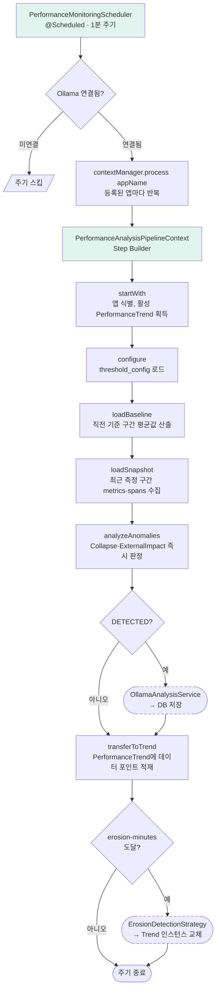

# 데이터 흐름과 코드 경로

Metrics, Traces, Logs가 각각 어느 클래스를 거쳐 저장되고 조회되는지, AI 분석이 어떤 흐름으로 실행되는지를 코드 레벨로 정리했습니다. fork 후 IDE에서 아래 경로를 따라가면 전체 파이프라인을 탐색할 수 있습니다.

---

### Metrics 흐름

**수집 → 전송**

`MetricsCollector`가 5초 주기로 JVM MXBean에서 CPU, 메모리, Disk IO를 수집합니다. 수집된 값은 `DataQueue`에 적재되고 `QueueWorker`가 100ms 배치로 묶어 `GrpcSenderImpl`을 통해 게이트웨이로 전송합니다.

```
MetricsCollector → DataQueue → QueueWorker → GrpcSenderImpl → (gRPC) → gateway
```

- [`agent/src/main/java/com/apm/observatory/agent/collector/MetricsCollector.java`](https://github.com/buss-sooin/apm-observatory/blob/main/agent/src/main/java/com/apm/observatory/agent/collector/MetricsCollector.java)
- [`agent/src/main/java/com/apm/observatory/agent/worker/QueueWorker.java`](https://github.com/buss-sooin/apm-observatory/blob/main/agent/src/main/java/com/apm/observatory/agent/worker/QueueWorker.java)
- [`agent/src/main/java/com/apm/observatory/agent/sender/GrpcSenderImpl.java`](https://github.com/buss-sooin/apm-observatory/blob/main/agent/src/main/java/com/apm/observatory/agent/sender/GrpcSenderImpl.java)

**수신 → 저장**

게이트웨이의 `MonitoringServiceImpl`이 gRPC 요청을 수신하고 `ApiKeyAuthInterceptor`로 인증을 처리합니다. 통과한 데이터는 `RedisStreamPublisher`가 `stream:metrics`에 발행합니다. `MetricsConsumer`가 Consumer Group으로 소비하고 `MetricsProcessor`가 Disk IO 누적값을 계산해 TimescaleDB에 저장합니다.

```
MonitoringServiceImpl → RedisStreamPublisher → stream:metrics → MetricsConsumer → MetricsProcessor → DB
```

- [`gateway/src/main/java/com/apm/observatory/gateway/service/MonitoringServiceImpl.java`](https://github.com/buss-sooin/apm-observatory/blob/main/gateway/src/main/java/com/apm/observatory/gateway/service/MonitoringServiceImpl.java)
- [`gateway/src/main/java/com/apm/observatory/gateway/redis/RedisStreamPublisher.java`](https://github.com/buss-sooin/apm-observatory/blob/main/gateway/src/main/java/com/apm/observatory/gateway/redis/RedisStreamPublisher.java)
- [`collectorserver/src/main/java/com/apm/observatory/collectorserver/consumer/MetricsConsumer.java`](https://github.com/buss-sooin/apm-observatory/blob/main/collectorserver/src/main/java/com/apm/observatory/collectorserver/consumer/MetricsConsumer.java)
- [`collectorserver/src/main/java/com/apm/observatory/collectorserver/processor/MetricsProcessor.java`](https://github.com/buss-sooin/apm-observatory/blob/main/collectorserver/src/main/java/com/apm/observatory/collectorserver/processor/MetricsProcessor.java)

**조회**

```
GET /metrics/trend    → MetricsController → MetricsPort → MetricsAdapter → DB
GET /metrics/summary  → MetricsController → MetricsPort → MetricsAdapter → DB
```

- [`apiserver/src/main/java/com/apm/observatory/apiserver/metrics/controller/MetricsController.java`](https://github.com/buss-sooin/apm-observatory/blob/main/apiserver/src/main/java/com/apm/observatory/apiserver/metrics/controller/MetricsController.java)
- [`apiserver/src/main/java/com/apm/observatory/apiserver/metrics/adapter/MetricsAdapter.java`](https://github.com/buss-sooin/apm-observatory/blob/main/apiserver/src/main/java/com/apm/observatory/apiserver/metrics/adapter/MetricsAdapter.java)

---

### Traces 흐름

**수집 → 전송**

HTTP 요청이 들어오면 `ServletAdvice`가 `DispatcherServlet.doDispatch()`를 후킹해 TraceID, SpanID를 생성하고 MDC에 전파합니다. DB 쿼리는 `PreparedStatementAdvice`가, 외부 API 호출은 `RestClientRequestAdvice`가 각각 후킹해 자식 Span을 생성합니다. 세 Advice 모두 `DataQueue`를 통해 게이트웨이로 전송됩니다.

```
ServletAdvice (INTERNAL)          ──┐
PreparedStatementAdvice (DB)      ──┤→ DataQueue → QueueWorker → GrpcSenderImpl → gateway
RestClientRequestAdvice (EXTERNAL)──┘
```

- [`agent/src/main/java/com/apm/observatory/agent/advice/mvc/ServletAdvice.java`](https://github.com/buss-sooin/apm-observatory/blob/main/agent/src/main/java/com/apm/observatory/agent/advice/mvc/ServletAdvice.java)
- [`agent/src/main/java/com/apm/observatory/agent/advice/mvc/PreparedStatementAdvice.java`](https://github.com/buss-sooin/apm-observatory/blob/main/agent/src/main/java/com/apm/observatory/agent/advice/mvc/PreparedStatementAdvice.java)
- [`agent/src/main/java/com/apm/observatory/agent/advice/mvc/RestClientRequestAdvice.java`](https://github.com/buss-sooin/apm-observatory/blob/main/agent/src/main/java/com/apm/observatory/agent/advice/mvc/RestClientRequestAdvice.java)

**수신 → 저장**

게이트웨이에서 `stream:spans`로 발행된 데이터를 `SpanConsumer`가 소비합니다. `SpanProcessor`가 DB/EXTERNAL Span의 부모-자식 관계를 정리하고 INTERNAL Span을 파생 계산해 저장합니다.

```
stream:spans → SpanConsumer → SpanProcessor → DB
```

- [`collectorserver/src/main/java/com/apm/observatory/collectorserver/consumer/SpanConsumer.java`](https://github.com/buss-sooin/apm-observatory/blob/main/collectorserver/src/main/java/com/apm/observatory/collectorserver/consumer/SpanConsumer.java)
- [`collectorserver/src/main/java/com/apm/observatory/collectorserver/processor/SpanProcessor.java`](https://github.com/buss-sooin/apm-observatory/blob/main/collectorserver/src/main/java/com/apm/observatory/collectorserver/processor/SpanProcessor.java)

**조회**

`SpanAdapter`가 trace_id로 전체 Span을 조회하고, DFS 재귀 순회로 INTERNAL → DB/EXTERNAL 트리를 조립해 폭포수 차트 형태로 반환합니다.

```
GET /spans/waterfall?trace_id= → SpanController → SpanPort → SpanAdapter → DB
```

- [`apiserver/src/main/java/com/apm/observatory/apiserver/span/controller/SpanController.java`](https://github.com/buss-sooin/apm-observatory/blob/main/apiserver/src/main/java/com/apm/observatory/apiserver/span/controller/SpanController.java)
- [`apiserver/src/main/java/com/apm/observatory/apiserver/span/adapter/SpanAdapter.java`](https://github.com/buss-sooin/apm-observatory/blob/main/apiserver/src/main/java/com/apm/observatory/apiserver/span/adapter/SpanAdapter.java)

---

### Logs 흐름

**수집 → 전송**

`AppenderRegistrationAdvice`가 `FrameworkServlet.initServletBean()`을 후킹해 Spring MVC 초기화 완료 시점에 `GrpcLogbackAppender`를 logback ROOT Logger에 등록합니다. 이후 애플리케이션에서 발생하는 모든 로그가 `GrpcLogbackAppender`를 통해 게이트웨이로 전송됩니다.

```
GrpcLogbackAppender (ROOT Logger 등록) → DataQueue → QueueWorker → GrpcSenderImpl → gateway
```

- [`agent/src/main/java/com/apm/observatory/agent/advice/mvc/AppenderRegistrationAdvice.java`](https://github.com/buss-sooin/apm-observatory/blob/main/agent/src/main/java/com/apm/observatory/agent/advice/mvc/AppenderRegistrationAdvice.java)
- [`agent/src/main/java/com/apm/observatory/agent/appender/GrpcLogbackAppender.java`](https://github.com/buss-sooin/apm-observatory/blob/main/agent/src/main/java/com/apm/observatory/agent/appender/GrpcLogbackAppender.java)

**수신 → 저장**

```
stream:logs → LogConsumer → LogProcessor → DB
```

- [`collectorserver/src/main/java/com/apm/observatory/collectorserver/consumer/LogConsumer.java`](https://github.com/buss-sooin/apm-observatory/blob/main/collectorserver/src/main/java/com/apm/observatory/collectorserver/consumer/LogConsumer.java)
- [`collectorserver/src/main/java/com/apm/observatory/collectorserver/processor/LogProcessor.java`](https://github.com/buss-sooin/apm-observatory/blob/main/collectorserver/src/main/java/com/apm/observatory/collectorserver/processor/LogProcessor.java)

**조회**

```
GET /logs/stream?app_name=&start_time=&end_time=&level= → LogController → LogAdapter → DB
```

- [`apiserver/src/main/java/com/apm/observatory/apiserver/log/controller/LogController.java`](https://github.com/buss-sooin/apm-observatory/blob/main/apiserver/src/main/java/com/apm/observatory/apiserver/log/controller/LogController.java)
- [`apiserver/src/main/java/com/apm/observatory/apiserver/log/adapter/LogAdapter.java`](https://github.com/buss-sooin/apm-observatory/blob/main/apiserver/src/main/java/com/apm/observatory/apiserver/log/adapter/LogAdapter.java)

---

### AI 분석 흐름

이 모듈의 분석 로직은 두 가지 주기로 동작합니다.

**`PerformanceAnalysisPipelineContext`의 주기 구성**

- **즉시 판정 주기** — 1분마다 한 번 돕니다. 즉각적인 이상 신호와 외부 영향의 이상 신호를 이 주기 안에서 판정합니다. 주기 내부에서 baseline을 매번 새로 산출하고 그 시점의 측정값과 비교합니다.
- **누적 분석 주기** — 30분 동안 즉시 판정 주기가 매번 측정 결과를 적재해 시계열을 쌓고, 30분에 도달하면 그 시계열에 선형 회귀를 적용해 점진적인 이상 신호를 판정합니다. 분석이 끝나면 새 시계열로 교체.

누적 분석 주기의 길이가 즉시 판정 주기의 간격보다 반드시 커야 한다는 제약은 시작 시점에 검증합니다 — `PerformanceContextManager.init()` 에서 `erosionMinutes ≤ intervalMinutes` 이면 `IllegalStateException`으로 부팅을 막습니다.

**즉시 판정 주기의 파이프라인 단계**

스케줄러가 1분마다 `PerformanceMonitoringScheduler.run()`을 호출하고, 그 안에서 등록된 앱마다 `PerformanceAnalysisPipelineContext`가 한 번 돕니다. 한 주기 동안 다음 단계를 거칩니다.



각 단계는 입력만 주면 결과가 결정되도록 짜여 있어 단계 사이에 부수 효과가 누적되지 않습니다. AI 호출과 DB 저장은 `analyzeAnomalies()` 단계에서만 일어나며, 같은 단계가 여러 번 호출되는 일은 없습니다.

<a id="interval-vars"></a>
**구간 변수의 실제 길이**

룰 기반 이상 감지 단락의 수식에 등장한 구간 변수들은 다음 설정을 사용합니다.

| 수식 변수 | 설정 키 | 기본값 |
|---|---|---|
| 최근 측정 구간 | `aipipeline.window.recent-minutes` | 5분 |
| 직전 기준 구간 | `aipipeline.window.baseline-minutes` | 30분 |
| 누적 분석 주기 길이 | `aipipeline.window.erosion-minutes` | 30분 |
| 즉시 판정 주기 간격 | `aipipeline.scheduler.interval-minutes` | 1분 |

[status 결정 수식으로 돌아가기](모듈-설계-aipipeline#status-formula)

**baseline 산출 시점**

`business_cycle`은 운영 중인 서비스의 피크 시간대(예: ecommerce의 점심·저녁 트래픽 집중 구간)를 기준 시간으로 정의해 baseline 시점을 결정하는 사용자 정의 기준입니다. 같은 임계 배수라도 어느 시점의 평균을 baseline으로 삼느냐에 따라 판정이 갈리기 때문에, 시간대별 트래픽 패턴이 뚜렷한 서비스에서 새벽 평균을 기준으로 삼아 발생하는 오탐을 막기 위해 둔 분기입니다.

| `business_cycle` 등록 여부 | baseline 시점 | 사용 의도 |
|---|---|---|
| 등록됨 | 전날 같은 시각의 같은 길이 구간 | 시간대별 트래픽 패턴이 있는 서비스 — 같은 시간대끼리 비교 |
| 미등록 | 현재로부터 직전 baseline-minutes 구간 | 시간대 영향이 작은 서비스 — 단순 직전 비교 |

**호출부 정리**

```
PerformanceMonitoringScheduler
  → PerformanceAnalysisPipelineContext
      .startWith()        // 앱 식별, 활성 Trend 획득
      .configure()        // ThresholdConfigAdapter
      .loadBaseline()     // PerformanceDataAdapter / ExternalImpactDataAdapter
      .loadSnapshot()     // 같은 두 Adapter에서 최근 구간 수집
      .analyzeAnomalies() // CollapseDetectionStrategy / ExternalImpactDetectionStrategy
      .transferToTrend()  // PerformanceTrend 누적 → 만료 시 ErosionDetectionStrategy
  → OllamaAnalysisService      // DETECTED → 자연어 분석 요청
  → AiAnalysisResultAdapter    // 분석 결과 + evidence 저장
```

- [`aipipeline/src/main/java/com/apm/observatory/aipipeline/scheduler/PerformanceMonitoringScheduler.java`](https://github.com/buss-sooin/apm-observatory/blob/main/aipipeline/src/main/java/com/apm/observatory/aipipeline/scheduler/PerformanceMonitoringScheduler.java)
- [`aipipeline/src/main/java/com/apm/observatory/aipipeline/context/PerformanceContextManager.java`](https://github.com/buss-sooin/apm-observatory/blob/main/aipipeline/src/main/java/com/apm/observatory/aipipeline/context/PerformanceContextManager.java)
- [`aipipeline/src/main/java/com/apm/observatory/aipipeline/context/pipeline/PerformanceAnalysisPipelineContext.java`](https://github.com/buss-sooin/apm-observatory/blob/main/aipipeline/src/main/java/com/apm/observatory/aipipeline/context/pipeline/PerformanceAnalysisPipelineContext.java)
- [`aipipeline/src/main/java/com/apm/observatory/aipipeline/context/strategy/CollapseDetectionStrategy.java`](https://github.com/buss-sooin/apm-observatory/blob/main/aipipeline/src/main/java/com/apm/observatory/aipipeline/context/strategy/CollapseDetectionStrategy.java)
- [`aipipeline/src/main/java/com/apm/observatory/aipipeline/ai/service/OllamaAnalysisService.java`](https://github.com/buss-sooin/apm-observatory/blob/main/aipipeline/src/main/java/com/apm/observatory/aipipeline/ai/service/OllamaAnalysisService.java)
- [`aipipeline/src/main/java/com/apm/observatory/aipipeline/ai/adapter/AiAnalysisResultAdapter.java`](https://github.com/buss-sooin/apm-observatory/blob/main/aipipeline/src/main/java/com/apm/observatory/aipipeline/ai/adapter/AiAnalysisResultAdapter.java)

**AI 분석 결과 조회**

```
GET /ai/results?app_name= → AiResultController → AiResultAdapter → DB
```

- [`apiserver/src/main/java/com/apm/observatory/apiserver/ai/controller/AiResultController.java`](https://github.com/buss-sooin/apm-observatory/blob/main/apiserver/src/main/java/com/apm/observatory/apiserver/ai/controller/AiResultController.java)
- [`apiserver/src/main/java/com/apm/observatory/apiserver/ai/adapter/AiResultAdapter.java`](https://github.com/buss-sooin/apm-observatory/blob/main/apiserver/src/main/java/com/apm/observatory/apiserver/ai/adapter/AiResultAdapter.java)

---

[← 위키 홈](Home)
