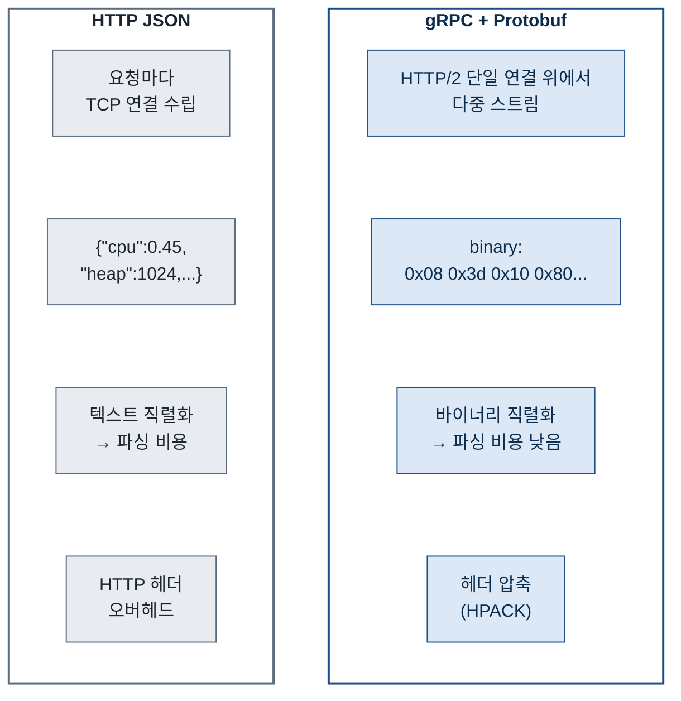

# 모듈 설계 · agent

**역할과 주요 코드**

타겟 앱 JVM에 `-javaagent`로 붙어서 동작합니다. Byte Buddy로 DispatcherServlet, PreparedStatement, RestClient를 후킹해서 Metrics, Spans, Logs를 수집하고 gRPC로 게이트웨이에 전송합니다.

- [`agent/src/main/java/com/apm/observatory/agent/AgentMain.java`](https://github.com/buss-sooin/apm-observatory/blob/main/agent/src/main/java/com/apm/observatory/agent/AgentMain.java)
- [`agent/src/main/java/com/apm/observatory/agent/advice/mvc/`](https://github.com/buss-sooin/apm-observatory/blob/main/agent/src/main/java/com/apm/observatory/agent/advice/mvc/)

---

에이전트 설계의 시작은 에이전트가 타겟 앱의 JVM 안에서 함께 실행된다는 사실이었습니다. 에이전트가 수집하는 모든 지점은 타겟 앱의 요청 처리 스레드 위에서 실행됩니다. 데이터 저장과 전송 과정의 성능 비효율이 요청 처리 스레드를 점유하거나 블로킹하면 그 지연이 타겟 앱으로 전파됩니다. 에이전트의 부하가 타겟 앱에 영향을 주어서는 안된다고 생각했습니다.

에이전트의 역할은 크게 두 가지입니다. 관측 데이터를 수집하는 것과 수집한 데이터를 엔드포인트로 전송하는 것입니다. 수집은 Byte Buddy Advice가 담당하고, 전송 측의 효율적인 설계를 고민해야 했습니다. 가장 단순한 방법은 HTTP JSON 전송입니다. 구현이 쉽고 디버깅이 편하지만 APM 에이전트처럼 짧고 빈번한 데이터를 대량으로 전송하는 환경에서는 맞지 않다고 판단했습니다.

JSON 텍스트 직렬화 비용, HTTP 헤더 오버헤드, 요청마다 연결을 맺는 비용이 누적됩니다. gRPC + Protobuf는 바이너리 직렬화로 페이로드 크기가 작고 HTTP/2 기반으로 하나의 연결에서 다중 스트림을 처리합니다. 또한 gRPC는 OpenTelemetry의 표준 전송 프로토콜인 [OTLP](https://opentelemetry.io/docs/specs/otlp/)가 채택한 방식이기도 합니다.

전송 방식을 정했다면 다음은 어떤 구조로 전송할 것인가였습니다. 타겟 앱의 수많은 요청 스레드가 동시에 데이터를 전송하기 위해 자원을 점유하는 상황을 가정하면, 전송 구조가 타겟 앱에 미치는 영향이 커집니다. Java 플랫폼 스레드는 OS 스레드와 1:1로 매핑됩니다. 스레드가 네트워크 I/O를 기다리는 동안에도 블로킹 상태로 약 1MB의 스택 메모리를 점유하고, OS 스케줄러는 이 스레드를 블로킹 상태로 두고 다른 스레드로 전환하는 컨텍스트 스위칭 비용을 지불합니다. Tomcat의 기본 `maxThreads`는 200입니다. ([Apache Tomcat 공식 문서](https://tomcat.apache.org/tomcat-10.1-doc/config/http.html)) Advice에서 수집 즉시 전송하면 전송이 완료될 때까지 요청 처리 스레드가 gRPC 채널을 잡고 기다리게 됩니다. 전송 지연이 요청 처리 지연으로 전파되는 구조입니다.

Go의 고루틴은 이 구조가 다릅니다. Go 런타임은 G(고루틴), M(OS 스레드), P(논리 프로세서) 세 가지로 구성됩니다. Go 코드는 G 위에서 실행되고, G는 P의 실행 큐에 들어가고, P는 실제 OS 스레드인 M에 붙어서 실행됩니다. OS 스레드를 사용하는 건 동일하지만 Go 런타임 스케줄러가 그 위에서 고루틴을 직접 스케줄링합니다. 고루틴이 블로킹 상태가 되면 P가 M에서 분리되고 다른 M에 붙어서 다른 고루틴을 계속 실행합니다. OS 스레드가 1~2MB를 소비하는 것과 달리 고루틴은 약 2KB에서 시작합니다. ([Go 공식 FAQ](https://go.dev/doc/faq#goroutines))

대규모 전송 환경에서는 Go 고루틴 방식이 구조적으로 유리합니다. 다만 별도 Go 프로세스로 분리하면 프로세스 간 통신 구현이 추가되고, 단일 언어로 통일하는 것이 구현하기에 적합한 난이도라고 봐서 Java를 선택했습니다.

다음과 같이 구현했습니다. Java 에이전트 안에서 `QueueWorker`를 별도 데몬 스레드로 분리했습니다. `setDaemon(true)`로 설정하면 타겟 앱의 일반 스레드가 모두 종료될 때 JVM과 함께 종료됩니다. Advice는 `DataQueue`에 넣기만 하고 `QueueWorker`가 배치로 묶어 Netty 기반 gRPC 채널로 전송합니다. 전송 중에 `QueueWorker` 스레드는 블로킹되지 않습니다.

`QueueWorker`는 `setDaemon(true)`로 등록된 데몬 스레드로 동작합니다. `offer()`는 즉시 반환되어 타겟 앱 스레드를 블로킹하지 않고, 큐가 꽉 차면 드롭되어 타겟 앱에 영향을 주지 않습니다.

`DataQueue`는 처음에 `ArrayBlockingQueue`로 구현했습니다. 큐에 넣는 일은 타겟 앱의 요청 스레드가 직접 수행하므로, producer 쪽 lock 경쟁이 생기면 그만큼 타겟 앱의 요청 처리가 지연됩니다. 이 경쟁을 없애려고 producer가 lock 없이 넣는 JCTools의 `MpscArrayQueue`로 교체했습니다. 다수 producer와 단일 consumer(MPSC) 구조를 전제한 lock-free 큐이고 용량도 고정할 수 있습니다. 두 자료구조의 지연 차이를 측정해 확인했습니다. 후보 비교와 측정 지표·결과는 [큐 자료구조 선택과 적재 지연 측정](https://github.com/buss-sooin/queue-benchmark)에 정리했습니다.

- [`agent/src/main/java/com/apm/observatory/agent/worker/QueueWorker.java`](https://github.com/buss-sooin/apm-observatory/blob/main/agent/src/main/java/com/apm/observatory/agent/worker/QueueWorker.java)
- [`agent/src/main/java/com/apm/observatory/agent/queue/DataQueue.java`](https://github.com/buss-sooin/apm-observatory/blob/main/agent/src/main/java/com/apm/observatory/agent/queue/DataQueue.java)

DataQueue를 처음에 `ArrayBlockingQueue`로 설계하고 구현했던 것처럼, 게이트웨이로 보내는 전송도 처음에는 동기 방식인 gRPC BlockingStub으로 만들었습니다. BlockingStub은 한 배치를 보내고 응답을 받은 뒤 다음 배치로 넘어가므로, 진행 중인 요청을 따로 관리하지 않아도 되는 단순한 구조입니다.

DataQueue를 `MpscArrayQueue`로 바꾼 것처럼 큐가 효율적으로 동작하려면 빠른 전송이 뒷받침되어야 한다고 생각했습니다. 큐를 다수 producer·단일 consumer 구조에 맞게 바꿔도, consumer인 worker가 전송에서 막히면 적재부터 전송까지 이어지는 흐름이 느려집니다. BlockingStub과 AsyncStub은 각각 동기·비동기 방식으로 RPC를 호출하는 gRPC의 stub 구현체입니다([gRPC Java 가이드](https://grpc.io/docs/languages/java/basics/)). BlockingStub은 한 배치의 응답이 올 때까지 worker가 대기하므로 큐를 비우는 속도가 응답 여부에 종속됩니다. 적재를 빠르게 만든 만큼 전송도 실시간 소비에 가까운 방식인 AsyncStub으로 바꿨습니다.

AsyncStub은 요청을 보낸 뒤 바로 다음 배치로 넘어가고, 응답은 콜백에서 처리합니다. worker가 응답을 기다리지 않고 다음 요청을 바로 전송하기 때문에, 제한을 두지 않으면 동시 발생 요청이 매우 많아질 때 전송이 끝나지 않은 메시지가 계속 쌓입니다. gRPC 전송에 쓰는 grpc-netty-shaded는 이 메시지 데이터를 Netty의 off-heap(direct memory)에 버퍼링하고([grpc-java #10532](https://github.com/grpc/grpc-java/issues/10532)), 에이전트가 타겟 앱과 같은 프로세스에서 실행되므로 이 off-heap 메모리는 곧 타겟 앱 프로세스의 메모리이기도 합니다. 동시 요청이 증식할수록 이 메모리를 크게 점유해 타겟 앱에 영향을 줄 위험이 있어, 동시 요청 수를 제한할 수 있는 [`java.util.concurrent.Semaphore`](https://docs.oracle.com/en/java/javase/21/docs/api/java.base/java/util/concurrent/Semaphore.html)로 50개까지로 제한했습니다. 요청을 보내기 전에 permit을 얻고 응답 콜백에서 돌려주는 방식이라, 큐가 아무리 커도 동시 요청이 50개를 넘지 않습니다.

worker가 gRPC 전송을 통해 큐 데이터를 소비하는 속도를 측정 대상으로 삼았습니다. 비동기 요청의 장점은 한 요청의 응답을 기다리는 동안 다음 요청을 보내는 데서 나오므로, 한 요청이 처리되어 응답이 오기까지의 시간 안에 여러 요청이 앞선 요청의 완료를 기다리지 않고 동시에 나가는 상황을 재현해야만 드러납니다. 실제로 후킹 포인트에서 관측한 데이터는 즉시 동시다발적으로 gateway로 전송되고, 원격에 있는 gateway가 Redis 발행을 거쳐 응답하기까지 시간이 듭니다. 이 상황을 만들기 위해 게이트웨이 대신 응답에 지연을 주는 간단한 임시 gRPC 서버를 두어, 요청 하나가 응답까지 시간이 걸리는 동안 여러 요청이 동시에 진행되는 환경을 구성했습니다. 큐(DataQueue)와 worker(QueueWorker), 비동기 전송(GrpcSenderImpl)은 실제 구현을 그대로 쓰고, 동기 비교군은 같은 경로에서 전송만 BlockingStub으로 바꿨습니다. 응답 지연 시간(Delay Time)을 늘리며 두 방식의 전송 시간을 비교했습니다.

| 응답 지연(ms) | 동기 전송(ms) | 비동기 전송(ms) | 동기/비동기(배) |
|---|---|---|---|
| 0 | 12 | 7 | 1.7 |
| 1 | 256 | 13 | 19.7 |
| 5 | 1248 | 30 | 41.6 |
| 20 | 4605 | 98 | 47.0 |

응답 지연이 0이면 두 방식이 비슷하고, 지연이 커질수록 비동기 전송이 더 빨리 끝납니다. 동기와 비동기의 시간 배수는 50배 근처로 수렴하는데, 동시에 진행하는 요청을 50개로 제한했기 때문입니다. 동기가 한 번에 하나씩 처리하는 동안 비동기는 최대 50개를 동시에 처리합니다.

측정 코드는 agent 모듈 test 소스에 있고 `./gradlew :agent:benchmark`로 실행합니다.

- [`agent/src/test/java/com/apm/observatory/agent/benchmark/TransportEfficiencyBenchmark.java`](https://github.com/buss-sooin/apm-observatory/blob/main/agent/src/test/java/com/apm/observatory/agent/benchmark/TransportEfficiencyBenchmark.java)
- [`agent/src/test/java/com/apm/observatory/agent/benchmark/BlockingGrpcSender.java`](https://github.com/buss-sooin/apm-observatory/blob/main/agent/src/test/java/com/apm/observatory/agent/benchmark/BlockingGrpcSender.java)
- [`agent/src/test/java/com/apm/observatory/agent/benchmark/DelayingMonitoringService.java`](https://github.com/buss-sooin/apm-observatory/blob/main/agent/src/test/java/com/apm/observatory/agent/benchmark/DelayingMonitoringService.java)

---

[← 위키 홈](Home)
