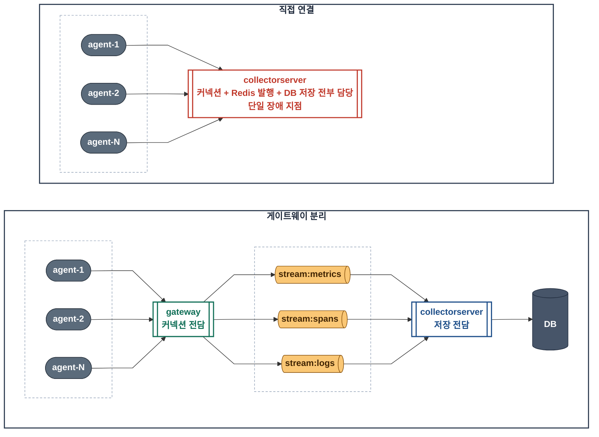
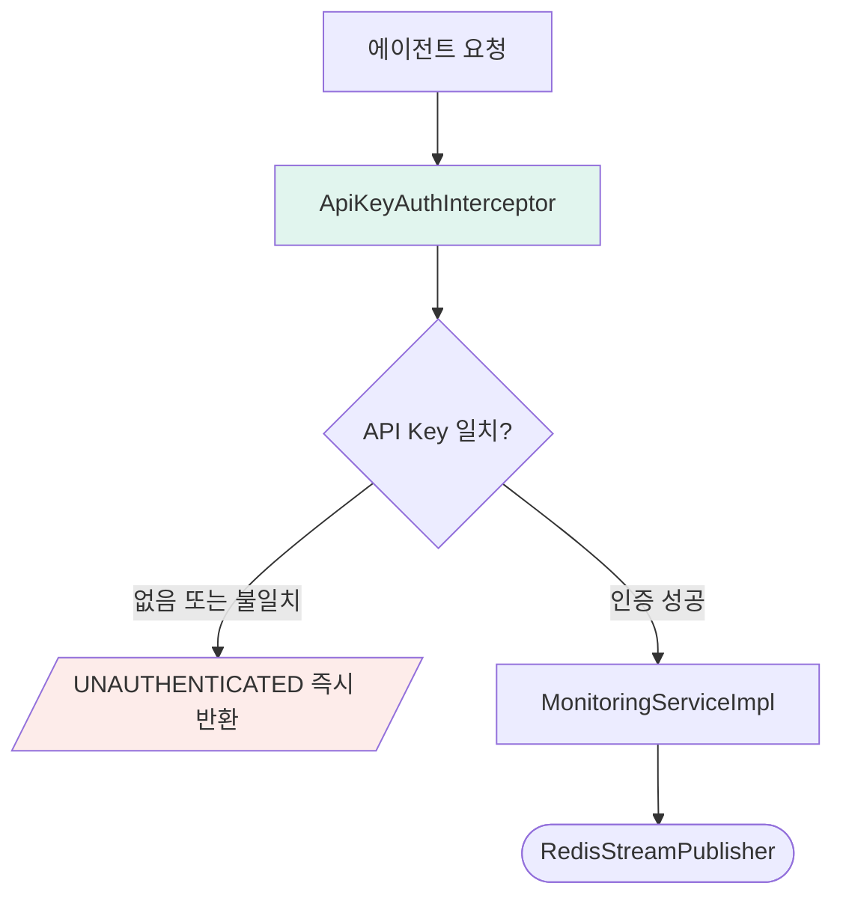
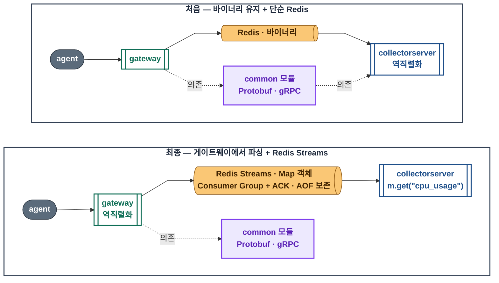

# 모듈 설계 · gateway

**역할과 주요 코드**

에이전트로부터 gRPC 요청을 받아 API Key 인증과 유효성 검증을 처리합니다. 통과한 데이터를 Metrics, Spans, Logs 각각의 Redis Stream으로 라우팅합니다. Netty 기반으로 동작합니다.

- [`gateway/src/main/java/com/apm/observatory/gateway/server/GatewayServer.java`](https://github.com/buss-sooin/apm-observatory/blob/main/gateway/src/main/java/com/apm/observatory/gateway/server/GatewayServer.java)
- [`gateway/src/main/java/com/apm/observatory/gateway/redis/RedisStreamPublisher.java`](https://github.com/buss-sooin/apm-observatory/blob/main/gateway/src/main/java/com/apm/observatory/gateway/redis/RedisStreamPublisher.java)

---

에이전트가 게이트웨이 없이 수집서버에 직접 연결하는 구조도 가능합니다. 그러나 그 구조에서는 수집서버가 모든 에이전트 커넥션을 직접 받으면서 동시에 Redis 발행과 DB 저장까지 담당해야 합니다. 에이전트 수가 늘어날수록 수집서버가 커넥션 부하를 고스란히 받고, 수집서버 장애가 에이전트 연결 전체를 끊는 단일 장애 지점이 됩니다.

게이트웨이를 중간에 두면 역할이 분리됩니다. 게이트웨이가 에이전트 커넥션을 전담하고 Redis Streams로 넘기면, 수집서버는 Redis에서 데이터를 꺼내 저장하는 역할에만 집중합니다. 수집서버는 에이전트 커넥션 부하로부터 격리됩니다.

외부 요청을 받는 게이트웨이 특성상 요청에 대한 인증이 필요했습니다. 인증 구현은 gRPC 공식 가이드의 인터셉터 방식을 참조했습니다. ([Java Example](https://github.com/grpc/grpc-java/tree/master/examples/src/main/java/io/grpc/examples/header)) 인증 실패 시 `UNAUTHENTICATED`로 즉시 거부하고 `MonitoringServiceImpl`까지 요청이 전달되지 않습니다.

- [`gateway/src/main/java/com/apm/observatory/gateway/interceptor/ApiKeyAuthInterceptor.java`](https://github.com/buss-sooin/apm-observatory/blob/main/gateway/src/main/java/com/apm/observatory/gateway/interceptor/ApiKeyAuthInterceptor.java)
- [`gateway/src/main/java/com/apm/observatory/gateway/service/MonitoringServiceImpl.java`](https://github.com/buss-sooin/apm-observatory/blob/main/gateway/src/main/java/com/apm/observatory/gateway/service/MonitoringServiceImpl.java)

---

**[gateway] Protobuf 파싱 경계**

처음 설계는 Protobuf 바이너리를 단순 Redis를 통해 수집서버까지 그대로 가져가는 방식이었습니다. 그러면 common 모듈과 gRPC 의존성이 수집서버까지 전파됩니다. 수집서버가 Redis에서 꺼낸 바이너리를 직접 역직렬화해야 하니 구현 복잡도가 올라갑니다.

게이트웨이는 언제든 늘어날 수 있는 외부 에이전트의 데이터를 빠르게 받는 것이 목적입니다. 반면 게이트웨이 이후 내부 구간에서는 에이전트 수가 동적으로 늘어나더라도 Redis Streams를 통해 수신 속도를 통제하고 확장할 수 있습니다. 또한 수집서버 장애나 재시작으로 인한 데이터 유실을 대비하고자 Consumer Group + ACK 구조로 재처리가 가능하고 AOF로 디스크에도 보존되는 Redis Streams를 택했습니다. 이 구조에서 바이너리를 유지해 전송 효율을 극대화하는 이득보다, 게이트웨이에서 파싱을 끝내 모듈 복잡성을 줄이고 수집서버가 저장 역할에만 집중하게 하는 쪽이 낫다고 판단했습니다.

- [`gateway/src/main/java/com/apm/observatory/gateway/redis/RedisStreamPublisher.java`](https://github.com/buss-sooin/apm-observatory/blob/main/gateway/src/main/java/com/apm/observatory/gateway/redis/RedisStreamPublisher.java)

모니터링은 수집한 데이터가 즉시 결과로 이어져야 합니다. 에이전트가 동시다발적으로 보내는 데이터를 빠르게 받는 것만큼, 게이트웨이가 Redis Streams로 발행하는 속도도 중요합니다. 발행이 블로킹되면 그만큼 데이터가 파이프라인에 늦게 진입하고 모니터링 결과도 늦어집니다. Netty 기반으로 하나의 커넥션을 여러 스레드가 공유할 수 있고 발행 응답을 기다리는 동안 스레드가 블로킹되지 않는 Lettuce 비동기 방식을 선택했습니다. ([Lettuce 공식 문서](https://redis.github.io/lettuce/user-guide/async-api/))

- [`gateway/src/main/java/com/apm/observatory/gateway/redis/RedisStreamPublisher.java`](https://github.com/buss-sooin/apm-observatory/blob/main/gateway/src/main/java/com/apm/observatory/gateway/redis/RedisStreamPublisher.java)

---

[← 위키 홈](Home)
