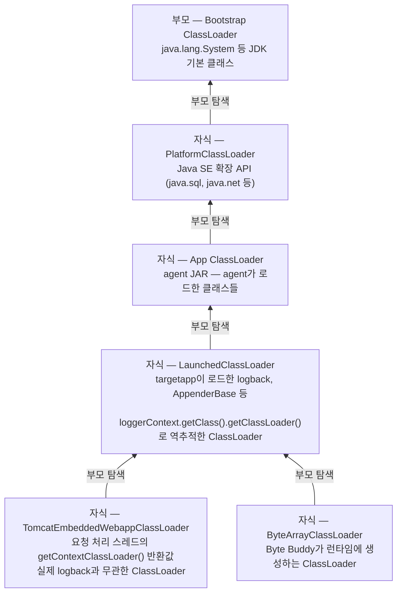
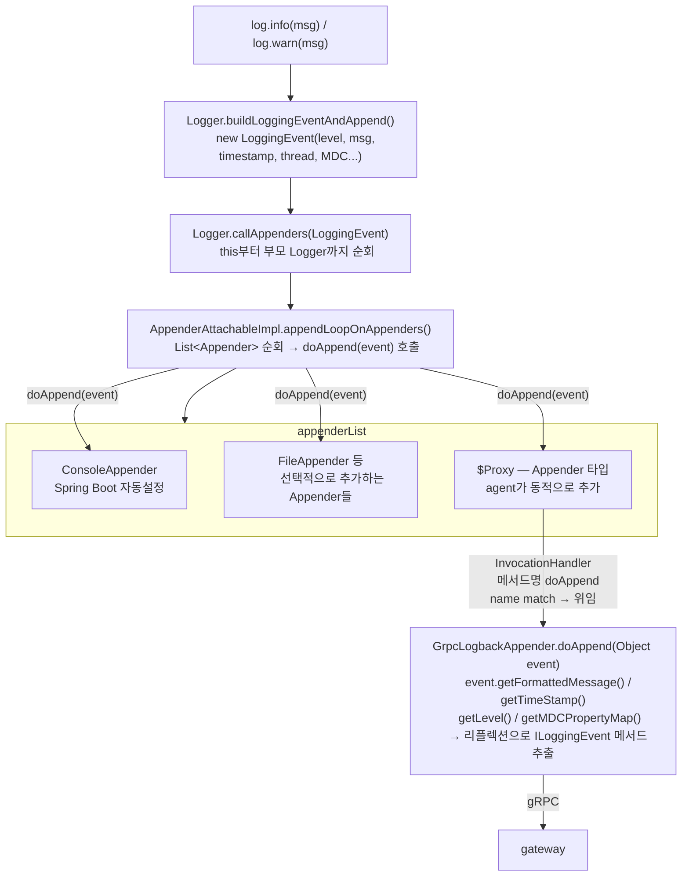

# 어려웠던 문제와 해결 과정

Spring으로 API를 만드는 건 백엔드 개발자로서 익숙한 영역입니다. 이 프로젝트에서 진짜 어려웠던 건 JVM을 사용하는 개발자가 아니라 다루는 개발자처럼 접근해야 했던 부분이었습니다.

---

**GrpcLogbackAppender와 ClassLoader**

logback은 `Logger`, `Appender`, `Layout` 세 가지를 기반으로 동작합니다. `log.info()`든 `log.warn()`이든 어떤 레벨의 로그 메서드가 호출되면 내부적으로 `Logger.buildLoggingEventAndAppend()`가 `LoggingEvent` 객체를 생성하고 `callAppenders()`를 통해 ROOT Logger에 등록된 `appenderList`를 순회하며 각 `Appender`의 `doAppend(event)`를 호출합니다. `appenderList`에 들어갈 수 있는 건 `ch.qos.logback.core.Appender` 인터페이스를 구현한 객체뿐입니다. ([logback 공식 문서 Chapter 2: Architecture](https://logback.qos.ch/manual/architecture.html), [logback GitHub Logger.java](https://github.com/qos-ch/logback/blob/master/logback-classic/src/main/java/ch/qos/logback/classic/Logger.java) — `buildLoggingEventAndAppend`, `callAppenders` 메서드)

커스텀 `Appender`를 만드는 일반적인 방법은 `AppenderBase<ILoggingEvent>`를 상속해서 `append()` 메서드를 구현하는 방식입니다. `AppenderBase`는 필터 체인 실행, 시작 상태 확인 같은 공통 처리를 담당하고 서브클래스는 실제 출력 목적지에 대한 구현만 하면 됩니다. `GrpcLogbackAppender`도 처음엔 이 방식으로 만들었습니다.

ClassLoader 위임 모델 (Delegation Model) — 화살표 방향: 클래스를 찾을 때 부모로 탐색 위임하는 방향



([Oracle Java 21 ClassLoader JavaDoc](https://docs.oracle.com/en/java/javase/21/docs/api/java.base/java/lang/ClassLoader.html) — "Each instance of ClassLoader has an associated parent class loader" 단락)

`AppenderBase`는 `LaunchedClassLoader` 소속(Spring Boot fat JAR의 `BOOT-INF/lib/logback-classic.jar`)이고 `GrpcLogbackAppender`는 `App ClassLoader` 소속입니다. `App ClassLoader`는 `LaunchedClassLoader`의 부모이기 때문에 자식인 `LaunchedClassLoader`의 클래스를 볼 수 없습니다.

`AppenderBase` 상속을 시도한 과정에서 아래와 같은 순서로 문제가 발생했습니다.

---

**1차 시도. logback.xml에 GrpcLogbackAppender 클래스명 직접 등록 (실패)**
```
ClassNotFoundException: GrpcLogbackAppender not found
// Spring Boot가 logback-spring.xml을 읽을 때 사용하는 LaunchedClassLoader의 탐색 범위 밖
```
Spring Boot가 `logback-spring.xml`을 읽을 때 `LaunchedClassLoader`를 사용하는데 `GrpcLogbackAppender`는 agent JAR 소속이라 탐색 범위 밖입니다.

---

**2차 시도. agent JAR에 logback `implementation`으로 패키징 (실패)**
```
LoggerFactory is not a Logback LoggerContext
// Spring Boot가 클래스패스에서 logback 구현체 두 개를 감지
```
Spring Boot가 클래스패스에서 logback 구현체가 두 개라고 감지합니다.

---

**3차 시도. logback `compileOnly` + 첫 요청 시점 리플렉션 등록 (실패)**
```
ClassCastException
// GrpcLogbackAppender(App ClassLoader)와 AppenderBase(LaunchedClassLoader)
// 로드한 ClassLoader가 달라 JVM이 다른 타입으로 인식
```
`agentCl.loadClass()`로 `GrpcLogbackAppender`를 로드하면 `AppenderBase`를 찾으려 하는데, `GrpcLogbackAppender`(`App ClassLoader`)와 `AppenderBase`(`LaunchedClassLoader`)를 로드한 ClassLoader가 다릅니다. JVM의 타입 동일성 규칙은 클래스명이 같아도 로드한 ClassLoader가 다르면 다른 타입입니다. 결국 어느 ClassLoader로 로드하든 상속 구조 자체가 ClassLoader 경계를 넘을 수 없었습니다. logback이 제공하는 방식으로는 해결이 안 되고 코드를 직접 주입하는 방법이 필요했습니다.

---

**4차 시도. `Thread.currentThread().getContextClassLoader()`로 ClassLoader 탐색 (실패)**
```
ClassCastException
// TomcatEmbeddedWebappClassLoader 반환
// ROOT Logger(LaunchedClassLoader)와 다른 ClassLoader에 주입 → 타입 불일치
```
내장 Tomcat이 요청 처리 스레드의 context ClassLoader를 `TomcatEmbeddedWebappClassLoader`로 설정하기 때문에 이 메서드가 `TomcatEmbeddedWebappClassLoader`를 반환했습니다. ROOT Logger(`LaunchedClassLoader` 소속)가 `addAppender(proxy)`를 받을 때 로드한 ClassLoader가 달라 타입 불일치가 발생합니다.

---

**5차 시도. `LoggerFactory.getILoggerFactory().getClass().getClassLoader()`로 `LaunchedClassLoader` 역추적 + `ClassInjector.UsingReflection` 바이트코드 주입 + `Proxy.newProxyInstance` 프록시 생성 (성공)**
```
[Agent] GrpcLogbackAppender ROOT Logger 등록 성공
// redis-cli XLEN stream:logs → (integer) 17
```
`loggerContext` 객체 자신의 `getClassLoader()`로 ROOT Logger를 실제로 로드한 `LaunchedClassLoader`를 찾았습니다. `ClassInjector.UsingReflection`은 `ClassLoader`의 `protected` 메서드인 `defineClass()`를 Java 버전별 모듈 제약을 내부적으로 처리하면서 호출해서 `GrpcLogbackAppender` 바이트코드를 `LaunchedClassLoader`에 직접 주입합니다. 주입 후 `GrpcLogbackAppender`는 `LaunchedClassLoader` 소속이 되어 logback 클래스들과 같은 ClassLoader 안에 있게 됩니다.

`AppenderBase` 상속을 제거했으니 `GrpcLogbackAppender`는 `Appender` 인터페이스를 구현하지 않아 `appenderList`에 직접 등록할 수 없습니다. `LaunchedClassLoader`로 로드한 `Appender` 인터페이스를 `Proxy.newProxyInstance`에 넘기면 JVM이 런타임에 `Appender`를 구현하는 프록시 클래스를 메모리 안에서 즉석으로 생성합니다. ROOT Logger가 `addAppender(proxy)`를 받을 때 프록시가 `LaunchedClassLoader` 소속의 `Appender` 구현체로 인식되어 타입 검사를 통과합니다.

최종 해결 실행 흐름 (Execution Flow)



logback이 `proxy.doAppend(event)`를 호출하면 `InvocationHandler`가 받아서 메서드명 `"doAppend"`로 `GrpcLogbackAppender`에서 같은 이름의 메서드를 찾아 호출합니다. `event`는 실제로 `LoggingEvent` 객체인데 `GrpcLogbackAppender`가 `ILoggingEvent`를 직접 import할 수 없으니 `Object`로 받아서 `ILoggingEvent` 인터페이스에 정의된 메서드들(`getFormattedMessage()`, `getTimeStamp()`, `getLevel()`, `getMDCPropertyMap()` 등)을 리플렉션으로 꺼내 gRPC로 게이트웨이에 전송합니다. ([logback GitHub ILoggingEvent.java](https://github.com/qos-ch/logback/blob/master/logback-classic/src/main/java/ch/qos/logback/classic/spi/ILoggingEvent.java))

이 구조에서 `AppenderBase.doAppend()`의 원본 동작인 필터 체인 실행과 시작 상태 확인이 우회됩니다. 사이드 이펙트 없이 온전히 구현하려 했다면 이 원본 동작도 함께 구현해줘야 하지만, 이 프로젝트에서는 전송 구현만 담당했습니다.

다른 방식으로 접근할 수 있는지 알아보기 위해 소스코드가 공개된 OpenTelemetry Java agent를 살펴보니, "전체 애플리케이션에서 전역으로 접근 가능해야 하는 클래스와 인터페이스"를 별도 bootstrap 모듈로 분리해서 Bootstrap ClassLoader에 올리는 구조로 되어 있었습니다. ([OpenTelemetry Java instrumentation — javaagent-structure.md](https://github.com/open-telemetry/opentelemetry-java-instrumentation/blob/main/docs/contributing/javaagent-structure.md) — "classes and interfaces that must be globally available to the whole application" 단락) 이 구조를 완전히 이해하고 적용하기엔 현재 시점에서 지식이 부족하다고 판단해서 이 프로젝트에서는 적용하지 않았습니다.

`--add-opens java.base/java.lang=ALL-UNNAMED` 옵션은 `defineClass()`를 직접 리플렉션으로 호출할 때 Java 9 이전 환경에서 모듈 시스템 제약을 우회하기 위해 필요합니다. 이 프로젝트는 Java 21에서 `ClassInjector.UsingReflection`을 사용했고 내부적으로 Java 버전별 모듈 제약을 처리해주기 때문에 별도로 추가하지 않았습니다.

- [`agent/src/main/java/com/apm/observatory/agent/appender/GrpcLogbackAppender.java`](https://github.com/buss-sooin/apm-observatory/blob/main/agent/src/main/java/com/apm/observatory/agent/appender/GrpcLogbackAppender.java)
- [`agent/src/main/java/com/apm/observatory/agent/advice/mvc/AppenderRegistrationAdvice.java`](https://github.com/buss-sooin/apm-observatory/blob/main/agent/src/main/java/com/apm/observatory/agent/advice/mvc/AppenderRegistrationAdvice.java)

---

**start_time이 전부 1970-01-01로 저장된 문제**

Byte Buddy `@Advice`는 표시한 메서드를 별개로 호출하지 않고, 후킹 대상 클래스(예: `DispatcherServlet.doDispatch`)의 바이트코드에 본문을 runtime에 그대로 심는 인라인 방식으로 동작합니다. 인라인된 코드 안에서 발생한 예외는 `suppress = Throwable.class` 옵션으로 자동 삽입되는 try-catch에 의해 호출자에게 전파되지 않고 메서드는 정상 종료된 것처럼 보입니다. ([Byte Buddy `Advice.OnMethodEnter` JavaDoc](https://javadoc.io/doc/net.bytebuddy/byte-buddy/latest/net/bytebuddy/asm/Advice.OnMethodEnter.html))

`ServletAdvice`는 초기 구현 단계에서 Span 수집과 Log appender 등록 두 기능이 한 파일 안에 들어 있었고, 이때 `start_time`이 모두 `1970-01-01`로 저장됐습니다. 이후 Log appender의 후킹 지점을 분리하는 리팩토링을 거치면서 새 advice(`AppenderRegistrationAdvice`)에서 같은 문제가 다시 드러났습니다.

appender 등록은 `onEnter` 첫머리에서 static 필드 `appenderRegistered`를 `compareAndSet`으로 검사하는 코드였고, 이 `onEnter`가 `doDispatch`에 그대로 인라인됩니다.

```java
@Advice.OnMethodEnter(suppress = Throwable.class)
public static long onEnter() {
    if (appenderRegistered.compareAndSet(false, true)) {
        registerGrpcAppender();
    }
    String traceId = UUID.randomUUID().toString();
    MDC.put("trace_id", traceId);
    return System.currentTimeMillis();
}
```

**삽입된 인라인 바이트코드의 문제 되는 부분** (`DispatcherServlet.doDispatch`)
```
 0: getstatic     ServletAdvice.appenderRegistered    // private static AtomicBoolean
 5: invokevirtual AtomicBoolean.compareAndSet         // ← 여기서 IllegalAccessError 발생
 8: ifeq          14
11: invokestatic  ServletAdvice.registerGrpcAppender
14: invokestatic  UUID.randomUUID                     // 정상이면 이후 코드 실행
...
44: invokestatic  System.currentTimeMillis            // long 반환
47: goto          52                                  // 정상이면 catch 건너뜀
50: pop                                               // 예외 잡고 버림
51: lconst_0                                          // long 0을 스택에 push
52: lstore_3                                          // startTime ← 0 (예외 시) 또는 정상값
```
> Byte Buddy의 덤프 옵션(`-Dnet.bytebuddy.dump`)으로 변환된 클래스를 디스크에 저장한 뒤 javap으로 디스어셈블한 결과.

---

**1차 시도. `start_time` 1970-01-01로 잘못 저장됨**
```sql
SELECT start_time FROM spans WHERE span_type = 'INTERNAL' LIMIT 5;
-- 1970-01-01 09:00:00
```
`1970-01-01 09:00:00`은 KST(+9) 기준 epoch 0입니다. 타임존 변환 문제라면 시간 값 자체는 정상이어야 하는데, 0이 저장됐다는 건 `start_time` 자체가 0이라는 뜻이었습니다. 모든 INTERNAL Span을 조회하니 931건 전부 동일했습니다.

---

**2차 시도. `currentTimeMillis()`가 실행되지 않고 0이 반환됨**

`onEnter()`가 0을 반환한다는 건 마지막 줄 `return System.currentTimeMillis()`가 실행되지 않았다는 뜻이었습니다. 그런데 코드상 `currentTimeMillis()` 외에 0을 반환할 자리가 없었습니다.

`long` 변수 반환 직전까지의 코드 줄을 하나씩 제거하며 테스트한 결과, `private static AtomicBoolean appenderRegistered` 선언과 `compareAndSet`을 실행하는 if 문을 함께 제거했을 때 DB에 날짜가 정상 저장됐습니다.

이후 `long` 형 반환값이 0으로 치환되는 자리를 찾기 위해 Byte Buddy 변환 결과를 디스크에 덤프해 javap으로 확인했더니, 도입부의 바이트코드 블록에 보이는 `getstatic`(offset 0-5)에서 `IllegalAccessError`가 발생하고, `suppress` 옵션에 의해 자동 삽입된 catch 블록(offset 50-52)이 `pop` + `lconst_0`으로 `long` 0을 반환값 자리에 채우는 구조였습니다.

---

**3차 시도. 분리된 advice에서 `IllegalAccessError` 노출**

`ServletAdvice`는 `DispatcherServlet.doDispatch`에 후킹되어 매 요청마다 호출됩니다. 매 요청에 간섭해 코드를 심는 방식보다 한 번의 후킹으로 동일한 효과를 낼 수 있는 방법을 모색했습니다.

이 프로젝트의 로깅은 Spring Boot 기본 logger인 Logback 하나로 통일되어 있어, Logback의 출력 책임을 가진 `Appender`를 초기화 시점에 1회만 등록하면 이후의 모든 로그가 그 `Appender`를 거쳐 수집됩니다. Log appender 등록 책임을 `AppenderRegistrationAdvice`로 분리하고 후킹 자리를 `FrameworkServlet.initServletBean`(Spring MVC 초기화 1회)으로 옮겼습니다.

`AtomicBoolean`의 `compareAndSet(false, true)`은 원자적 비교-교환 연산이라 여러 스레드가 동시에 호출해도 `true`를 반환하는 호출은 단 하나뿐입니다. `ServletAdvice`에서 제거했던 이 코드를 새로 만든 `AppenderRegistrationAdvice`에 옮겨 appender 등록의 초기 1회 실행을 보장했습니다.

`doDispatch`처럼 매 요청을 후킹하는 자리와 달리, 초기 1회 등록이 정상 동작하면 `suppress`로 에러를 억제하지 않아도 타겟 앱 실행에 영향을 주지 않으리라 보고 `suppress`를 적용하지 않은 채 실행했더니 콘솔에 다음 에러가 출력됐습니다.

```
java.lang.IllegalAccessError: class org.springframework.web.servlet.FrameworkServlet
tried to access private field com.apm.observatory.agent.advice.mvc.AppenderRegistrationAdvice.appenderRegistered
(FrameworkServlet is in loader LaunchedClassLoader
 AppenderRegistrationAdvice is in loader 'app')
```

---

**4차 시도. `System.getProperty`로 우회**

ClassLoader가 클래스를 찾을 때의 의존성 방향을 고려해, agent와 targetapp의 ClassLoader가 공유하는 공통 조상인 Bootstrap ClassLoader를 통해 탐색 가능하게 하기 위해 `System.getProperty`/`setProperty`를 응용했습니다. `java.lang.System`은 JDK 기본 클래스라 Bootstrap ClassLoader에 로드되므로 어느 ClassLoader 환경에서도 접근 가능합니다.

```java
@Advice.OnMethodExit
public static void onExit() {
    if (System.getProperty("apm.appender.registered") == null) {
        System.setProperty("apm.appender.registered", "true");
        registerGrpcAppender();
        ClassLoaderDiagnostic.run();
    }
}
```

---

**5차 시도. `public static AtomicBoolean`으로 개선 (해결)**

ClassLoader 경계 시각에 매몰되어 있다가 `IllegalAccessError` 에러 문구를 다시 보니, 결국 다른 클래스의 `private` 필드에 접근할 수 없다는 접근 제어자의 문제였습니다. `public static`으로 바꾸는 것만으로 해결되고, `AtomicBoolean.compareAndSet(false, true)`의 원자적 비교-교환 연산으로 멀티 스레드 환경에서의 1회 실행 보장까지 되는 더 나은 해결책이었습니다. `System.getProperty/setProperty` 방식은 `get`과 `set`이 별개 연산이라 동시성을 고려하지 않은 자원값 변경으로 동시성 문제가 있을 수 있다고 판단했습니다.

```java
public static final AtomicBoolean appenderRegistered = new AtomicBoolean(false);

if (appenderRegistered.compareAndSet(false, true)) {
    registerGrpcAppender();
}
```

- [`agent/src/main/java/com/apm/observatory/agent/advice/mvc/AppenderRegistrationAdvice.java`](https://github.com/buss-sooin/apm-observatory/blob/main/agent/src/main/java/com/apm/observatory/agent/advice/mvc/AppenderRegistrationAdvice.java)

---

<a id="classloader-diagnostic"></a>
**ClassLoaderDiagnostic**

ClassLoader 문제를 디버깅하는 과정에서 JVM에 어떤 ClassLoader들이 올라와 있고 계층 구조가 어떻게 되는지를 직접 찍어볼 수단이 없었습니다. 출력 유틸리티를 직접 만들기로 했습니다.

`Instrumentation` 객체는 `premain()`의 인자로만 받을 수 있어서 `AgentMain`에서 `ClassLoaderDiagnostic.init(inst)`로 먼저 전달해야 합니다. 이후 진단이 필요한 시점에 `public static` 메서드를 직접 호출합니다. 내부적으로는 데이터 조회와 출력 역할을 분리해서 출력 메서드만 외부에 노출했습니다.

실제 출력 결과는 [ClassLoaderDiagnostic 출력 확인](실행-방법#5-classloaderdiagnostic-출력-확인)에서 확인할 수 있습니다.

```
===== [Diagnostic] ClassLoader 계층 구조 =====

null (Bootstrap)
└── PlatformClassLoader
    └── AppClassLoader
        ├── LaunchedClassLoader
        ├── ByteArrayClassLoader
        └── JavaDispatcher$DynamicClassLoader

===== [Diagnostic] 현재 Thread[nio-8080-exec-1]의 ClassLoader 상세 정보 =====

Name               : TomcatEmbeddedWebappClassLoader
Parent             : LaunchedClassLoader
SystemClassLoader  : AppClassLoader
PlatformClassLoader: PlatformClassLoader
```

- [`agent/src/main/java/com/apm/observatory/agent/diagnostic/ClassLoaderDiagnostic.java`](https://github.com/buss-sooin/apm-observatory/blob/main/agent/src/main/java/com/apm/observatory/agent/diagnostic/ClassLoaderDiagnostic.java)

---

[← 위키 홈](Home)
